+++
author = "Bernat Gabor"
date = 2026-05-17T00:00:00Z
description = "A tutorial-style deep dive into blanket, Larry Hastings' library for writing deterministic tests of multithreaded Python code, and why it matters for the free-threaded future"
draft = true
image = ""
slug = "blanket-deterministic-threading"
tags = [ "python", "testing", "concurrency", "threading", "free-threading", "blanket", "pycon"]
title = "Taming Threads: Deterministic Multithreaded Testing in Python with blanket"
+++

> [!TLDR] **TLDR:**
>
> - **The problem:** testing multithreaded code is hard because the OS scheduler decides which thread runs when, making
>   race conditions nearly impossible to reproduce in a test suite.
> - **The solution:** [blanket](https://pypi.org/project/blanket/) wraps real `threading` primitives (Lock, Condition,
>   Event, Barrier, Semaphore) and lets your test act as the scheduler, controlling exactly which thread proceeds at
>   each step.
> - **Why now:** free-threaded Python (no [GIL](https://docs.python.org/3/glossary.html#term-GIL)) shipped
>   experimentally in 3.13, is [officially supported in 3.14](https://docs.python.org/3.14/whatsnew/3.14.html), and
>   keeps maturing in [3.15](https://docs.python.org/3.15/whatsnew/3.15.html). Code that was "accidentally thread-safe"
>   under the GIL will start exhibiting real concurrency bugs.
> - **How it works:** every method call on a blanket primitive becomes a _transaction_ that parks at a _scheduler
>   block_. Your test unblocks transactions in whatever order you want, making execution 100% deterministic.
> - **What makes it different:** unlike stateless model checkers ([Loom](https://github.com/tokio-rs/loom),
>   [Shuttle](https://github.com/awslabs/shuttle),
>   [CHESS](https://www.microsoft.com/en-us/research/project/chess-find-and-reproduce-heisenbugs-in-concurrent-programs/))
>   that _discover_ bugs by exploring interleavings automatically, blanket lets you _declare_ specific scenarios by hand
>   -- perfect for regression tests of known bugs and for achieving full coverage of rare code paths.

At [PyCon US 2026](https://us.pycon.org/2026/schedule/presentation/51),
[Larry Hastings](https://github.com/larryhastings) (CPython core developer, creator of
[Argument Clinic](https://peps.python.org/pep-0436/) (the C preprocessor that generates argument parsing code across
CPython), release manager for Python 3.4 and 3.5, and the person behind the original
[Gilectomy](https://github.com/larryhastings/gilectomy) experiment) presented
[blanket](https://github.com/larryhastings/blanket). The talk,
[_Conquer multithreaded Python with Blanket_](https://us.pycon.org/2026/schedule/presentation/51), addressed a problem
every multithreaded developer has hit: how do you write a test that reliably reproduces a race condition?

This post walks through what blanket does, why it matters right now, how it works under the hood, and how to start using
it. If you've ever stared at a flaky test that "only fails on CI" or tried to get coverage on an `except` branch that
only triggers under a specific thread interleaving, read on.

## Why now

[PEP 703](https://peps.python.org/pep-0703/) -- _Making the Global Interpreter Lock Optional in CPython_ -- removes the
[GIL](https://docs.python.org/3/glossary.html#term-GIL), the lock that has historically forced Python to run only one
thread at a time. Without it, threads can execute in parallel on multiple cores -- this mode is called **free-threaded
Python**. The change is not just about speed: it rewires CPython's internals -- biased reference counting, per-object
locking, [mimalloc](https://github.com/microsoft/mimalloc) replacing
[pymalloc](https://docs.python.org/3/c-api/memory.html#the-pymalloc-allocator), stop-the-world GC pauses.

Code that was "accidentally thread-safe" will start exhibiting real data races:

```python
import threading


def increment() -> None:
    global counter
    for _ in range(1_000):
        counter += 1  # read-modify-write: NOT atomic without GIL


counter: int = 0
threads = [threading.Thread(target=increment) for _ in range(2)]
for thread in threads:
    thread.start()
for thread in threads:
    thread.join()
```

With the GIL: `counter` probably equals 2,000. Without: it's some unpredictable number below 2,000 -- two threads read
the same value, both increment it, and one write clobbers the other.

As the GIL fades, Python developers face the same concurrency challenges that Rust, Go, Java, and C++ developers have
dealt with for decades. Those ecosystems built tooling: [Loom](https://github.com/tokio-rs/loom) and
[Shuttle](https://github.com/awslabs/shuttle) in Rust, the [race detector](https://go.dev/blog/race-detector) in Go,
[Lincheck](https://github.com/JetBrains/lincheck) and [Thread Weaver](https://github.com/google/thread-weaver) in
JVM-land, [Coyote](https://microsoft.github.io/coyote/) in .NET, [Jepsen](https://jepsen.io/) for distributed systems.

Python's concurrency testing story has been thin because the GIL made it less urgent.
[blanket](https://github.com/larryhastings/blanket) is the first serious entry in what will need to become a richer
ecosystem.

## Synchronization primitives

Before we can test multithreaded code, we need to understand the tools threads use to coordinate. Python's
[`threading`](https://docs.python.org/3/library/threading.html) module provides several **synchronization primitives**
-- objects that let threads signal each other and take turns accessing shared state.

### Lock

A [`Lock`](https://docs.python.org/3/library/threading.html#threading.Lock) is the most basic primitive. At any moment
it is either _unlocked_ or _locked_. Only one thread can hold it at a time. Any other thread calling `acquire()` while
the lock is held blocks -- sits idle -- until the holder calls `release()`.

A web server tracking active requests needs a lock to safely update the counter from multiple threads:

```python
import threading

active_requests: int = 0
request_lock = threading.Lock()


def handle_request() -> None:
    global active_requests
    with request_lock:  # acquire() on entry, release() on exit
        active_requests += 1
    # ... process request ...
    with request_lock:
        active_requests -= 1
```

Without the lock, two threads can both read `active_requests = 5`, both compute `6`, and both write `6` -- one increment
is lost. `with lock:` calls `acquire()` on entry and `release()` on exit, even if an exception is raised.

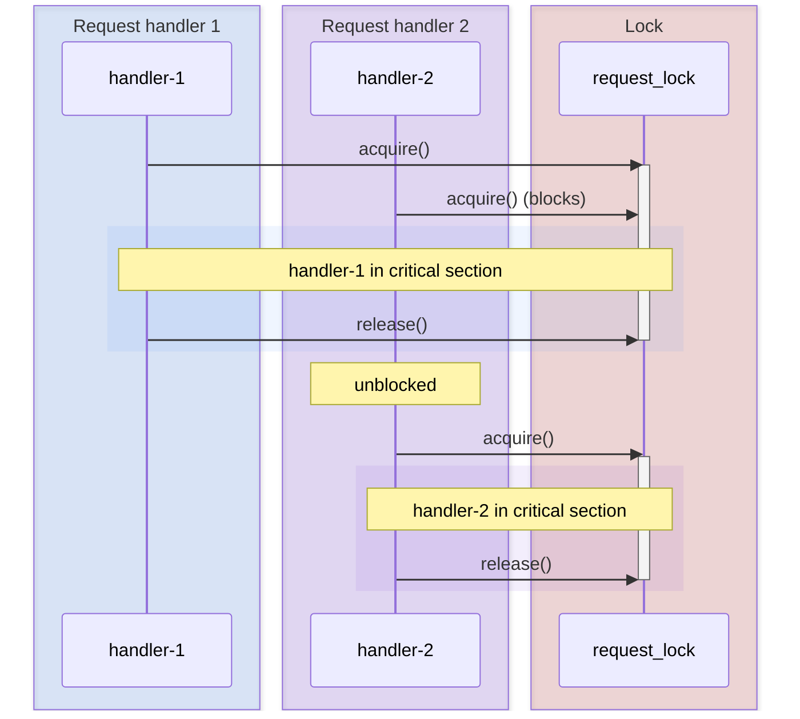

### Barrier

A [`Barrier(n)`](https://docs.python.org/3/library/threading.html#threading.Barrier) makes `n` threads wait until all of
them have called `barrier.wait()`. The first `n - 1` arrivals block. When the last arrives, all `n` are released at
once. It is a rendezvous point: no one proceeds until everyone is ready.

A data pipeline that runs three parallel preprocessing steps before the merge phase:

```python
import threading

merge_barrier = threading.Barrier(3)


def preprocess_shard(shard_id: int, data: list[str]) -> list[str]:
    # ... expensive transformation ...
    results = [line.upper() for line in data]
    merge_barrier.wait()  # wait for all three shards to finish
    return results  # all shards proceed to merge simultaneously
```

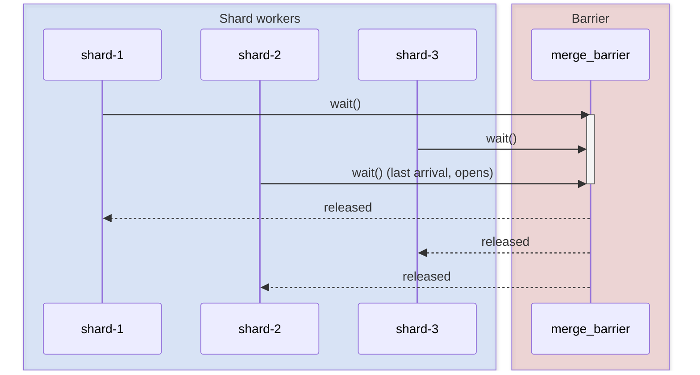

### RLock

An [`RLock`](https://docs.python.org/3/library/threading.html#threading.RLock) (reentrant lock) is a Lock that the
_same_ thread can acquire multiple times without deadlocking itself. It tracks an internal count: each `acquire()`
increments it, each `release()` decrements it, and the lock is fully released only when the count reaches zero.

Useful when a locked method calls another method that also needs the lock:

```python
import threading

account_lock = threading.RLock()


def transfer(amount: int) -> None:
    with account_lock:
        validate(amount)  # also acquires account_lock -- fine with RLock


def validate(amount: int) -> None:
    with account_lock:  # reentrant: same thread, count goes 2 → 1 on exit
        if amount <= 0:
            raise ValueError("amount must be positive")
```

With a plain `Lock`, the second `acquire()` inside `validate` would deadlock because the same thread already holds it.

### Event

An [`Event`](https://docs.python.org/3/library/threading.html#threading.Event) is a boolean flag shared between threads.
It starts unset. Any thread can call `event.wait()` to block until the flag is set; another thread calls `event.set()`
to unblock all waiters at once. `event.clear()` resets it.

A background configuration loader that signals workers when startup is complete:

```python
import threading

config_ready = threading.Event()
config: dict[str, str] = {}


def loader() -> None:
    config.update({"db_host": "localhost", "db_port": "5432"})
    config_ready.set()  # unblocks all waiting workers


def worker(name: str) -> None:
    config_ready.wait()  # blocks until loader calls set()
    print(f"{name} connecting to {config['db_host']}")
```

### Condition

A [`Condition`](https://docs.python.org/3/library/threading.html#threading.Condition) combines a lock with a
notification mechanism. Threads call `wait()` to release the lock and sleep until another thread calls `notify()` or
`notify_all()`. Used in producer-consumer patterns where consumers sleep when the queue is empty.

```python
import threading
from collections import deque

queue: deque[str] = deque()
queue_condition = threading.Condition()


def producer() -> None:
    with queue_condition:
        queue.append("task")
        queue_condition.notify()  # wake one waiting consumer


def consumer() -> None:
    with queue_condition:
        while not queue:
            queue_condition.wait()  # release lock, sleep, reacquire on wake
        task = queue.popleft()
    print(f"processing {task}")
```

### Semaphore

A [`Semaphore(n)`](https://docs.python.org/3/library/threading.html#threading.Semaphore) maintains an internal counter
starting at `n`. `acquire()` decrements it (blocking when it reaches zero); `release()` increments it. Up to `n` threads
can hold it simultaneously. A `BoundedSemaphore` is the same but raises an error if `release()` is called more times
than `acquire()`, preventing bugs where the counter drifts above the initial value.

A connection pool that limits concurrent database connections to 5:

```python
import threading

connection_semaphore = threading.Semaphore(5)


def query_database(sql: str) -> str:
    with connection_semaphore:  # blocks if 5 connections already active
        # ... execute query ...
        return "result"
```

---

blanket wraps all seven primitives with the same interface your production code already uses, so worker threads need no
changes.

## The problem with testing threads

Three threads share a lock and a barrier:

```python
import random
import threading

lock = threading.Lock()
barrier = threading.Barrier(3)


def worker(name: str) -> None:
    with lock:
        print(f"worker {name} got the lock")
    barrier.wait()
    print(f"worker {name} is past the barrier")


threads: list[threading.Thread] = [
    threading.Thread(target=worker, args=(n,)) for n in ("A", "B", "C")
]
random.shuffle(threads)
for thread in threads:
    thread.start()
for thread in threads:
    thread.join()
```

Run it five times, get five different outputs. The OS scheduler picks who gets the lock first, who exits the barrier
first. That's 6 possible lock orderings times 6 possible barrier orderings -- 36 distinct executions, and you control
none of them.

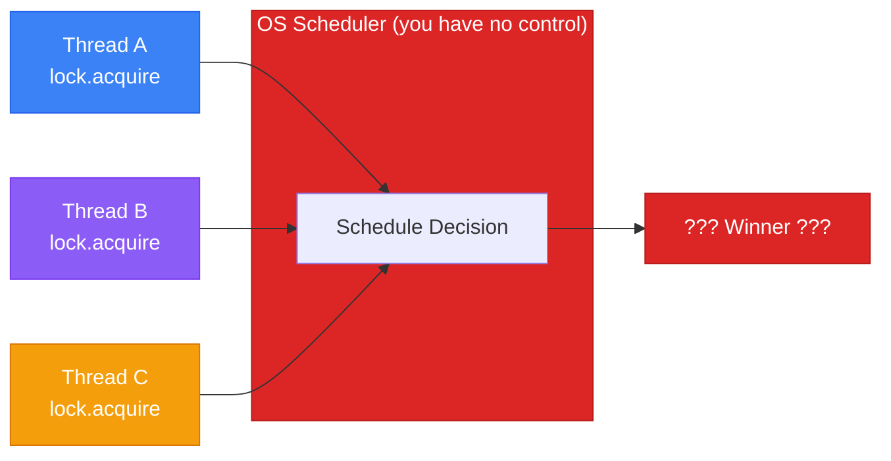

Now imagine this isn't a toy example but a connection pool, a cache invalidation layer, or a task queue. The bug shows
up only when thread B acquires the lock _before_ thread A has released its resource. You can't write a regression test
for that because you can't tell the OS "run B next."

**Synchronization primitives are non-deterministic by design.** They have to be -- the whole point of a lock is to
manage contention without requiring a specific ordering. But that same property makes them untestable in isolation.

### The GIL used to hide this

The [Global Interpreter Lock](https://docs.python.org/3/glossary.html#term-GIL) masked many threading bugs for decades.
The GIL ensures only one thread executes Python bytecode at a time, which means operations like `dict[key] = value` or
`list.append(x)` are effectively atomic. Code that was "thread-unsafe" in theory often worked fine in practice because
the GIL serialized everything.

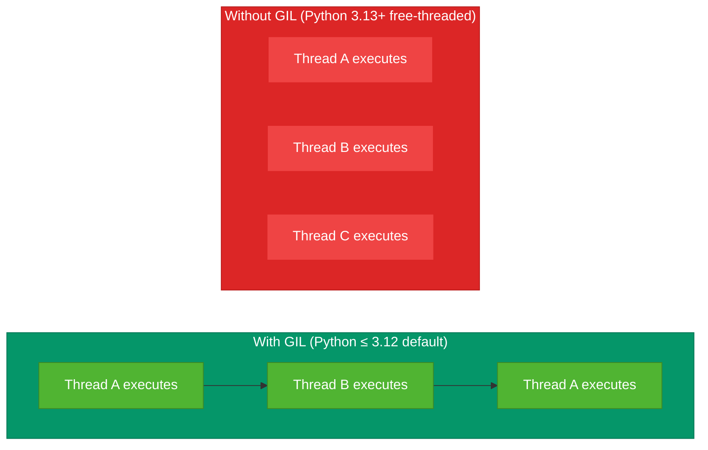

That era is ending. [PEP 703](https://peps.python.org/pep-0703/) made the GIL optional, Python 3.13 shipped the first
experimental free-threaded build, [Python 3.14 officially supports it](https://docs.python.org/3.14/whatsnew/3.14.html)
(with the performance penalty down to roughly 5-10%), and
[Python 3.15 adds stable ABI support for free-threaded builds](https://docs.python.org/3.15/whatsnew/3.15.html) along
with new threading utilities like
[`serialize_iterator`](https://docs.python.org/3.15/library/threading.html#threading.serialize_iterator) and
[`concurrent_tee`](https://docs.python.org/3.15/library/threading.html#threading.concurrent_tee). Code that relied on
implicit GIL serialization will start breaking.

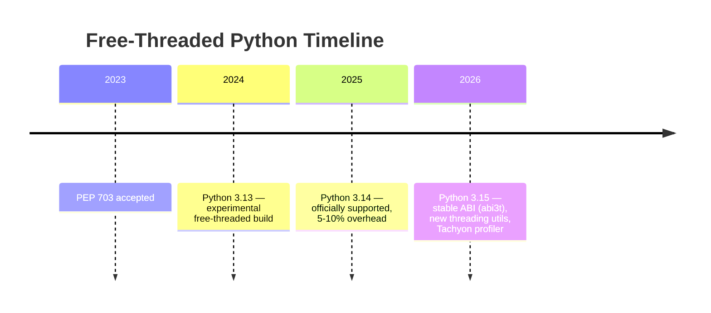

Larry Hastings' [Gilectomy project](https://github.com/larryhastings/gilectomy), started years before PEP 703, was an
early experimental attempt to remove the GIL from CPython -- which gives him a practical grounding in the concurrency
problems free-threading introduces.

## Enter blanket

[blanket](https://pypi.org/project/blanket/) (v1.0, MIT license, Python 3.11+) replaces your `threading` synchronization
primitives with wrapped versions that **stop and wait for instructions** instead of making their own scheduling
decisions.

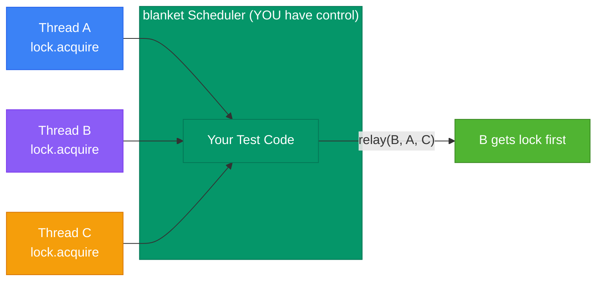

The same three-thread example, rewritten with blanket:

```python
import blanket
from threading import Thread

scenario = blanket.Scenario()

lock = scenario.Lock()
barrier = scenario.Barrier(3)


def worker(name: str) -> None:
    with lock:
        print(f"worker {name} got the lock")
    barrier.wait()
    print(f"worker {name} is past the barrier")


thread_a: Thread = Thread(target=worker, args=("A",))
thread_b: Thread = Thread(target=worker, args=("B",))
thread_c: Thread = Thread(target=worker, args=("C",))

lock_api = scenario.api(lock)
barrier_api = scenario.api(barrier)

with scenario:
    for th in [thread_a, thread_b, thread_c]:
        th.start()
    list(lock_api.relay(thread_b, thread_a, thread_c))
    lock_api.unblock(lock.release, thread_c)
    with barrier_api.cycle(thread_c, thread_a, thread_b):
        pass

for th in [thread_a, thread_b, thread_c]:
    th.join()
```

Every single run produces:

```
worker B got the lock
worker A got the lock
worker C got the lock
worker C is past the barrier
worker A is past the barrier
worker B is past the barrier
```

The changes are minimal:

1. Create a `Scenario`.
2. Replace `threading.Lock()` with `scenario.Lock()` and `threading.Barrier(3)` with `scenario.Barrier(3)`.
3. Enter `with scenario:` -- your main thread becomes _the scheduler_.
4. Use `relay` to control lock acquisition order and `cycle` to control barrier exit order.

The worker code is _unchanged_. It still does `with lock:` and `barrier.wait()` like it would in production. The workers
have no idea they're being orchestrated.

## Wrapping, not reimplementing

blanket wraps real `threading` primitives rather than reimplementing them. When you call `lock.acquire()` on a blanket
Lock, it calls the real `threading.Lock.acquire()` underneath. When you call `condition.wait()`, the real
`threading.Condition.wait()` executes, with all its semantics around releasing and reacquiring the underlying lock.

If a testing framework reimplements `Lock.acquire()` and gets some edge case wrong, your tests pass but production
breaks. blanket avoids this entirely. The semantics come straight from CPython's `threading` module.

> _blanket has no opinion about what synchronization primitives mean. It does no reimplementation. Every
> `lock.acquire()` is a real `threading.Lock.acquire()` underneath._

## How it works under the hood

### The transaction state machine

Every method call on a blanket primitive becomes a **transaction** -- a state machine:

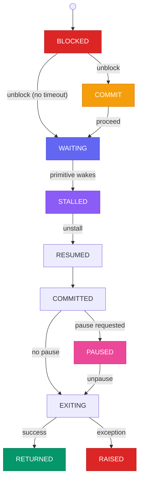

Four **parking states** exist where the transaction stops and waits:

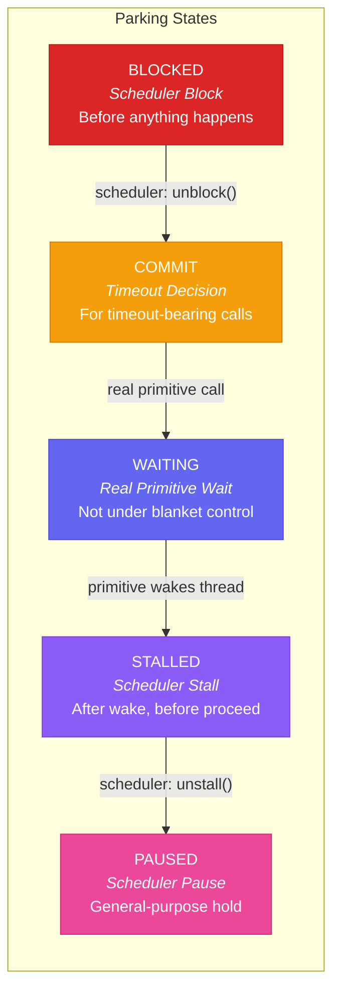

- **BLOCKED** (the _scheduler block_): before anything happens. Every transaction starts here.
- **COMMIT**: for timeout-bearing calls (like `lock.acquire(timeout=5)`). The scheduler can force a timeout or ignore
  it.
- **WAITING**: inside the real primitive's wait. Not under blanket's control -- it's the real `threading.Lock` doing its
  thing.
- **STALLED**: after waking from the real wait but before proceeding.
- **PAUSED**: a general-purpose pause point.

When thread B calls `lock.acquire()`, blanket creates a transaction in `BLOCKED` state and puts B to sleep. The
scheduler sees the transaction, calls `transaction.unblock()`, and B wakes up to actually acquire the lock.

### The four-object architecture

Each blanket primitive is four objects:

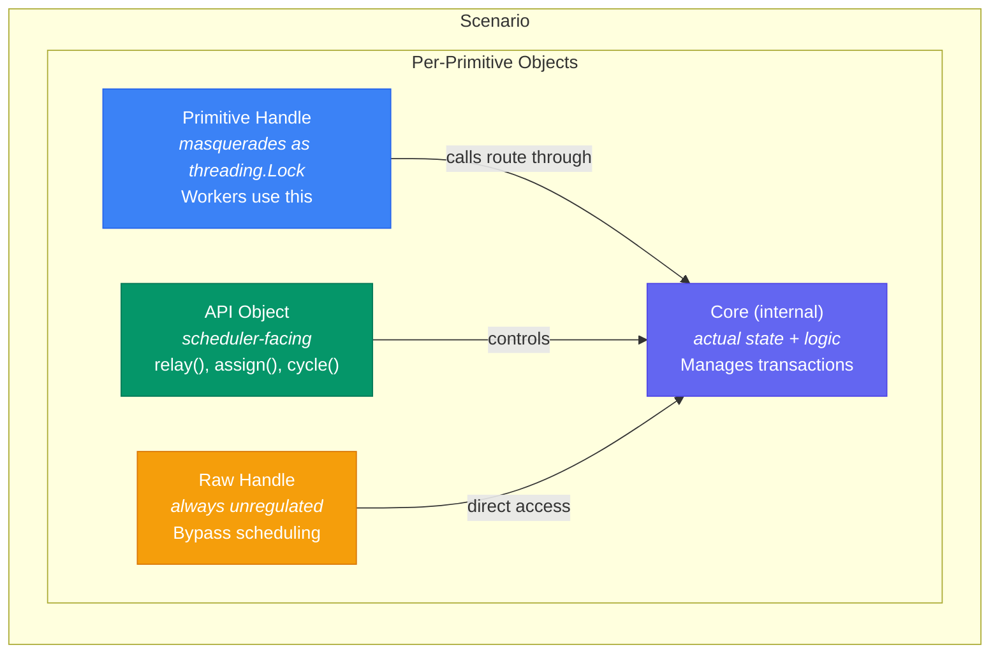

- **Primitive Handle**: what workers use. Masquerades as a real `threading.Lock` (passes `isinstance` checks).
- **API Object**: what the scheduler uses. Provides `relay()`, `assign()`, `cycle()`, `allocate()`.
- **Raw Handle**: always unregulated. Use inside `with scenario:` when the scheduler itself needs to call the primitive.
- **Core**: internal. You never touch this directly.

### Masquerading

`isinstance(scenario.Lock(), threading.Lock)` returns `True`. The `repr()` looks identical to a real lock's. One subtle
tell: blanket uppercases the hex ID. A real lock shows `0x78c990475650`; a blanket lock shows `0X78C9905B2CF0`.

## The three API layers

blanket's API has three layers, each built on the one below. The high-level helpers handle common patterns in one call.
When those don't fit, drop to the middle level for manual step-by-step control. The low level exposes raw transactions
and signal-based waiting for cases that need more precision.

```mermaid
flowchart LR
    subgraph High["High-Level"]
        direction TB
        H1["relay()  assign()"]
        H2["cycle()  allocate()"]
    end

    subgraph Mid["Middle-Level"]
        direction TB
        M1["park()  skip()  finish()"]
        M2["Driver / Chain / Dispatch"]
    end

    subgraph Low["Low-Level"]
        direction TB
        L1["transactions"]
        L2["scenario.wait() + signals"]
    end

    High -->|"uses"| Mid -->|"uses"| Low

    style High fill:#059669,stroke:#047857,color:#fff
    style Mid fill:#f59e0b,stroke:#d97706,color:#fff
    style Low fill:#dc2626,stroke:#b91c1c,color:#fff
    style H1 fill:#059669,stroke:#047857,color:#fff
    style H2 fill:#059669,stroke:#047857,color:#fff
    style M1 fill:#f59e0b,stroke:#d97706,color:#fff
    style M2 fill:#f59e0b,stroke:#d97706,color:#fff
    style L1 fill:#dc2626,stroke:#b91c1c,color:#fff
    style L2 fill:#dc2626,stroke:#b91c1c,color:#fff
```

### Low-level: transactions and scenario.wait

Raw transactions and `scenario.wait(*items)` -- a universal blocking function modeled after Win32's
[`WaitForMultipleObjects`](https://learn.microsoft.com/en-us/windows/win32/api/synchapi/nf-synchapi-waitformultipleobjects).
You can wait on threads, transactions, bound methods, or signal tokens:

```python
from blanket import Call, Reached, State, Terminated

with scenario:
    signaled: set[object] = scenario.wait(
        Call(lock.acquire, thread_a), Terminated(thread_b)
    )
```

### Middle-level: park, skip, finish, and drivers

Drives threads through sequences of method calls:

```python
with scenario:
    result: dict[Thread, object] = scenario.park(thread_a, lock.acquire)
    result[thread_a].unblock()

    scenario.skip(thread_b, lock.acquire, lock.release)
    scenario.finish(thread_c)
```

For multi-thread orchestration, `Driver`, `Chain`, and `Dispatch` provide lazy imperative control:

```python
with scenario:
    d1 = scenario.Driver(thread_a)
    d2 = scenario.Driver(thread_b)
    d1.skip()
    d2.skip()
    dispatch = scenario.Dispatch()
    dispatch.add(d1)
    dispatch.add(d2)
    for driver in dispatch:
        driver.skip()
```

### High-level: per-primitive helpers

Where you'll spend most of your time:

## Tutorial: real-world examples

### Connection pool: who gets the next connection

A connection pool protects its internal list with a lock. Three request handlers call `get_connection()` concurrently. A
bug report says handler B sometimes gets a stale connection when it acquires the pool lock before handler A has returned
its connection. With `relay`, force that exact ordering:

```python
import blanket
from threading import Thread

scenario = blanket.Scenario()
pool_lock = scenario.Lock()
connections: list[str] = ["conn_1", "conn_2"]
handed_out: list[str] = []


def get_connection(handler_name: str) -> None:
    with pool_lock:
        if connections:
            conn = connections.pop(0)
            handed_out.append(f"{handler_name}={conn}")


handler_a: Thread = scenario.thread(get_connection, "handler_a")
handler_b: Thread = scenario.thread(get_connection, "handler_b")
handler_c: Thread = scenario.thread(get_connection, "handler_c")

pool_api = scenario.api(pool_lock)

with scenario:
    for thread in pool_api.relay(handler_b, handler_a, handler_c):
        pass
    pool_api.unblock(pool_lock.release, handler_c)

assert handed_out == ["handler_b=conn_1", "handler_a=conn_2"]
```

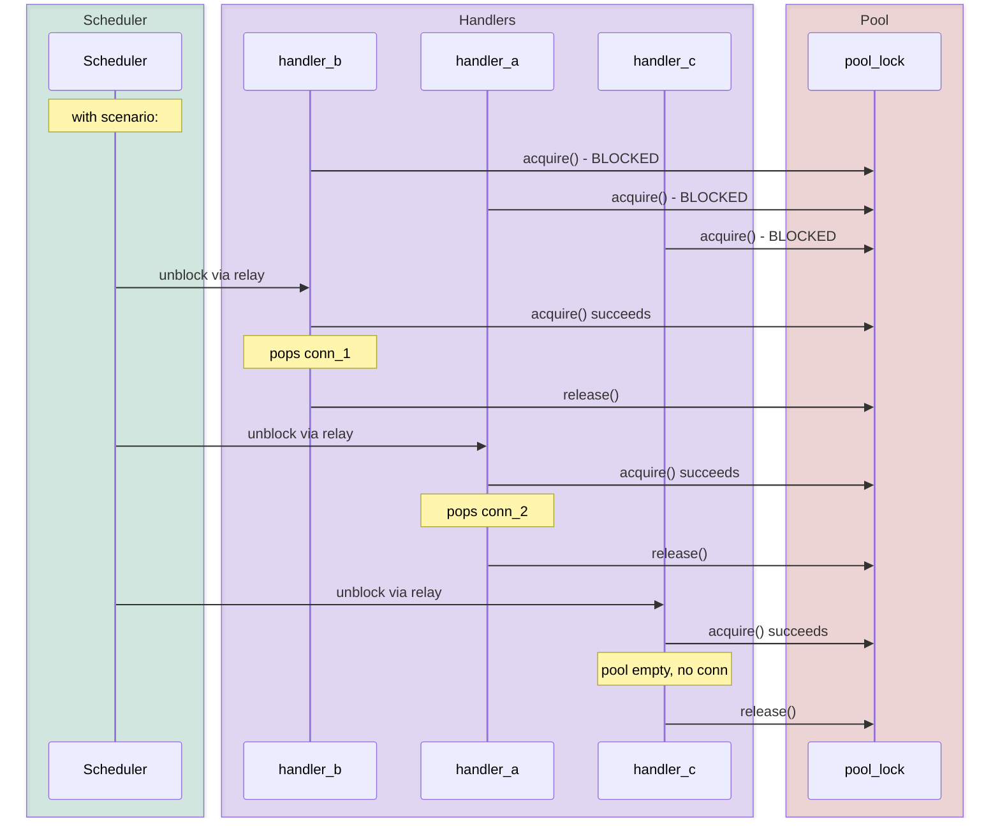

### Database migration: reproducing a deadlock

Two migration tasks each acquire locks in opposite order. Once in a thousand runs they deadlock. Without blanket you'd
loop the test hoping to get lucky. With blanket, force task 1 to hold the users lock while task 2 holds the orders lock,
then have each reach for the other's:

```python
import blanket
from threading import Thread

scenario = blanket.Scenario()
users_lock = scenario.Lock()
orders_lock = scenario.Lock()


def migrate_users() -> None:
    users_lock.acquire()
    if orders_lock.acquire(timeout=1.0):
        orders_lock.release()
    users_lock.release()


def migrate_orders() -> None:
    orders_lock.acquire()
    if users_lock.acquire(timeout=1.0):
        users_lock.release()
    orders_lock.release()


users_task: Thread = scenario.thread(migrate_users)
orders_task: Thread = scenario.thread(migrate_orders)

users_api = scenario.api(users_lock)
orders_api = scenario.api(orders_lock)

with scenario:
    users_api.assign(users_task)
    orders_api.assign(orders_task)

    parked_users = scenario.park(users_task, orders_lock.acquire)
    parked_orders = scenario.park(orders_task, users_lock.acquire)

    parked_users[users_task].expire()
    parked_users[users_task].unblock()
    scenario.finish(users_task)
    scenario.finish(orders_task)
```

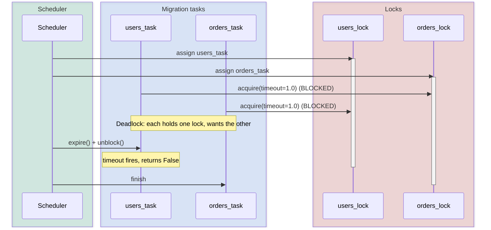

### Service startup: controlling initialization order

A service spawns background workers that block on a "ready" event until configuration loads. A race in the health check
means the HTTP listener must start _after_ the schema migration worker finishes. Force the migration to resume first:

```python
import blanket
from threading import Thread

scenario = blanket.Scenario()
ready = scenario.Event()
startup_order: list[str] = []


def schema_migrator() -> None:
    ready.wait()
    startup_order.append("migration")


def http_listener() -> None:
    ready.wait()
    startup_order.append("http")


def config_loader() -> None:
    ready.set()


migrator: Thread = scenario.thread(schema_migrator)
listener: Thread = scenario.thread(http_listener)
loader: Thread = scenario.thread(config_loader)
ready_api = scenario.api(ready)

with scenario:
    with ready_api.cycle(migrator, listener, loader) as cyc:
        cyc.wake(migrator, listener)

assert startup_order == ["migration", "http"]
```

`cycle` drives `migrator` and `listener` into `ready.wait()`, then drives `loader` through `ready.set()` (waking both),
and gives you control over who resumes first. Without blanket the wake order is OS-determined.

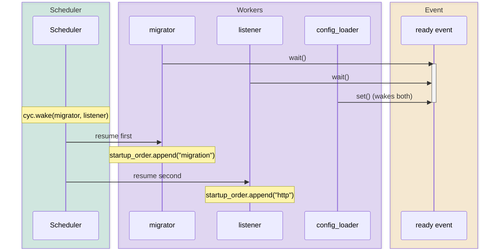

### Map-reduce: controlling shard completion order

Three shard processors reach a barrier before the reduce phase. A bug in the reducer only triggers when shard C's
partial results are merged before shard A's. Force that ordering to write a regression test:

```python
import blanket
from threading import Thread

scenario = blanket.Scenario()
sync_point = scenario.Barrier(3)
reduce_input: list[str] = []


def process_shard(shard_id: str) -> None:
    sync_point.wait()
    reduce_input.append(shard_id)


shard_a: Thread = scenario.thread(process_shard, "shard_a")
shard_b: Thread = scenario.thread(process_shard, "shard_b")
shard_c: Thread = scenario.thread(process_shard, "shard_c")

barrier_api = scenario.api(sync_point)

with scenario:
    with barrier_api.cycle(shard_a, shard_b, shard_c) as cyc:
        cyc.wake(shard_c, shard_b, shard_a)

assert reduce_input == ["shard_c", "shard_b", "shard_a"]
```

### Connection retry: testing the timeout fallback

Your pool has retry logic: if `acquire(timeout=5.0)` fails, it falls back to creating a fresh connection. That timeout
path is nearly impossible to trigger in tests because you'd need to hold the lock for 5 real seconds. `tx.expire()`
fires the timeout instantly:

```python
import blanket
from threading import Thread

scenario = blanket.Scenario()
pool_lock = scenario.Lock()
used_fallback: bool = False


def get_or_create_connection() -> None:
    global used_fallback
    if not pool_lock.acquire(timeout=5.0):
        used_fallback = True


pool_lock.acquire()  # simulate a long-running transaction holding the lock

retry_thread: Thread = scenario.thread(get_or_create_connection)

with scenario:
    parked = scenario.park(retry_thread, pool_lock.acquire)
    tx = parked[retry_thread]
    tx.expire()
    tx.unblock()
    scenario.finish(retry_thread)

assert used_fallback is True
```

`tx.expire()` forces the timeout to fire immediately. `tx.disregard()` does the opposite -- pretends no timeout was
specified.

### Monkey-patching code you don't own

When the code under test creates its own locks internally, `inject` swaps them for blanket primitives so you can still
control scheduling:

```python
import blanket
import connection_pool  # module that does `import threading` internally
from threading import Thread

scenario = blanket.Scenario()

with scenario.inject(connection_pool):
    pool = connection_pool.ConnectionPool(max_size=2)
    # All threading.Lock() calls inside connection_pool now create blanket locks

    results: dict[str, object] = {}

    def getter(name: str) -> None:
        results[name] = pool.get_connection()

    getter_a: Thread = scenario.thread(getter, "A")
    getter_b: Thread = scenario.thread(getter, "B")

    with scenario:
        pass  # orchestrate as needed
```

`inject` handles both `from threading import Lock` and `import threading` patterns. It returns a context manager; on
exit, original references are restored.

### Cache update race: injecting sync points into lockless code

Some code skips locks entirely, relying on Python's bytecode-level atomicity for `dict[key] = value`. Under
free-threading that's no longer safe. The bytecode injector lets you insert a synchronization checkpoint between two
operations so you can interleave another thread's read between them:

```python
import threading

from blanket.injector import Location, inject_call


def update_cache(cache: dict[str, str], key: str, value: str) -> None:
    old: str | None = cache.get(key)
    new_value: str = f"{old}_{value}" if old else value
    cache[key] = new_value  # race between the read above and this write


checkpoint = threading.Event()


def pause() -> None:
    checkpoint.wait()


loc = Location.text(update_cache, "cache[key] = new_value")
patched_update = inject_call(pause, loc)
# patched_update pauses right before the write, letting you interleave another thread
```

## The concurrency testing landscape

Testing concurrent code has been tackled differently across ecosystems. Understanding where blanket fits helps you know
when to reach for it versus something else.

| Approach                  | Tools                                                                                                                                                                                                                    | How it works                                                                                                     |
| ------------------------- | ------------------------------------------------------------------------------------------------------------------------------------------------------------------------------------------------------------------------ | ---------------------------------------------------------------------------------------------------------------- |
| **Bug discovery**         | [Loom](https://github.com/tokio-rs/loom) (Rust), [Shuttle](https://github.com/awslabs/shuttle) (Rust/AWS), [Coyote](https://microsoft.github.io/coyote/) (.NET), [Lincheck](https://github.com/JetBrains/lincheck) (JVM) | Run the test many times with different scheduling choices to systematically find interleavings that trigger bugs |
| **Runtime detection**     | [Go Race Detector](https://go.dev/blog/race-detector), [ThreadSanitizer](https://github.com/google/sanitizers) (C/C++)                                                                                                   | Instrument memory accesses and flag races as they happen in real runs                                            |
| **Deterministic control** | **blanket** (Python), [kotlinx-coroutines-test](https://kotlinlang.org/api/kotlinx.coroutines/kotlinx-coroutines-test/) (Kotlin), [Thread Weaver](https://github.com/google/thread-weaver) (Java)                        | Declare the exact interleaving you want; the tool guarantees it executes that way                                |
| **Scenario generation**   | [Hypothesis](https://hypothesis.readthedocs.io/en/latest/stateful.html) (Python), [Jepsen](https://jepsen.io/) (distributed systems)                                                                                     | Generate test programs automatically from state machine rules or fault injection                                 |

### Stateless model checkers

The largest family uses
**[stateless model checking](https://en.wikipedia.org/wiki/Model_checking#Stateless_model_checking)** (SMC) -- running
code many times with different scheduling decisions to explore interleavings.

[Loom](https://github.com/tokio-rs/loom) (Rust) does exhaustive permutation testing under the
[C11 memory model](https://en.cppreference.com/w/c/language/memory_model):

```rust
use loom::sync::Arc;
use loom::sync::atomic::{AtomicUsize, Ordering};
use loom::thread;

#[test]
fn test_concurrent_increment() {
    loom::model(|| {
        let num = Arc::new(AtomicUsize::new(0));
        let num2 = num.clone();

        let t1 = thread::spawn(move || {
            num2.fetch_add(1, Ordering::SeqCst);
        });

        num.fetch_add(1, Ordering::SeqCst);
        t1.join().unwrap();

        assert_eq!(2, num.load(Ordering::SeqCst));
    });
}
```

Loom is _sound_ (if all explorations pass, the code is correct) but the number of interleavings grows exponentially.

[Shuttle](https://github.com/awslabs/shuttle) (Rust, AWS) trades completeness for scalability using randomized testing:

```rust
use shuttle::sync::Mutex;
use shuttle::thread;
use std::sync::Arc;

#[test]
fn shuttle_test() {
    shuttle::check_random(|| {
        let data = Arc::new(Mutex::new(0));
        let data2 = data.clone();

        let t = thread::spawn(move || {
            *data2.lock().unwrap() += 1;
        });

        *data.lock().unwrap() += 1;
        t.join().unwrap();

        assert_eq!(*data.lock().unwrap(), 2);
    }, 1000);
}
```

[Coyote](https://microsoft.github.io/coyote/) (Microsoft, .NET) uses binary rewriting and records schedules for replay.
Azure teams report finding bugs "in minutes that would have taken days with stress testing."

[Lincheck](https://github.com/JetBrains/lincheck) (JetBrains, JVM) tests concurrent data structures for
[linearizability](https://en.wikipedia.org/wiki/Linearizability):

```kotlin
class ConcurrentCounterTest {
    private val counter = ConcurrentCounter()

    @Operation fun increment() = counter.increment()
    @Operation fun get() = counter.get()

    @Test fun modelCheckingTest() = ModelCheckingOptions().check(this::class)
}
```

### Runtime detectors

[Go's Race Detector](https://go.dev/blog/race-detector), built on
[ThreadSanitizer](https://github.com/google/sanitizers), instruments every memory access:

```go
func main() {
    counter := 0
    var wg sync.WaitGroup
    for i := 0; i < 1000; i++ {
        wg.Add(1)
        go func() {
            defer wg.Done()
            counter++ // DATA RACE
        }()
    }
    wg.Wait()
}
```

```bash
$ go run -race main.go
WARNING: DATA RACE
Write at 0x00c0000b4010 by goroutine 7:
```

Catches races only when triggered. Adds ~10x overhead, so it's a CI tool, not production.

### Deterministic virtual time

[Kotlin's `kotlinx-coroutines-test`](https://kotlinlang.org/api/kotlinx.coroutines/kotlinx-coroutines-test/) controls
_time_ rather than thread scheduling -- similar philosophy, different domain:

```kotlin
@Test
fun testTimeout() = runTest {
    val deferred = async {
        delay(1_000) // skipped, no real wait
        "result"
    }
    advanceTimeBy(1_000)
    assertEquals("result", deferred.await())
}
```

### Distributed systems

[Jepsen](https://jepsen.io/) injects network partitions, node crashes, and clock skew into distributed databases, then
checks consistency guarantees. Different level (distributed nodes vs. threads in one process) but same philosophy:
declare a failure scenario, force it, verify correctness.

### Where blanket fits

blanket doesn't explore interleavings automatically, detect races at runtime, or generate scenarios. It lets you declare
a specific interleaving by hand and guarantees it executes that way every time.

Best for:

- **Regression tests for known bugs.** Pin the exact interleaving that triggers a bug. Fix it. Test stays green.
- **Coverage of rare code paths.** Force the sequence that triggers that one `except` branch.
- **Documentation of concurrency contracts.** A blanket test reads like a specification.

The trade-off: you have to know what scenario to test. blanket won't discover bugs, it reproduces ones you understand.
Ideal workflow: an SMC tool finds bugs, blanket pins them as regression tests.

## A complete test suite example

Testing a thread-safe LRU cache:

```python
import threading
from collections import OrderedDict
from typing import Generic, TypeVar

V = TypeVar("V")


class ThreadSafeLRUCache(Generic[V]):
    def __init__(self, max_size: int) -> None:
        self._lock: threading.Lock = threading.Lock()
        self._cache: OrderedDict[str, V] = OrderedDict()
        self._max_size: int = max_size

    def get(self, key: str) -> V | None:
        with self._lock:
            if key in self._cache:
                self._cache.move_to_end(key)
                return self._cache[key]
            return None

    def put(self, key: str, value: V) -> None:
        with self._lock:
            if key in self._cache:
                self._cache.move_to_end(key)
            self._cache[key] = value
            if len(self._cache) > self._max_size:
                self._cache.popitem(last=False)
```

The tests:

```python
from collections import OrderedDict
from threading import Thread

import blanket


def test_write_before_read() -> None:
    scenario = blanket.Scenario()
    lock = scenario.Lock()

    cache: OrderedDict[str, str] = OrderedDict({"x": "old"})
    results: dict[str, str] = {}

    def getter() -> None:
        with lock:
            if "x" in cache:
                cache.move_to_end("x")
                results["read"] = cache["x"]

    def putter() -> None:
        with lock:
            cache["x"] = "new"
            cache.move_to_end("x")

    getter_thread: Thread = scenario.thread(getter)
    putter_thread: Thread = scenario.thread(putter)
    lock_api = scenario.api(lock)

    with scenario:
        list(lock_api.relay(putter_thread, getter_thread))
        lock_api.unblock(lock.release, getter_thread)

    assert results["read"] == "new"


def test_eviction_order() -> None:
    scenario = blanket.Scenario()
    lock = scenario.Lock()
    max_size: int = 2

    cache: OrderedDict[str, int] = OrderedDict({"a": 1, "b": 2})

    def put_c() -> None:
        with lock:
            cache["c"] = 3
            if len(cache) > max_size:
                cache.popitem(last=False)

    def put_d() -> None:
        with lock:
            cache["d"] = 4
            if len(cache) > max_size:
                cache.popitem(last=False)

    writer_c: Thread = scenario.thread(put_c)
    writer_d: Thread = scenario.thread(put_d)
    lock_api = scenario.api(lock)

    with scenario:
        list(lock_api.relay(writer_c, writer_d))
        lock_api.unblock(lock.release, writer_d)

    assert list(cache.keys()) == ["c", "d"]


def test_read_prevents_eviction() -> None:
    scenario = blanket.Scenario()
    lock = scenario.Lock()
    max_size: int = 2

    cache: OrderedDict[str, int] = OrderedDict({"a": 1, "b": 2})

    def reader() -> None:
        with lock:
            if "a" in cache:
                cache.move_to_end("a")

    def writer() -> None:
        with lock:
            cache["c"] = 3
            if len(cache) > max_size:
                cache.popitem(last=False)

    reader_thread: Thread = scenario.thread(reader)
    writer_thread: Thread = scenario.thread(writer)
    lock_api = scenario.api(lock)

    with scenario:
        list(lock_api.relay(reader_thread, writer_thread))
        lock_api.unblock(lock.release, writer_thread)

    assert "a" in cache
    assert "b" not in cache
    assert "c" in cache
```

Each test forces one interleaving and asserts the exact outcome. No flakiness. 100% reproducible.

## Getting started

```bash
pip install blanket
```

Requires Python 3.11+ and depends on [big](https://github.com/larryhastings/big). The bytecode injector optionally needs
the [bytecode](https://pypi.org/project/bytecode/) package.

### The shape of every blanket test

Every blanket test follows three phases:

1. **Setup** -- create a `Scenario`, create the primitives, define worker functions, create threads (use
   `scenario.thread()` for managed threads that start and join automatically).
2. **Schedule** -- enter `with scenario:`. Your main thread becomes the scheduler. Call the high-level API (`relay`,
   `cycle`, `allocate`) to control execution order.
3. **Assert** -- after exiting `with scenario:`, blanket has joined all managed threads. Check results.

### Quick reference

| I want to...                                         | Use                                     |
| ---------------------------------------------------- | --------------------------------------- |
| Control which thread gets a lock next                | `lock_api.relay(A, B, C)`               |
| Transfer a lock from one thread to another           | `lock_api.assign(holder, acquirer)`     |
| Orchestrate wait/notify on a Condition               | `cond_api.cycle(waiter, notifier)`      |
| Control barrier exit order                           | `barrier_api.cycle(A, B, C)`            |
| Order semaphore acquires/releases                    | `sem_api.allocate(A, B, C)`             |
| Force a timeout to fire immediately                  | `tx.expire()` then `tx.unblock()`       |
| Ignore a timeout entirely                            | `tx.disregard()` then `tx.unblock()`    |
| Park a thread at a specific method                   | `scenario.park(thread, method)`         |
| Drive a thread through multiple calls                | `scenario.skip(thread, m1, m2, m3)`     |
| Drive a thread to termination                        | `scenario.finish(thread)`               |
| Use a primitive without regulation (inside scenario) | `scenario.raw(primitive)`               |
| Test code that creates its own locks                 | `scenario.inject(module)`               |
| Add sync points to lockless code                     | `blanket.injector.inject_call(fn, loc)` |

Whether you're maintaining a library that needs to work under free-threading, writing new concurrent code, or pinning
down a flaky test -- `pip install blanket` and try it.
