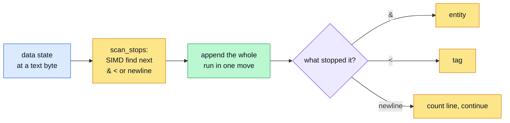
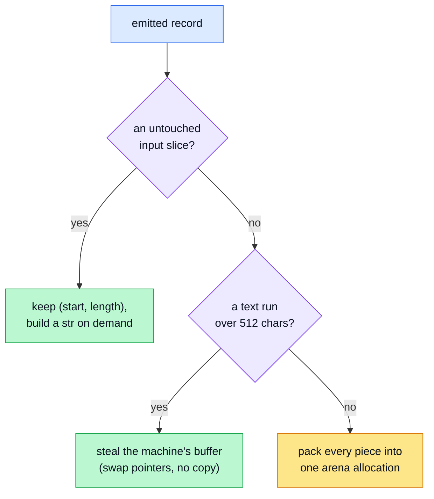
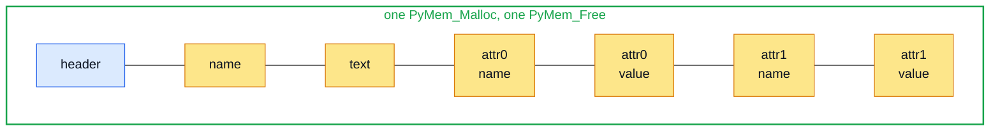

+++
author = "Bernat Gabor"
title = "Building a fast HTML parser in C: SWAR, SIMD, and zero-copy"
description = "A walk through the techniques that make turbohtml's escape, unescape, and HTML tokenizer several times faster than the Python standard library: SWAR, SIMD, per-width specialization, and zero-copy text runs."
image = "splash.webp"
images = [ "splash.webp"]
tags = [ "python", "c", "performance", "simd", "html", "parser", "tokenizer", "unicode", "turbohtml"]
draft = true
slug = "blazing-fast-html-parser"
date = 2026-06-18T09:00:00Z
+++

> [!TLDR] **TLDR:**
>
> - [**The setting**](#why-bother): escaping, unescaping, and tokenizing HTML sit on hot paths. The Python standard
>   library does them in pure Python, one character at a time. [turbohtml](https://pypi.org/project/turbohtml/) does
>   them in C and comes out 3-15x ahead.
> - [**Scan many bytes at once**](#scanning-sixteen-bytes-at-a-time): most text contains nothing special, so the trick
>   is to confirm that quickly. [SWAR](#the-swar-trick-checking-eight-bytes-with-one-subtraction) checks eight bytes
>   with a subtraction; [SIMD](#sixteen-bytes-with-one-shuffle) checks sixteen with one shuffle.
> - [**Measure, then write**](#two-passes-measure-then-write): one pass sizes the result exactly, so the second pass
>   allocates once and copies clean stretches wholesale.
> - [**Keep the native width**](#the-tokenizer-a-spec-exact-state-machine): a Python `str` stores text at one, two, or
>   four bytes per character ([PEP 393](https://peps.python.org/pep-0393/)). The tokenizer compiles its state machine
>   [once per width](#stamping-the-machine-once-per-width) and never copies a clean run of text out of the input
>   ([zero-copy slices](#never-copy-text-you-dont-have-to)).
> - [**The result**](#what-it-all-adds-up-to): an all-ASCII document, the common case, travels from input to tokens as
>   one-byte copies, scanned sixteen bytes at a step.
> - [**Free-threaded**](#making-it-free-threaded): no shared mutable state, so it declares `Py_MOD_GIL_NOT_USED` and
>   runs on the [no-GIL build](https://peps.python.org/pep-0703/) without forcing the lock back on.

This started as a proposal to CPython. The standard library's
[`html.escape`](https://docs.python.org/3/library/html.html#html.escape) and
[`html.unescape`](https://docs.python.org/3/library/html.html#html.unescape) are written in pure Python: `escape` runs
up to five `str.replace` passes, and `unescape` runs a regex with a per-match Python callback over the 2,231-entry HTML5
entity table. Both sit on hot paths, since `html.parser.HTMLParser` calls `unescape` on every run of text it sees, so I
[opened an issue](https://github.com/python/cpython/issues/151024) and a
[pull request](https://github.com/python/cpython/pull/151025) to add a small C accelerator behind them, keeping the
Python versions as the [PEP 399](https://peps.python.org/pep-0399/) fallback.

The core developers turned it down, and their reasons were fair. A C extension is a maintenance burden, `HTMLParser` is
still being rewritten, and there is talk of a unified `xml.escape` that might one day want to share an accelerator. One
of the maintainers
[suggested PyPI as the better home](https://github.com/python/cpython/issues/151024#issuecomment-4640666387) for this
rather than the standard library. So that is where it went, as [turbohtml](https://github.com/tox-dev/turbohtml).

Outside the standard library's constraints I kept going, and added a tokenizer too. turbohtml now does three things: it
escapes text for HTML, it unescapes HTML back to text, and it tokenizes HTML into a stream of tags and text. It matches
`html.escape`, `html.unescape`, and `html.parser` byte for byte, in C, several times faster.

I want to walk you through how. None of the techniques are mine; they come from CPython itself, from
[simdjson](https://github.com/simdjson/simdjson), from [html5ever](https://github.com/servo/html5ever), and from a
decades-old page of [bit tricks](https://graphics.stanford.edu/~seander/bithacks.html). Putting them together in one
place taught me a lot, and I think the ideas are worth knowing even if you never touch HTML. If you have written C
before and know roughly what a CPU does, you have enough background to follow along. Let me start with why any of this
matters.

## Why bother

Escaping runs on every fragment of text a web app renders. Unescaping runs on every chunk of text an HTML parser hands
back. Tokenizing runs on every document you scrape. These are the kind of functions that get called millions of times,
so a constant-factor speedup on each call adds up to real time saved.

Here is the shape of the gap, measured with [pyperf](https://pyperf.readthedocs.io) on CPython 3.14 against the standard
library:

| operation  | input                     | turbohtml | stdlib  | speedup |
| ---------- | ------------------------- | --------- | ------- | ------- |
| `escape`   | prose, nothing to escape  | 0.12 ms   | 2.66 ms | 22x     |
| `escape`   | real HTML (4 MiB)         | 1.35 ms   | 4.88 ms | 3.6x    |
| `unescape` | entity-heavy text         | 10.4 ms   | 78.5 ms | 7.6x    |
| `tokenize` | typical markup            | 30.3 µs   | 449 µs  | 14.8x   |
| `tokenize` | a 7.9 MB HTML spec source | 37.0 ms   | 399 ms  | 10.8x   |

Numbers vary with input and hardware; reproduce them with `tox -e bench` against the
[benchmark corpus](https://github.com/tox-dev/turbohtml/tree/main/tools) (Project Gutenberg's _War and Peace_, the
WHATWG and ECMAScript specs) in the repo.

The standard library is not slow because its authors were careless. It is slow because it is written in Python, and
Python pays an interpreter cost on every character it touches. `html.unescape` calls a Python function for every entity
it finds. `html.parser` runs a regular expression and then steps through matches in Python. Rewriting in C removes the
interpreter from the inner loop, and that alone buys a few times speedup. The rest of the gap comes from being clever
about what work to do at all, which is the interesting part.

A recurring theme runs through everything below: **the fastest work is the work you skip.** Most text needs no escaping.
Most characters in a document are ordinary letters. If you can confirm "nothing interesting here" for a big block of
text in one cheap step, you have already won. Let me show you the cheapest way I know to do that.

## Scanning sixteen bytes at a time

Take `escape`. Its job is to replace five characters (`&`, `<`, `>`, `"`, `'`) with their entity forms and leave
everything else alone. The naive version looks at one character, decides, and moves on:

```c
for each character:
    if it is special, append the replacement
    else, append the character
```

That is a branch per character. For a paragraph of prose where nothing needs escaping, you pay that branch thousands of
times to confirm there was nothing to do. We can do better by asking a different question: instead of "is *this* byte
special?", ask "does this *block* of bytes contain anything special?" and answer it for many bytes at once.

### The SWAR trick: checking eight bytes with one subtraction

The oldest version of this idea needs no special hardware, just a 64-bit integer. It is called
[SWAR](https://en.wikipedia.org/wiki/SWAR), short for "SIMD within a register": you treat one wide integer as a row of
small lanes and operate on all of them together with ordinary arithmetic.

The building block is a test for whether a word contains a zero byte. Here it is, lifted from
[Sean Anderson's bit-twiddling collection](https://graphics.stanford.edu/~seander/bithacks.html):

```c
#define ONES  0x0101010101010101ULL  // a 1 in the low bit of every byte
#define HIGHS 0x8080808080808080ULL  // a 1 in the high bit of every byte

uint64_t has_zero(uint64_t word) {
    return (word - ONES) & ~word & HIGHS;
}
```

The result is nonzero exactly when some byte of `word` is zero. The reasoning fits in three steps. Subtracting `ONES`
takes one off each byte lane. A lane holding `0x00` borrows and wraps to `0xFF`, which sets its high bit. The `& ~word`
term keeps a high bit only where the original byte had its high bit clear, which rules out lanes that were already big
(a byte like `0x80` would also look "set" after the subtraction, and we do not want that false alarm). The final
`& HIGHS` throws away everything except the per-lane high bits. What survives is a high bit in each lane that started at
zero.

That finds zero bytes. We want to find a specific byte, say `&`. The fix is a single XOR. Pick the byte you are hunting,
broadcast it into all eight lanes by multiplying with `ONES`, and XOR it against the word. Every lane that held your
byte becomes `0x00`, and now `has_zero` lights it up. turbohtml writes it like this:

```c
static inline uint64_t swar_hasbyte(uint64_t word, uint8_t byte) {
    uint64_t lanes = word ^ (ONES * byte);
    return (lanes - ONES) & ~lanes & HIGHS;
}
```

Eight bytes, one comparison, no per-character branch. To check all five specials in a block, you OR five of these
together. If the combined result is zero, the whole eight-byte block is clean and you can copy it straight through.

Here is the trick running for real. Type eight characters, pick the byte to hunt for, and watch the XOR turn matches
into `0x00` and the has-zero mask light up those lanes (the mask below is computed with real 64-bit math, so it is the
same arithmetic the C runs):



This SWAR test is the portable fallback. It is also what `glibc` uses inside
[`strlen`](https://en.cppreference.com/w/c/string/byte/strlen) and `memchr` when no vector instructions are available.
On a real CPU we can do better, because the hardware has instructions built for exactly this.

### Sixteen bytes with one shuffle

Every modern CPU has vector registers: 128 bits wide, holding sixteen bytes, with instructions that compare all sixteen
lanes in one step. This is [SIMD](https://en.wikipedia.org/wiki/Single_instruction,_multiple_data) proper, one
instruction working on many lanes. On x86 the relevant instruction set is [SSE2](https://en.wikipedia.org/wiki/SSE2); on
ARM (including Apple Silicon) it is
[NEON](<https://en.wikipedia.org/wiki/ARM_architecture_family#Advanced_SIMD_(Neon)>). turbohtml uses whichever the build
target has and falls back to SWAR otherwise.

The straightforward way on x86 is to compare the sixteen bytes against each special and OR the results:

```c
__m128i bytes = _mm_loadu_si128((const __m128i *)block);
__m128i hits  = _mm_cmpeq_epi8(bytes, _mm_set1_epi8('&'));
hits = _mm_or_si128(hits, _mm_cmpeq_epi8(bytes, _mm_set1_epi8('<')));
hits = _mm_or_si128(hits, _mm_cmpeq_epi8(bytes, _mm_set1_epi8('>')));
// ... '"' and '\'' when quoting
```

Each [`_mm_cmpeq_epi8`](https://www.felixcloutier.com/x86/pcmpeqb:pcmpeqw:pcmpeqd) sets a lane to `0xFF` on a match and
`0x00` otherwise. After the ORs, `hits` has `0xFF` wherever any special sits.

These `_mm_*` names are not magic incantations. Each is an SSE2 or SSSE3 _intrinsic_, a thin wrapper the compiler turns
into a single CPU instruction, and you can look any of them up in the
[Intel Intrinsics Guide](https://www.intel.com/content/www/us/en/docs/intrinsics-guide/index.html). The NEON `v*` names
play the same role on ARM and live in
[Arm's NEON intrinsics reference](https://arm-software.github.io/acle/neon_intrinsics/advsimd.html).

On ARM, turbohtml uses a sharper trick borrowed from [pulldown-cmark](https://github.com/pulldown-cmark/pulldown-cmark)
and the [simdjson](https://arxiv.org/abs/1902.08318) line of work. Look at the five specials in hex: `"` is `0x22`, `&`
is `0x26`, `'` is `0x27`, `<` is `0x3C`, `>` is `0x3E`. Their low four bits (the low nibble) are all different. So you
can build a sixteen-entry table indexed by low nibble, put each special's byte value in its slot, and zero everywhere
else. One NEON shuffle instruction ([`vqtbl1q_u8`](https://arm-software.github.io/acle/neon_intrinsics/advsimd.html))
looks up all sixteen lanes against that table at once. Compare the lookup result against the original bytes, and a lane
matches only when the byte is that special:

```c
static const uint8_t NIBBLE_SPECIALS[16] =
    {0x7F, 0, '"', 0, 0, 0, '&', '\'', 0, 0, 0, 0, '<', 0, '>', 0};
//   ^idx0 holds 0x7F so a byte like 0x10 (low nibble 0) never false-matches
```

A whole block classified with one table lookup and one compare. The comment in the source calls it "the
[PSHUFB](https://www.felixcloutier.com/x86/pshufb) trick," after the x86 instruction that started it.
[Geoff Langdale](https://branchfree.org/) and [Daniel Lemire](https://lemire.me/blog/) have written it up in depth if
you want to go deeper; their UTF-8 validator classifies bytes
[in less than one instruction each](https://arxiv.org/abs/2010.03090) using the same nibble-table idea.

### From "something is here" to "here is where"

Knowing a block is dirty is only half the job; the writing pass needs to know *which* lanes. The vector compare gives a
sixteen-lane result, but we want it as a plain integer bitmask we can pick bits out of. On x86 that is one instruction,
[`_mm_movemask_epi8`](https://www.felixcloutier.com/x86/pmovmskb), which takes the high bit of each of the sixteen lanes
and packs them into a sixteen-bit number.

ARM has no such instruction, which tripped me up the first time. The workaround comes from
[Danila Kutenin](https://developer.arm.com/community/arm-community-blogs/b/servers-and-cloud-computing-blog/posts/porting-x86-vector-bitmask-optimizations-to-arm-neon):
treat the comparison result as eight 16-bit lanes, shift each right by four and narrow it to a byte, and you get a
64-bit value where each input byte contributed one nibble. A matched byte becomes `0xF`, an unmatched one becomes `0`.
It costs two instructions instead of one, and it is good enough.

Once the mask is an integer, two more bit tricks walk it. `__builtin_ctzll(mask)`
[counts the trailing zeros](https://en.wikipedia.org/wiki/Find_first_set), which is the index of the lowest set bit, so
it points at the first match. `mask & (mask - 1)` clears that lowest bit. Loop on those two and you visit every special
in the block, in order, touching nothing in between:

```c
do {
    Py_ssize_t index = SPECIAL_INDEX(mask);        // ctz: first match
    memcpy(out, in + prev, index - prev);          // copy the clean gap before it
    out += write_escaped(out, in[index]);          // write the entity
    mask = SPECIAL_CLEAR(mask, index);             // mask &= mask - 1: drop it
    prev = index + 1;
} while (mask != 0);
```

The clean stretch between two specials moves with one [`memcpy`](https://en.cppreference.com/w/c/string/byte/memcpy).
Only the specials themselves get rewritten. A block with no specials skips the loop and copies all sixteen bytes at
once.

Try it on your own text below. The bytes group into blocks; each block reports whether it is clean (one `memcpy`) or
dirty (copy the gaps, rewrite the specials), and the running total is the exact output size the counting pass computes.
Flip the block size between the 8-byte SWAR word and the 16-byte SIMD register to see how much each step clears:



## Two passes: measure, then write

There is a structural decision underneath all of this. To build the output string, turbohtml runs the input twice.

The first pass counts. It scans the input with the same block trick and adds up how much each special grows the output
(`&amp;` adds four characters over `&`, `&lt;` adds three, and so on), without writing anything. At the end it knows the
exact final length. Then it allocates the output string once, at exactly the right size, and the second pass fills it.

Two scans of the input sounds wasteful next to one. It usually is not. The alternative, writing into a buffer that grows
as you go, copies the data you already wrote every time the buffer doubles, and the growth path adds a bounds check to
every append. Counting first means the second pass writes each output byte exactly once into a buffer it never has to
resize. The counting pass is cheap because it is the block scan we already built, with no writes to slow it down.

The counting is branchless too, which matters because a branch the predictor cannot guess costs more than the work it
guards. Rather than test each byte and add to a running total, turbohtml turns the comparison straight into a number.
Each special's compare gives a lane of `0xFF` on a match; AND that with the special's growth amount and the matched
lanes hold the growth while the rest hold zero. Summing all sixteen lanes with one instruction gives the block's total
growth, no per-byte branch in sight:

```c
// each match becomes 0xFF; AND with the growth turns it into 4, 3, or 5
__m128i extras = _mm_and_si128(_mm_cmpeq_epi8(bytes, _mm_set1_epi8('&')), _mm_set1_epi8(4));
extras = _mm_add_epi8(extras, _mm_and_si128(_mm_cmpeq_epi8(bytes, _mm_set1_epi8('<')), _mm_set1_epi8(3)));
// ... '>' adds 3, '"' and '\'' add 5
__m128i sums = _mm_sad_epu8(extras, _mm_setzero_si128());  // sum all 16 lanes at once
```

[`_mm_sad_epu8`](https://www.felixcloutier.com/x86/psadbw) exists to add up sixteen bytes in one shot. On ARM the nibble
table from earlier does double duty: a second table maps each special's low nibble to its growth, and one horizontal add
([`vaddvq_u8`](https://arm-software.github.io/acle/neon_intrinsics/advsimd.html)) totals the lanes. Either way, sizing a
clean block costs a few instructions and no branches.

The measure pass also hands us a shortcut. If the count comes back zero, nothing needs escaping, and the input is
already its own answer:

```c
if (extra == 0) {
    return PyUnicode_FromObject(text);  // hand back the original, no copy
}
```

That single check is why the "prose, nothing to escape" row up top shows a 22x speedup. The standard library walks the
whole string building a new one; turbohtml scans it sixteen bytes at a step, sees nothing, and returns the string it was
given.

The sizing pass leans on a CPython detail worth knowing. A Python `str` is allocated for a known length and a known
maximum character value, through
[`PyUnicode_New(length, maxchar)`](https://docs.python.org/3/c-api/unicode.html#c.PyUnicode_New), part of CPython's
public Unicode C API alongside the
[`PyUnicode_1BYTE_KIND`](https://docs.python.org/3/c-api/unicode.html#c.PyUnicode_1BYTE_KIND),
[`PyUnicode_DATA`](https://docs.python.org/3/c-api/unicode.html#c.PyUnicode_DATA), and
[`PyUnicode_FindChar`](https://docs.python.org/3/c-api/unicode.html#c.PyUnicode_FindChar) calls in the later snippets.
Because we computed both numbers in pass one, we get a correctly sized buffer in one allocation and write straight into
it, no reallocation, no waste. I will come back to that `maxchar` in a moment, because it ties into how strings are
stored.

## Going backwards: unescape

`unescape` is the mirror image, and it reuses the same instinct: hop to the next interesting spot, bulk-copy everything
in between. The interesting character here is `&`, the start of every entity.

To find the next `&`, turbohtml first probes the next sixteen bytes inline, and only if that comes up empty does it call
`memchr` over the rest:

```c
// in reference-dense text the next '&' is a handful of characters away,
// so probe inline first; memchr's call cost only pays off on long spans
Py_ssize_t probe_end = from + 16 < length ? from + 16 : length;
for (Py_ssize_t pos = from; pos < probe_end; pos++) {
    if (input[pos] == '&') return pos;
}
const uint8_t *hit = memchr(input + probe_end, '&', length - probe_end);
```

[`memchr`](https://en.cppreference.com/w/c/string/byte/memchr) is itself vectorized in any decent C library, so on a
long clean span it races ahead at memory speed. The text between two entities copies in one `memcpy`. Every character
that is not part of an entity is touched once, by a bulk copy, never inspected on its own.

When it lands on an `&`, it resolves the entity. Numeric ones like `&#127881;` parse the digits. Named ones like `&amp;`
need a lookup, and HTML has about 2,000 of them. A binary search over a sorted table finds any of them in around eleven
comparisons, but most real text uses only a handful, so turbohtml checks those first with one comparison each before
falling back to the search:

```c
switch (name[0]) {
case 'a':
    if (len == 4 && memcmp(name, "amp;", 4) == 0) return &entities[INDEX_AMP];
    if (len == 5 && memcmp(name, "apos;", 5) == 0) return &entities[INDEX_APOS];
    break;
case 'g':
    if (len == 3 && memcmp(name, "gt;", 3) == 0) return &entities[INDEX_GT];
    // lt, quot ...
}
// fall through to the ~11-step binary search
```

The longest-prefix rule is the subtle part. A reference does not need its trailing semicolon, so the matcher tries the
whole name, then keeps dropping the last character until something in the table matches. That is why `&notit;` becomes
`¬it;`: `not` is the longest prefix that is a real entity, and `it;` is left as plain text. Try a few below and watch
the binary search narrow and the prefix shrink (the table here is a small sorted sample of the real ~2,000 entries):



There is one more wrinkle worth showing. Unescaping can introduce a character wider than the input had (an emoji hiding
in `&#127881;` inside otherwise-ASCII text). To handle this without paying for wide storage when it never happens, the
output buffer starts narrow, one byte per character, so clean spans are a plain `memcpy`. The first time an entity
produces a character above `0xFF`, turbohtml widens what it has written so far in place, walking back to front so the
copy never overwrites a byte it still needs to read. After that it stays wide. Text that never needs it never pays for
it.

Picking the final width needs one more number, the largest character in the result, which tells `PyUnicode_New` how wide
to make the output string. Tracking the exact maximum would mean a comparison on every character. turbohtml cheats with
a bitwise OR instead. It keeps a `seen` value and ORs every emitted character into it. CPython only ever sorts a string
into one of three bins, at `0x7F`, `0xFF`, and `0xFFFF`, and an OR can push `seen` past one of those boundaries only if
some character crossed it. So the OR'd value lands in the same bin as the true maximum, for the price of one branchless
operation:

```c
seen |= character;   // accumulate; can't cross a width bin unless a character did
// ...
PyUnicode_New(count, seen > 0xFFFF ? 0x10FFFF : seen);
```

That idea, storing text at the narrowest width it needs, is the whole story of the tokenizer, so let me turn to that.

## The tokenizer: a spec-exact state machine

Escaping and unescaping are small. The tokenizer is where the interesting structure lives.

Tokenizing means turning a string of HTML into a stream of pieces: a start tag here, a run of text, an end tag, a
comment. The [WHATWG HTML specification](https://html.spec.whatwg.org/multipage/parsing.html#tokenization) defines this
as a state machine with about eighty states, written out character by character. You start in the "data" state. A `<`
moves you to "tag open." A letter after that moves you to "tag name." And so on, with a named state for every situation
the messy reality of HTML can produce.

Python's `html.parser` does not implement this machine; it approximates it with regular expressions. That is faster to
write and good enough for tidy input, but it diverges from real browsers on malformed markup, and a regex cannot express
one thing the spec needs: the tokenizer's state sometimes depends on the tags it has already seen (inside `<script>`, a
`<b>` is text, not a tag). turbohtml implements the actual state machine, and it is checked against
[html5lib-tests](https://github.com/html5lib/html5lib-tests), the same conformance suite browsers use. Being correct and
being fast pull in different directions here, and most of the cleverness is in not letting correctness cost speed.

The dispatch loop is a plain `switch` over the current state, wrapped in a `for(;;)`:

```c
for (;;) {
    Py_UCS4 ch = read(self->pos);
    switch (self->state) {
    case ST_DATA:        /* ... */ continue;
    case ST_TAG_OPEN:    /* ... */ continue;
    case ST_TAG_NAME:    /* ... */ continue;
    // ~75 more
    }
}
```

The state enum is dense, so the compiler turns this into a [jump table](https://en.wikipedia.org/wiki/Branch_table): one
indirect jump per step. A transition is a store to `self->state` and a `continue`. Suspending the machine when the input
runs out is just leaving `self->state` alone and returning, which is what makes it resumable for streaming input. So far
this is a textbook tokenizer. Three things make it quick.

The easiest way to feel how the machine works is to step it. Type some markup and walk it one character at a time: watch
the current state light up, the cursor advance, and tokens pop out as tags and runs of text close. This widget models
the tag and attribute states faithfully (it simplifies character references, which the next section covers):



### Stamping the machine once per width

Here is that `str` storage detail I promised. Since [PEP 393](https://peps.python.org/pep-0393/), CPython stores every
string at the narrowest of three fixed widths, chosen by its largest character: one byte per character for Latin-1
(anything up to `U+00FF`), two bytes for the rest of the basic multilingual plane (up to `U+FFFF`), four bytes once an
astral character like an emoji appears (up to `U+10FFFF`). Type into the box below to watch a string land in one of the
three bins; add an accent or an emoji and see the whole string jump to a wider storage:



A pure-ASCII document, which is most HTML, is one byte per character. Reading a character means indexing an array, and
the stride depends on the width. The naive way to handle all three is to branch on the width on every read. That branch,
on every character, is exactly the kind of cost we keep trying to avoid.

CPython solves this for its own string functions with a trick its source calls `stringlib`: write the algorithm once
against an abstract character type, then `#include` the file three times, redefining the type each time, to stamp out
three specialized copies. turbohtml does the same with its whole state machine. The core lives in a file
`tokenizer_sm_run.inc`, and it gets included three times:

```c
#define TH_CHAR  Py_UCS1                 // 1-byte build
#define TH_READ(i) ((Py_UCS4)((const TH_CHAR *)self->input.data)[(i)])
#include "tokenizer_sm_run.inc"
#undef  TH_CHAR
// ... again with Py_UCS2, again with Py_UCS4
```

Because `TH_CHAR` is a concrete type inside each copy, `TH_READ` compiles to a single indexed load with a fixed stride.
There is no width branch in the inner loop at all. The one runtime decision happens once, at the top, when the code
picks which of the three compiled machines to run:

```c
if (kind == PyUnicode_1BYTE_KIND) return run_ucs1(self);
if (kind == PyUnicode_2BYTE_KIND) return run_ucs2(self);
return run_ucs4(self);
```

You write the machine once and the compiler hands you three fast ones. For the one-byte case that dominates real
traffic, every read is plain byte arithmetic that the compiler is free to vectorize.

### Scanning text runs, not characters

A textbook state machine takes one step per character, even through a long paragraph of plain text where every character
does the same dull thing: append me to the current text run. That is a `switch`, a few comparisons, and some bookkeeping
per character, to copy bytes that needed no decisions.

[html5ever](https://github.com/servo/html5ever), the HTML parser in Servo, skips that. In the data state, when the
current character is ordinary text, it scans ahead to the next character that matters and moves the whole run in one
shot. turbohtml copies the approach. Only a few characters end a text run: `&` starts an entity, `<` starts a tag, and
`\n` needs line-counting. Everything else is just text. So the data state asks "where is the next of those?" and hands
over the entire span up to it:

```c
if (ch != '&' && ch != '<' && ch != '\n') {
    Py_ssize_t stop = scan_stops(self, self->pos + 1, '&', '<', '\n');
    text_append_run(self, stop);   // move the whole run at once
    continue;
}
```

And `scan_stops` is our friend from the escaping code: the same SIMD-or-SWAR block scan, now hunting for the first of
several stop characters instead of HTML specials. Sixteen bytes a step on ARM and x86, eight in the portable fallback.



A document that is mostly text, which describes most documents, gets processed at close to `memcpy` speed, with the
state machine waking up only at the tags.

### Never copy text you don't have to

There is one more level. When the machine moves a run of text, it does not copy the bytes. A run of plain text that came
straight from the input and was not modified is recorded as a pair of numbers, a start index and a length, pointing back
into the original string. turbohtml calls this a slice:

```c
// if this character is the next input byte, and contiguous
// with the slice we are already building, just extend the slice
if (ch == input[self->pos] &&
    self->pos == self->slice_start + self->slice_len) {
    self->slice_len++;     // no copy, just grow the window
    return;
}
```

The bytes get copied only when something forces it: an entity that decodes to a different character, a `\r\n` that needs
normalizing, a stray `<` that turned out to be text. Plain runs never materialize; the text token carries the indices,
and the actual `str` gets built lazily, with a single substring, only if the caller asks for the text.

It goes one step further for whole-document tokenizing. The spec asks a tokenizer to normalize newlines first, turning
every `\r\n` and lone `\r` into a single `\n`, and that rewrite is the one thing that forces the input to be copied.
Streaming `feed` does it in bulk anyway: it uses `memchr` to jump to the next `\r` and appends the whole run before it
in one move, so only the carriage returns themselves are handled character by character. But a document with no `\r` at
all needs no rewriting, so for the common one-shot case turbohtml checks for that and borrows the original string's
storage directly instead of copying the document in:

```c
if (PyUnicode_FindChar(arg, '\r', 0, length, 1) == -1) {
    th_tok_borrow_input(sm, kind, PyUnicode_DATA(arg), length);  // no copy at all
}
```

Put these together and trace a clean ASCII paragraph through the system. The input is borrowed, not copied. The text run
is a slice, a start and a length, not copied. The token carries those indices. Nothing in that paragraph gets copied
anywhere until you ask for its `.data`, and even then it is one substring. The data moves zero times on the way through.

### A token builds only what you ask for

The state machine emits a plain C record. The `Token` you get back is a thin wrapper that copies that record, since the
machine reuses its record storage for the next token, and then does as little as it can. None of the Python-visible
values exist yet. Ask for `token.type` and you get back a cached enum member with one reference bump; the five
`TokenType` members are built once when the module loads and kept in module state, so reading a type never does a
lookup. Ask for `token.tag` or `token.attrs` and only then does turbohtml build the string or the list. A consumer that
scans a document to count its start tags never builds a single attribute string. The same laziness keeps attribute
lookup cheap: `token.attr("href")` walks the record's C array and compares bytes in place, returning the one value you
asked for without building a dict.

When the token does copy the record, it picks the cheapest of three strategies for where to put the bytes:



The first branch is the zero-copy slice from above. The second handles a large block of text: rather than duplicate a
long run, the token takes the machine's text buffer outright by swapping pointers, and the machine grows a fresh one for
the next run. The third, the default for tags and short tokens, is the arena.

### One allocation per token, not a dozen

Take that third branch, a tag with attributes. It has to hand the caller a tag name, and for each attribute a name and a
value, plus the odd comment or doctype with a public and system identifier. These are variable-length pieces, so the
obvious way to store them is one `malloc` each. A tag with five attributes works out to roughly a dozen small
allocations, and a matching dozen `free` calls when the token is thrown away.

That is wasteful for two reasons. The first is that `malloc` and `free` are not cheap when you call them this often:
each one walks a free list, updates the allocator's bookkeeping, and on a free-threaded build takes a lock. Spending a
dozen of them on a single token, millions of times, adds up. The second is locality. Twelve separate allocations land in
twelve scattered spots on the heap, so reading the token back later chases pointers through cache-cold memory.

turbohtml uses an arena instead. The idea is to make one big allocation and carve all the pieces out of it by hand. It
takes two quick passes over the token's parts. The first pass adds up how many bytes everything needs, rounding each
piece up so the next one starts on an aligned boundary (wide UCS-2 or UCS-4 text has to sit at an even or four-aligned
address). The second pass does a single `malloc` of that total and then walks a cursor through the block, copying each
piece in and handing back a pointer to where it landed:

```c
// pass 1: total the sizes, with alignment padding between pieces
size_t total = sizeof(Token);
total += padded(name.len) + padded(text.len);
for (each attribute a) total += padded(a.name.len) + padded(a.value.len);

// one allocation for the whole token
char *arena  = PyMem_Malloc(total);
char *cursor = arena + sizeof(Token);

// pass 2: bump the cursor, point each field into the block
name_ptr = cursor;  memcpy(cursor, name.data, name.len);  cursor += padded(name.len);
text_ptr = cursor;  memcpy(cursor, text.data, text.len);  cursor += padded(text.len);
// ... and so on for every attribute name and value
```

The whole token, header and tag name and every attribute, is now one contiguous block of memory:



This helps in three ways. A token costs one `malloc` and one `free` no matter how many attributes it carries, instead of
one per field. The bytes sit next to each other, so reading the token touches one cache line region rather than a dozen
scattered ones. And freeing is a single `free` of the base pointer, with no per-field cleanup to get wrong and no way to
leak one piece while releasing the rest. It is the same instinct as the rest of the library, do the bookkeeping once up
front so the common path stays cheap.

### Small things that add up

A few more touches keep the inner loop lean, none of them dramatic on their own:

- **Buffers are reused, not freed.** Between tokens, the growable buffers for tag names and text reset their length to
  zero and keep their memory. After the first few tokens the machine stops allocating and just refills the same space.
  When a buffer does grow, it doubles, so appends are amortized constant time.
- **Tokens hold no Python references**, so they sit outside the
  [garbage collector](https://github.com/python/cpython/blob/main/InternalDocs/garbage_collector.md). The most
  frequently created object in the system never gets tracked or traversed.
- **The line and column counters update without a branch.** A newline test becomes a `0` or `1` that is added to the
  line count and used to reset the column, so the per-character bookkeeping carries no jump.
- **Tag names are lowercased on the way in**, so every later comparison works on already-folded text. Deciding whether
  `<script>` switches the tokenizer into raw-text mode is then a chain of
  [`memcmp`](https://en.cppreference.com/w/c/string/byte/memcmp) calls against string literals, with the literal lengths
  taken at compile time so there is no runtime `strlen`. Checking whether an end tag matches the open raw-text element
  is a length comparison, a width comparison, and one `memcmp`, never a character loop.
- **Error handling stays off the hot path.** A failed allocation sets one sticky `oom` flag that is checked once per
  token rather than after every append, so the per-character code carries no error branch.
- **Duplicate attributes are dropped lazily.** The spec keeps the first occurrence of a repeated attribute name; rather
  than maintain a set while tokenizing, turbohtml resolves that only when you read `token.attrs`, scanning the few
  attributes a real tag has.
- **The pending-token queue is two slots.** The only time the machine emits two tokens at once is when a text run ends
  and the tag that ended it follows, so a fixed two-entry ring is all it needs, with no dynamic queue to allocate.

None of these would matter alone. Together they mean a steady stream of tokens runs with almost no allocation and no
garbage-collector overhead.

## What it all adds up to

Step back and the techniques rhyme. Escaping, unescaping, and tokenizing are different problems, but the fast versions
all do the same four things:

1. **Scan in blocks, not characters.** SWAR checks eight bytes with a subtraction; SIMD checks sixteen with a shuffle.
   The common case, a clean block, costs almost nothing to clear.
2. **Skip to the next interesting byte and bulk-copy the rest.** Whether the needle is a special character, an `&`, or a
   tag opener, the long boring spans between them move at `memcpy` speed and never get inspected per character.
3. **Keep text at its native width and copy it as few times as possible.** An ASCII document stays one byte per
   character from input to output, and a clean run of text is often never copied at all.
4. **Decide once, not per character.** Pick the storage width once, size the output once, choose the compiled machine
   once, and the inner loop stays branch-light.

For an ordinary ASCII web page, the path through turbohtml is: borrow the input, scan it sixteen bytes at a step, emit
text tokens that are just offsets into the original, and build a `str` only when asked. The bytes barely move. That is
where the speed comes from, and as far as I can tell none of it is magic, just a handful of old ideas stacked on top of
each other.

## Making it free-threaded

Speed is one half of why I wrote this now. The other half is that Python is in the middle of removing the
[global interpreter lock](https://docs.python.org/3/glossary.html#term-global-interpreter-lock), the lock that lets only
one thread run Python bytecode at a time. [PEP 703](https://peps.python.org/pep-0703/) added a build of CPython with the
GIL switched off; it
[shipped experimentally in 3.13](https://docs.python.org/3/whatsnew/3.13.html#free-threaded-cpython) and became
[officially supported in 3.14](https://docs.python.org/3.14/whatsnew/3.14.html) once
[PEP 779](https://peps.python.org/pep-0779/) signed off on it. On that build, threads run Python in parallel across
every core, and code that quietly leaned on the GIL for safety stops being safe. I have written more about that rollout
in my [PyTexas 2026 recap](/posts/pytexas-2026-recap), and about how to test threaded code for the races it surfaces in
[Deterministic Multithreaded Testing with blanket](/posts/blanket-deterministic-threading).

A C extension is exactly the kind of code that might have leaned on it. So the free-threaded build refuses to trust an
extension unless the extension says it is ready, and the
[rule is blunt](https://docs.python.org/3/howto/free-threading-extensions.html): if a module does not declare that it is
safe without the GIL, importing it on a free-threaded interpreter prints a warning and switches the GIL back on for the
whole process. One unprepared extension and every thread loses the parallelism.

Declaring readiness is one slot in the module definition. turbohtml uses
[multi-phase initialization](https://peps.python.org/pep-0489/), the modern module setup that also makes per-module
state and sub-interpreters work, and hangs two slots off it:

```c
static PyModuleDef_Slot html_slots[] = {
    {Py_mod_exec, html_exec},
    {Py_mod_multiple_interpreters, Py_MOD_PER_INTERPRETER_GIL_SUPPORTED},  // ok in per-interpreter-GIL subinterpreters
    {Py_mod_gil, Py_MOD_GIL_NOT_USED},                                     // safe with the GIL off
    {0, NULL},
};
```

[`Py_mod_gil` set to `Py_MOD_GIL_NOT_USED`](https://docs.python.org/3/c-api/module.html#c.Py_mod_gil) is the promise
that keeps the GIL off. The other slot,
[`Py_mod_multiple_interpreters`](https://docs.python.org/3/c-api/module.html#c.Py_mod_multiple_interpreters) set to
`Py_MOD_PER_INTERPRETER_GIL_SUPPORTED`, is the neighbouring promise from [PEP 684](https://peps.python.org/pep-0684/):
the module is happy inside sub-interpreters that each carry their own GIL. Both rest on the same property, and both are
guarded with `PY_VERSION_HEX` checks so the one source still builds on CPython 3.10 through 3.15.

That property is the absence of shared mutable state, and it is real rather than a label I stuck on. The state machine
keeps all of its scratch space, the input buffer, the reusable token buffers, the attribute array, inside the
`th_tokenizer` struct it owns; nothing sits in a global. The lookup tables, the 2,231 entities and the nibble tables,
are `const`, written once at compile time and only ever read. `escape` and `unescape` take an immutable `str` and return
a fresh one. Two threads escaping two strings, or tokenizing two documents, never write the same memory, so there is
nothing to lock. The one thing that is not safe, and the docs flag this for any stateful object, is feeding a single
`Tokenizer` from several threads at once: that object has mutable state, so sharing it is your lock to take.

Shipping it is the last piece. A free-threaded interpreter has its own ABI, tagged with a trailing `t` (`cp313t`,
`cp314t`), so it needs
[its own wheels](https://packaging.python.org/en/latest/specifications/platform-compatibility-tags/). turbohtml builds
them with [cibuildwheel](https://cibuildwheel.pypa.io/en/stable/options/#enable), which can add the free-threaded
interpreters to the build matrix, so `pip install turbohtml` lands a ready wheel whether or not your Python has the GIL.

If you maintain a C extension and want to walk this path, the ecosystem has collected the how-to in one place: the
[Python Free-Threading Guide](https://py-free-threading.github.io/) and its
[extension-porting pages](https://py-free-threading.github.io/porting-extensions/), Quansight Labs' write-ups on the
[rollout](https://labs.quansight.org/blog/free-threaded-python-rollout) and
[the first year](https://labs.quansight.org/blog/free-threaded-one-year-recap), and the
[official extension HOWTO](https://docs.python.org/3/howto/free-threading-extensions.html) for the slots above. The same
design that keeps turbohtml fast, no shared scratch space and no hidden globals, is what lets it keep its hands off the
lock.

If you want to read the real thing, it is on [GitHub](https://github.com/tox-dev/turbohtml) and
[PyPI](https://pypi.org/project/turbohtml/) (`pip install turbohtml`), and the C is meant to be read side by side with
the spec. I learned these tricks by reading other people's code, so it seems only fair to make mine easy to read back.

## Further reading

- [Bit Twiddling Hacks](https://graphics.stanford.edu/~seander/bithacks.html) by Sean Anderson, the source of the
  has-zero test and most of the bit math here.
- [Parsing Gigabytes of JSON per Second](https://arxiv.org/abs/1902.08318) and
  [Validating UTF-8 in less than one instruction per byte](https://arxiv.org/abs/2010.03090), the simdjson papers behind
  the nibble-table classification.
- [Porting x86 vector bitmask optimizations to Arm NEON](https://developer.arm.com/community/arm-community-blogs/b/servers-and-cloud-computing-blog/posts/porting-x86-vector-bitmask-optimizations-to-arm-neon)
  by Danila Kutenin, for the missing-movemask workaround.
- [PEP 393](https://peps.python.org/pep-0393/), the flexible string representation, and the CPython
  [stringlib](https://github.com/python/cpython/tree/main/Objects/stringlib) sources it inspired.
- [html5ever](https://github.com/servo/html5ever), the Servo HTML parser whose data-state run scanning I borrowed.
- The [WHATWG tokenization spec](https://html.spec.whatwg.org/multipage/parsing.html#tokenization), the state machine
  itself.
- [PEP 703](https://peps.python.org/pep-0703/), the proposal to make the GIL optional, and the
  [C API free-threading HOWTO](https://docs.python.org/3/howto/free-threading-extensions.html) for porting extensions.
- The [Python Free-Threading Guide](https://py-free-threading.github.io/), a community collection of porting notes and
  an ecosystem compatibility tracker.
