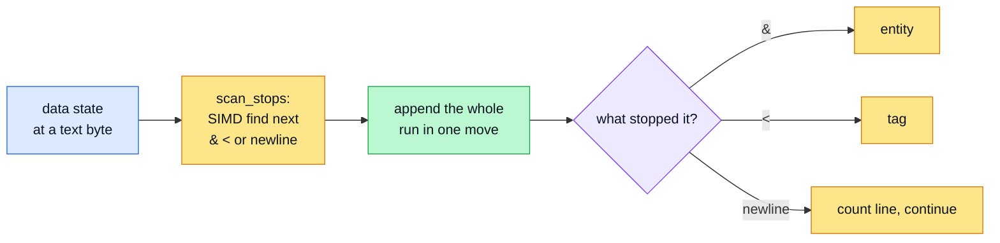
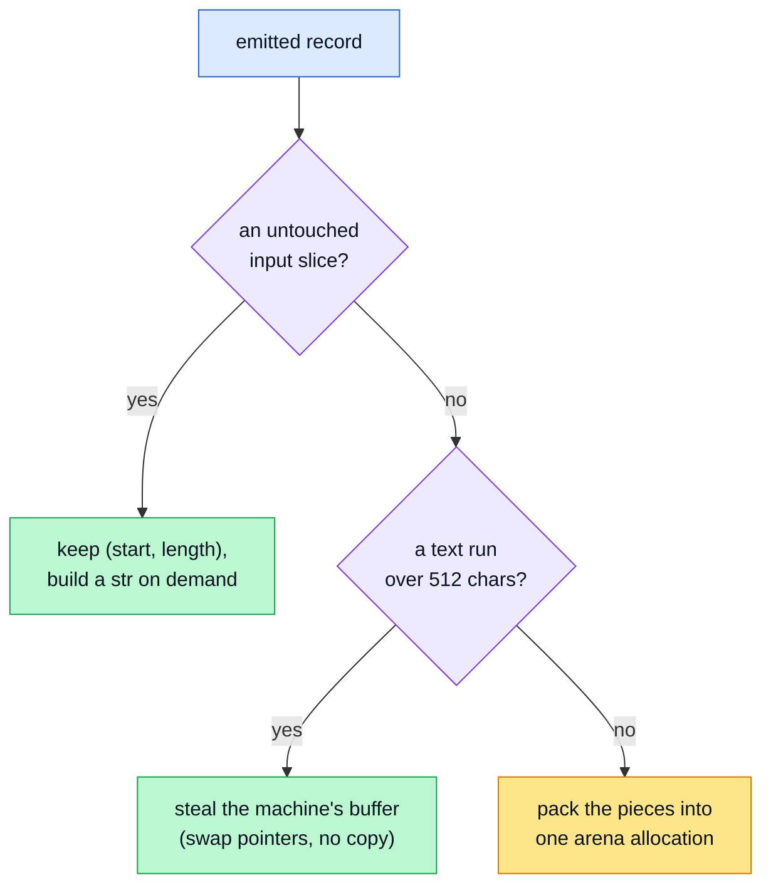
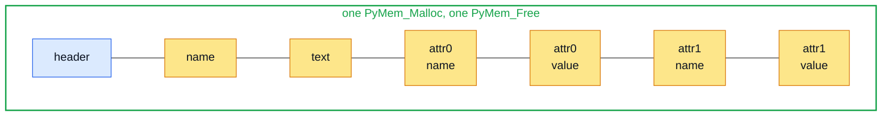
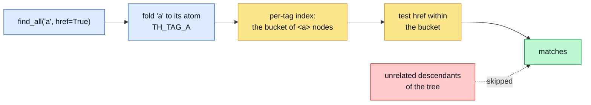
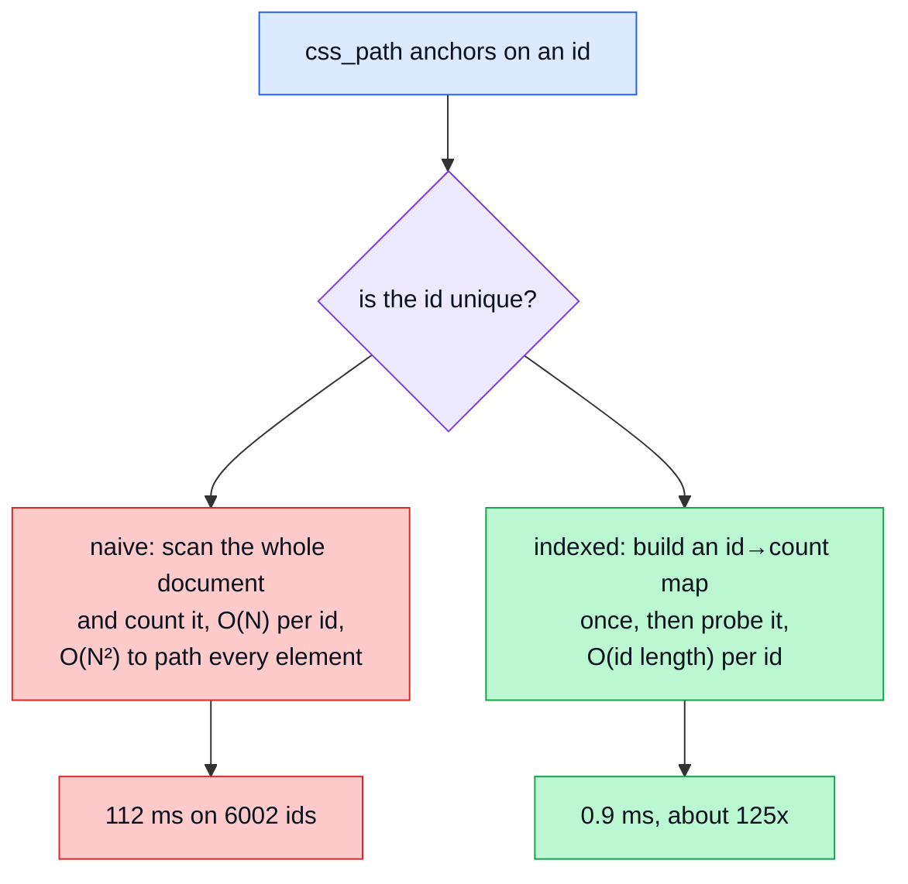
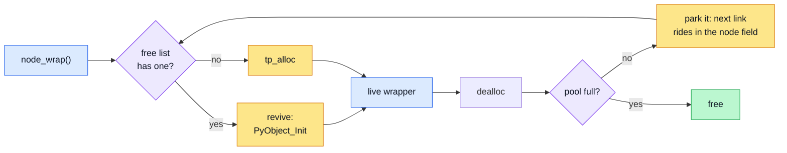
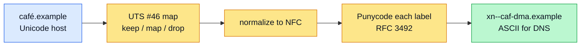
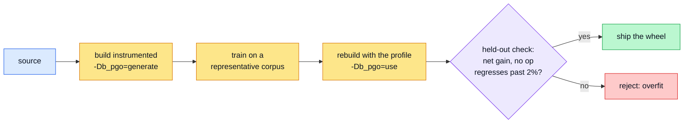
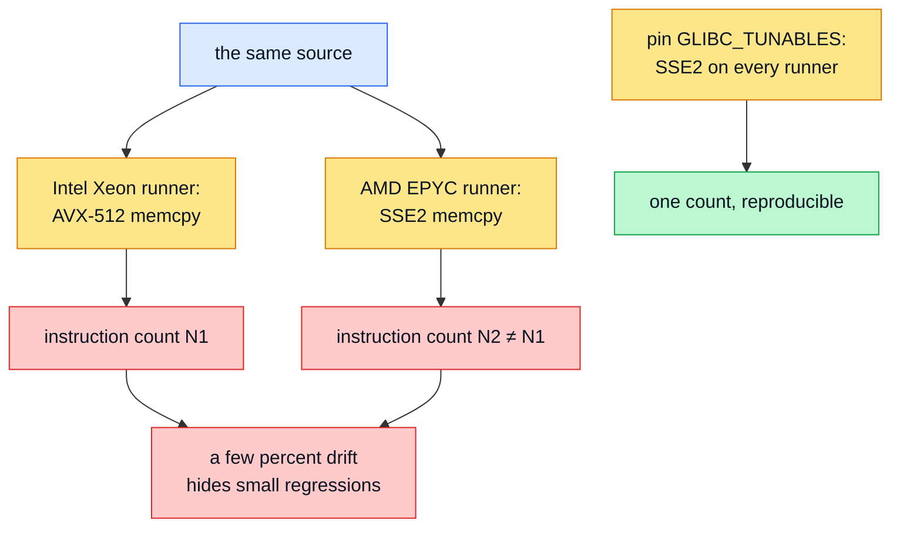
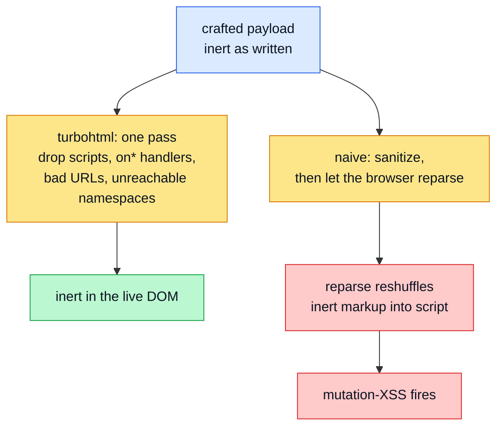

+++
author = "Bernat Gabor"
title = "How turbohtml makes Python HTML work 3-22x faster"
description = "C removes Python's loop overhead. turbohtml skips clean spans, allocates exact buffers, reuses indexes, and trains the compiler."
keywords = [ "html parser", "html toolkit", "python c extension", "simd", "swar", "zero-copy", "tokenizer", "idna", "punycode", "pgo", "lto", "free-threading", "benchmarking", "turbohtml", "lxml alternative", "beautifulsoup alternative"]
image = "splash.webp"
images = [ "splash.webp"]
topics = [ "python", "c", "performance", "simd", "html", "parser", "tokenizer", "unicode", "turbohtml", "idna", "pgo", "lto", "benchmarking"]
draft = false
slug = "blazing-fast-html-parser"
date = 2026-06-18T09:00:00Z
+++

Python's `html.escape` can scan one string five times. Moving those loops into C removes the interpreter from the hot
path, which explains part of a 22x result on prose. Most prose contains nothing to escape. turbohtml gets the rest of
the speedup by proving that sixteen bytes need no work, then moving past them in one step.

I began with a small accelerator for [`html.escape`](https://docs.python.org/3/library/html.html#html.escape) and
[`html.unescape`](https://docs.python.org/3/library/html.html#html.unescape). The Python implementation of `escape` runs
up to five `str.replace` passes. `unescape` runs a regular expression and calls back into Python for each match in the
2,231-entry HTML5 entity table. `html.parser.HTMLParser` calls `unescape` for each text run it encounters, so both
functions sit on hot paths. Interpreter dispatch explains the standard-library gap; its authors made reasonable choices
under different maintenance constraints.

I [opened an issue](https://github.com/python/cpython/issues/151024) and a
[pull request](https://github.com/python/cpython/pull/151025) to put a C accelerator behind the Python functions while
retaining the [PEP 399](https://peps.python.org/pep-0399/) fallback. CPython's core developers declined it. They did not
want to maintain a C extension with hand-written SIMD in the standard library while `HTMLParser` was under revision and
a future `xml.escape` might need the same accelerator. One maintainer
[recommended PyPI](https://github.com/python/cpython/issues/151024#issuecomment-4640666387), where that maintenance
tradeoff belonged to me.

The rejection stung because I had planned to contribute the accelerator to CPython; it changed more than the package
name. The core developers' reasoning held: code in the standard library must build across its platform range and remain
maintainable for decades. Hand-written vector paths create a permanent cost while `HTMLParser` and a possible shared
`xml.escape` design remain unsettled. PyPI moved that cost to the project choosing the speedup.

I got a better result than my original plan because I could pursue the same problem without asking CPython to own the
cost. I used the rejection to define the experiment. With the standard library's maintenance limits removed, how fast
could HTML-domain work become?

I took the experiment to PyPI, outside the standard library's portability constraint. Three functions grew into
[turbohtml](https://turbohtml.readthedocs.io/), a typed HTML toolkit over one C core. It matches `html.escape`,
`html.unescape`, and `html.parser` byte for byte. The toolkit builds trees, runs CSS and XPath queries, serializes
output, and sanitizes input. Its remaining APIs minify HTML, CSS, or JavaScript; extract metadata; and parse URLs. I
used one test for each addition: find work the toolkit can omit without changing its answer.

I widened the scope because applications call these functions in many places. Web rendering escapes each fragment.
Parsing unescapes each text run and tokenizes each document. Scrapers repeat those operations across page collections. A
process that makes millions of calls saves real time when each call performs less work. C removes the interpreter
dispatch per character; the larger gains require reducing the characters and allocations the native code touches.

I measured the initial gap with [pyperf](https://pyperf.readthedocs.io). These results compare turbohtml with the Python
3.14 standard library:

 operation | input | turbohtml | Python stdlib ; escape | prose, nothing to escape |
0.12 ms | 2.66 ms (22x) ; escape | real HTML (4 MiB) | 1.35 ms | 4.88 ms (3.6x) ; unescape | entity-heavy text | 10.4 ms
| 78.5 ms (7.6x) ; tokenize | typical markup | 30.3 µs | 449 µs (14.8x) ; tokenize | a 7.9 MB HTML spec source | 37.0 ms
| 399 ms (10.8x) 

Input and hardware affect the numbers. You can reproduce them with `tox -e bench` against the
[benchmark corpus](https://github.com/tox-dev/turbohtml/tree/main/tools) (Project Gutenberg's
[_War and Peace_](https://www.gutenberg.org/ebooks/2600), the [WHATWG](https://html.spec.whatwg.org/) and
[ECMAScript](https://tc39.es/ecma262/) specs) in the repo.



- [SWAR](#one-subtraction-checks-eight-bytes) tests eight bytes with a subtraction; [SIMD](#one-shuffle-checks-sixteen)
  tests sixteen with a shuffle.
- [One pass measures the output](#two-passes-beat-one), so the writing pass allocates once and copies clean spans in
  bulk.
- The tokenizer compiles [one state machine per string width](#one-machine-becomes-three) and returns
  [slices into the input](#text-can-move-zero-times).
- The toolkit [interns tag names](#a-tag-name-becomes-an-integer), [builds indexes once](#one-index-removes-an-n2-walk),
  and [recycles node wrappers](#a-free-list-removes-repeated-allocations).
- Host encoding needs [Punycode and Unicode normalization, backed by generated tables](#a-url-breaks-the-scanning-rule).
- [LTO and PGO](#a-file-split-cost-nine-percent) shape the machine code;
  [Callgrind counts instructions](#the-clock-is-too-noisy) in CI.
- The extension declares `Py_MOD_GIL_NOT_USED` because it has [no shared mutable state](#the-gil-cannot-be-the-lock).
- [Hostile input meets depth caps and linear attribute deduplication; checked buffer growth and fuzzers cover separate failure classes; DOMPurify's XSS corpus tests the sanitizer](#speed-meets-hostile-input).



_Anthropic's Opus 4.8 produced most of turbohtml over one month and close to 300 iterations. I reviewed the code and own
its correctness; [the development and verification process appears near the end](#the-code-needed-oracles)._

## The constraints behind the numbers

The standard library accepts a maintenance burden for decades and must build across its full platform range. turbohtml
accepts a different tradeoff. Speed can justify hand-written SIMD on PyPI because the project carries that cost outside
CPython.

Maintainability remains part of that choice. I split the C source by subsystem and use names and invariants that
document the implementation. Coverage gates run the Python and C paths under gcc and llvm-cov. PyPI changes who accepts
the maintenance cost while leaving future maintainers responsible for verification.

The hot path stays in C. The tokenizer and WHATWG tree builder share a
[bump-allocated arena](https://en.wikipedia.org/wiki/Region-based_memory_management) without Python objects. CSS and
XPath queries operate on the same storage, as do escaping and serialization. A thin, typed Python facade wraps the nodes
a caller touches, and annotations cover the full public API. The API gives each concept one name rather than cloning the
APIs it replaces; `turbohtml.migration` modules and guides translate code from
[BeautifulSoup](https://www.crummy.com/software/BeautifulSoup/), [lxml](https://lxml.de/),
[html5lib](https://github.com/html5lib/html5lib-python), [markupsafe](https://pypi.org/project/MarkupSafe/), and the
standard library.

I chose the typed facade to avoid carrying the replaced libraries' names and edge cases into the core. turbohtml defines
one representation and keeps compatibility knowledge in migration modules. Python objects appear for nodes the caller
requests, leaving tree construction and query traversal in the C arena.

Conformance remains a requirement. The tokenizer and tree builder follow the
[WHATWG HTML standard](https://html.spec.whatwg.org/multipage/parsing.html) state by state and run against the
html5lib-tests suite that browsers use. The specification controls its choices; where the text leaves a choice,
turbohtml follows a competitor. Both gcc and llvm-cov enforce 100% line and branch coverage for the C and Python code
before a change lands.

The extension holds no shared mutable state. A per-tree
[critical section](https://en.wikipedia.org/wiki/Critical_section) protects each edit and read. Before a Python
callback, turbohtml snapshots the arena so a concurrent mutation cannot tear the walk. The same structure supports
free-threaded Python. The core depends on no native library such as libxml2 or lxml; it includes an incremental codec
and uses the standard library for solved work such as
[regular-expression matching](https://docs.python.org/3/library/re.html).

I keep native HTML-domain state in the C core and use Python's standard library for solved general-purpose operations.
Avoiding libxml2 or lxml keeps ownership of the tree layout and free-threading model inside turbohtml, where the
optimizations depend on them.

I reject an optimization when measurements regress. pyperf compares turbohtml with native implementations in C and Rust,
plus tools written in Go. The design borrows the [lexbor](https://github.com/lexbor/lexbor) and
[html5ever](https://github.com/servo/html5ever) arena layout, html5ever's bulk text scan, and the Rust
[linkify](https://github.com/robinst/linkify) scanner. Other techniques come from CPython,
[simdjson](https://github.com/simdjson/simdjson), and Sean Anderson's collection of
[bit tricks](https://graphics.stanford.edu/~seander/bithacks.html).

The mechanisms below assume familiarity with C and basic CPU operations.

You can apply them beyond HTML by identifying expensive work that a program can prove unnecessary.

The smallest function exposes the governing idea. `escape` must find five special characters. Its first design choice
sets the number of bytes examined by one test.

## Sixteen bytes should not require sixteen questions

`escape` replaces five characters (`&`, `<`, `>`, `"`, `'`) with entity forms. A direct implementation asks one question
per character:

```c
for each character:
    if it is special, append the replacement
    else, append the character
```

The loop pays one branch for each character, including the thousands that need no replacement. A wider test asks whether
a block contains one of the five special bytes. A clean block can move as one unit.

The prediction changes on ordinary prose. A character loop performs almost the same control work whether it finds five
specials or none. A block test makes those cases diverge. Clean input clears eight or sixteen bytes with one
classification; dirty input yields the positions that need rewriting. The 22x row comes from making the common answer,
"none here," cheap.

### One subtraction checks eight bytes

[SWAR](https://en.wikipedia.org/wiki/SWAR), short for "SIMD within a register," needs a 64-bit integer rather than a
vector instruction. It treats the integer as eight byte lanes and applies normal arithmetic to the group.

The block test begins with Sean Anderson's test for a zero byte:
[Sean Anderson's bit-twiddling collection](https://graphics.stanford.edu/~seander/bithacks.html):

```c
#define ONES  0x0101010101010101ULL  // low bit set in each byte lane
#define HIGHS 0x8080808080808080ULL  // high bit set in each byte lane

uint64_t has_zero(uint64_t word) {
    return (word - ONES) & ~word & HIGHS;
}
```

The expression returns a nonzero value when a lane contains zero. Subtracting `ONES` takes one from each lane. A `0x00`
lane borrows and wraps to `0xFF`, setting its high bit. `& ~word` retains that bit where the input had its high bit
clear, which rejects a false match from a value such as `0x80`. `& HIGHS` discards the remaining bits.

An XOR turns that zero test into a search for any byte. Multiplying the target by `ONES` broadcasts it across the eight
lanes. XOR makes each matching lane zero, and `has_zero` detects the matches:

```c
static inline uint64_t swar_hasbyte(uint64_t word, uint8_t byte) {
    uint64_t lanes = word ^ (ONES * byte);
    return (lanes - ONES) & ~lanes & HIGHS;
}
```

OR five results to search for all five special bytes. A zero result clears the eight-byte block without a per-character
branch.

The widget runs the same 64-bit arithmetic as the C code. Change the text or target and watch XOR turn each match into
`0x00` before the zero-byte expression marks its lane:



The portable path uses this SWAR test. `glibc` applies the same idea inside
[`strlen`](https://en.cppreference.com/w/c/string/byte/strlen) and `memchr` when vector instructions are unavailable.
Vector registers double the block size.

### One shuffle checks sixteen

Current x86 and ARM CPUs provide 128-bit vector registers with sixteen byte lanes. Their
[SIMD](https://en.wikipedia.org/wiki/Single_instruction,_multiple_data) instructions operate on those lanes as a group.
turbohtml uses [SSE2](https://en.wikipedia.org/wiki/SSE2) on x86 and
[NEON](<https://en.wikipedia.org/wiki/ARM_architecture_family#Advanced_SIMD_(Neon)>) on ARM, including Apple Silicon.
Other targets use SWAR.

The x86 path compares all sixteen bytes with each target and ORs the results:

```c
__m128i bytes = _mm_loadu_si128((const __m128i *)block);
__m128i hits  = _mm_cmpeq_epi8(bytes, _mm_set1_epi8('&'));
hits = _mm_or_si128(hits, _mm_cmpeq_epi8(bytes, _mm_set1_epi8('<')));
hits = _mm_or_si128(hits, _mm_cmpeq_epi8(bytes, _mm_set1_epi8('>')));
// ... '"' and '\'' when quoting
```

Each [`_mm_cmpeq_epi8`](https://www.felixcloutier.com/x86/pcmpeqb:pcmpeqw:pcmpeqd) writes `0xFF` to a matching lane and
`0x00` to the rest. The OR leaves `0xFF` wherever the block contains a special byte. The `_mm_*` functions are SSE2 or
SSSE3 _intrinsics_; the compiler maps each one to a CPU instruction. The
[Intel Intrinsics Guide](https://www.intel.com/content/www/us/en/docs/intrinsics-guide/index.html) documents them. ARM
provides the corresponding `v*` functions in its
[NEON intrinsics reference](https://arm-software.github.io/acle/neon_intrinsics/advsimd.html).

An intrinsic names a CPU operation while the compiler assigns registers and schedules instructions. It avoids
hand-written assembly for each compiler and calling convention. The source states the lane-level algorithm, and the
generated code retains one comparison across sixteen bytes.

The ARM path borrows a table-shuffle method from [pulldown-cmark](https://github.com/pulldown-cmark/pulldown-cmark) and
[simdjson](https://arxiv.org/abs/1902.08318). The five bytes have distinct low nibbles. A quote (`"`) maps to `0x22`, an
ampersand (`&`) to `0x26`, an apostrophe (`'`) to `0x27`, a less-than sign (`<`) to `0x3C`, and a greater-than sign
(`>`) to `0x3E`. A sixteen-entry table places each special byte at the index named by its low nibble.
[`vqtbl1q_u8`](https://arm-software.github.io/acle/neon_intrinsics/advsimd.html) performs sixteen table lookups in one
shuffle. Comparing the lookup results with the input identifies the special bytes:

```c
static const uint8_t NIBBLE_SPECIALS[16] =
    {0x7F, 0, '"', 0, 0, 0, '&', '\'', 0, 0, 0, 0, '<', 0, '>', 0};
//   ^idx0 holds 0x7F to reject a byte such as 0x10, whose low nibble is 0
```

One table lookup and one comparison classify the block. The source calls this the
[PSHUFB](https://www.felixcloutier.com/x86/pshufb) trick after the x86 instruction that introduced it.
[Geoff Langdale](https://branchfree.org/) and [Daniel Lemire](https://lemire.me/blog/) use the same nibble table to
classify UTF-8 [in less than one instruction per byte](https://arxiv.org/abs/2010.03090).

### The mask points to each match

The writing pass needs the position of each match. The vector comparison produces sixteen lanes, so x86 packs their high
bits into one integer with [`_mm_movemask_epi8`](https://www.felixcloutier.com/x86/pmovmskb).

ARM lacks a matching instruction. The workaround comes from
[Danila Kutenin](https://developer.arm.com/community/arm-community-blogs/b/servers-and-cloud-computing-blog/posts/porting-x86-vector-bitmask-optimizations-to-arm-neon):
treat the result as eight 16-bit lanes, shift each lane right by four, and narrow the lanes to bytes. The resulting
64-bit integer holds one nibble per input byte. Matches become `0xF`; other lanes become zero. ARM spends two
instructions where x86 spends one.

This difference prevents a direct port of the x86 loop. Retesting each lane on ARM would discard the benefit of vector
classification. Packing one nibble per input byte preserves enough position information for trailing-zero count to find
matches, even though ARM cannot produce the x86 one-bit mask.

Two bit operations walk the integer mask. `__builtin_ctzll(mask)`
[counts trailing zeros](https://en.wikipedia.org/wiki/Find_first_set), which locates the lowest set bit.
`mask & (mask - 1)` removes that bit. Repeating those operations visits the special bytes in order and skips the gaps:

```c
do {
    Py_ssize_t index = SPECIAL_INDEX(mask);
    memcpy(out, in + prev, index - prev);
    out += write_escaped(out, in[index]);
    mask = SPECIAL_CLEAR(mask, index);
    prev = index + 1;
} while (mask != 0);
```

One [`memcpy`](https://en.cppreference.com/w/c/string/byte/memcpy) moves each clean gap. The loop rewrites the special
bytes. A clean block bypasses the loop and copies all sixteen bytes.

The widget groups input into SWAR or SIMD blocks, shows the resulting mask, and tracks the output size that the counting
pass will need:



## Two passes beat one

A one-pass writer appears to do half the scanning. It pays elsewhere. A buffer that grows during the write must check
its capacity for each append and copy prior output whenever it doubles.

The relevant comparison is total memory work rather than pass count. Two linear reads can cost less than one read mixed
with capacity branches and reallocations, plus copies of prior output. The measurement pass touches input through the
block classifier and writes the count used for an exact allocation.

turbohtml scans twice. The first pass adds the growth from each replacement (`&amp;` adds four characters over `&`,
`&lt;` adds three) and computes the final length. The second pass allocates that length once and writes each output byte
once. The block scan keeps the measurement pass cheap because it performs no writes.

The counting path converts comparisons into numbers rather than branching on each byte. A comparison produces `0xFF` in
each matching lane. ANDing that result with the replacement growth leaves the growth in matching lanes and zero in the
rest. One instruction sums the sixteen lanes:

This conversion avoids a branch-prediction cost. A branch attached to rare specials can be cheap on clean text and
expensive where entity density changes. The vector comparison contains the answer as lane bits. Turning those bits into
growth values gives the total without asking the predictor to guess sixteen outcomes.

```c
// each match becomes 0xFF; AND with the growth turns it into 4, 3, or 5
__m128i extras = _mm_and_si128(_mm_cmpeq_epi8(bytes, _mm_set1_epi8('&')), _mm_set1_epi8(4));
extras = _mm_add_epi8(extras, _mm_and_si128(_mm_cmpeq_epi8(bytes, _mm_set1_epi8('<')), _mm_set1_epi8(3)));
// ... '>' adds 3, '"' and '\'' add 5
__m128i sums = _mm_sad_epu8(extras, _mm_setzero_si128());  // sum all 16 lanes at once
```

[`_mm_sad_epu8`](https://www.felixcloutier.com/x86/psadbw) adds the sixteen x86 lanes. On ARM, a second nibble table
maps each special byte to its growth and [`vaddvq_u8`](https://arm-software.github.io/acle/neon_intrinsics/advsimd.html)
performs the horizontal sum. A clean block costs a few instructions without a branch.

A zero measurement means the input needs no replacement:

```c
if (extra == 0) {
    return PyUnicode_FromObject(text);
}
```

That branch produces the 22x result for prose. The standard library constructs a new string while turbohtml clears
sixteen bytes per step and returns the input object.

The sizing pass uses CPython's flexible string representation. CPython allocates a `str` for a known length and maximum
character value through
[`PyUnicode_New(length, maxchar)`](https://docs.python.org/3/c-api/unicode.html#c.PyUnicode_New), part of CPython's
public Unicode C API alongside the
[`PyUnicode_1BYTE_KIND`](https://docs.python.org/3/c-api/unicode.html#c.PyUnicode_1BYTE_KIND),
[`PyUnicode_DATA`](https://docs.python.org/3/c-api/unicode.html#c.PyUnicode_DATA), and
[`PyUnicode_FindChar`](https://docs.python.org/3/c-api/unicode.html#c.PyUnicode_FindChar), which later snippets use. The
first pass supplies both allocation inputs, so the second pass writes into an exact buffer without reallocating. The
`maxchar` value determines the width of each stored character.

## The same scan runs backward

`unescape` reverses the transformation. It searches for `&`, copies the span before it, and resolves the entity. The
distance to the next `&` determines the best search method.

turbohtml probes the next sixteen bytes inline. If that probe finds no ampersand, `memchr` searches the remaining span:

```c
// in reference-dense text the next '&' is a handful of characters away,
// an inline probe avoids memchr's call cost on short spans
Py_ssize_t probe_end = from + 16 < length ? from + 16 : length;
for (Py_ssize_t pos = from; pos < probe_end; pos++) {
    if (input[pos] == '&') return pos;
}
const uint8_t *hit = memchr(input + probe_end, '&', length - probe_end);
```

C libraries vectorize [`memchr`](https://en.cppreference.com/w/c/string/byte/memchr), so it moves across a long clean
span at memory speed. One `memcpy` copies the text between two entities; no per-character loop inspects that text.

Numeric entities such as `&#127881;` require digit parsing. A named entity such as `&amp;` requires a lookup among about
2,000 names. A [binary search](https://en.wikipedia.org/wiki/Binary_search) over the sorted table takes about eleven
comparisons. Real documents concentrate on a few names, so turbohtml tests those names before starting the search:

The inline probe and the entity fast paths make the same distance bet at two levels. Dense references put the next `&`
close enough that a `memchr` call costs more than a short loop. Common names such as `amp`, `lt`, and `quot` make a full
binary search unnecessary. Long clean spans and uncommon names fall through to the general algorithms.

```c
switch (name[0]) {
case 'a':
    if (len == 4 && memcmp(name, "amp;", 4) == 0) return &entities[INDEX_AMP];
    if (len == 5 && memcmp(name, "apos;", 5) == 0) return &entities[INDEX_APOS];
    break;
case 'g':
    if (len == 3 && memcmp(name, "gt;", 3) == 0) return &entities[INDEX_GT];
    // lt, quot ...
}
// fall through to the ~11-step binary search
```

HTML's longest-prefix rule allows a reference without a trailing semicolon. The matcher tests the full candidate, then
removes characters from the end until a table entry matches. `&notit;` becomes `¬it;` because `not` is the longest
entity prefix and `it;` remains text. The widget shows that process against a small sorted sample of about 2,000
entries:



An entity can produce a character wider than the input, as `&#127881;` does inside ASCII text. The output begins with
one byte per character so clean spans use `memcpy`. turbohtml widens the written prefix in place for an entity value
above `0xFF`. It walks backward to avoid overwriting unread bytes, then retains the wider storage. Inputs that stay
narrow avoid that conversion.

`PyUnicode_New` needs the largest output character to choose the storage width. Tracking the exact maximum would add a
comparison for each character. turbohtml ORs emitted characters into `seen`. CPython places strings in width bins at
`0x7F`, `0xFF`, and `0xFFFF`. A bitwise OR cannot cross one of those boundaries unless an emitted character crosses it,
so `seen` selects the same bin as the true maximum with one branchless operation:

```c
seen |= character;   // the OR crosses a width bin when a character does
// ...
PyUnicode_New(count, seen > 0xFFFF ? 0x10FFFF : seen);
```

The tokenizer applies the same narrow-storage decision to a larger problem.

## The specification appears to demand one step per character

Tokenization converts HTML into start tags, text runs, end tags, and comments. The
[WHATWG HTML specification](https://html.spec.whatwg.org/multipage/parsing.html#tokenization) defines about eighty
states. The machine begins in `data`; `<` moves it to `tag open`, and a letter moves it to `tag name`.

Python's `html.parser` approximates this process with regular expressions. It handles tidy input but differs from
browsers on malformed markup. Regular expressions lack the parser context needed for cases such as `<script>`, where
`<b>` is text rather than a tag. turbohtml implements the specification's state machine and checks it against
[html5lib-tests](https://github.com/html5lib/html5lib-tests), the conformance suite used by browser engines. The speed
work must preserve those answers.

The dispatch loop uses a `switch` inside `for (;;)`:

```c
for (;;) {
    Py_UCS4 ch = read(self->pos);
    switch (self->state) {
    case ST_DATA:        /* ... */ continue;
    case ST_TAG_OPEN:    /* ... */ continue;
    case ST_TAG_NAME:    /* ... */ continue;
    // ~75 more
    }
}
```

The dense state enum lets the compiler build a [jump table](https://en.wikipedia.org/wiki/Branch_table), producing one
indirect jump per state transition. A transition stores the next state and continues. The function returns without
changing `self->state` at the end of a streaming input; the next call resumes at the same point.

The widget exposes the state transitions. Step through the input and watch the cursor, active state, and emitted tokens.
It models tag and attribute states and simplifies character references:



### One machine becomes three

[PEP 393](https://peps.python.org/pep-0393/) stores a CPython string at the narrowest fixed width that holds its largest
character. Latin-1 values through `U+00FF` use one byte, the rest of the basic multilingual plane through `U+FFFF` use
two, and astral values through `U+10FFFF` use four. The widget shows the width change when an accent or emoji raises the
largest value:



ASCII documents use one byte per character. One-byte strings and ordinary text runs account for most HTML traffic. The
string width controls the stride for each indexed read. Branching on that width inside the tokenizer would add a
decision to each state-machine step.

CPython's `stringlib` avoids that branch by writing an algorithm against an abstract character type and including the
source three times with different type definitions. turbohtml stamps `tokenizer_sm_run.inc` in the same way:

```c
#define TH_CHAR  Py_UCS1                 // 1-byte build
#define TH_READ(i) ((Py_UCS4)((const TH_CHAR *)self->input.data)[(i)])
#include "tokenizer_sm_run.inc"
#undef  TH_CHAR
// ... again with Py_UCS2, again with Py_UCS4
```

Each copy gives `TH_CHAR` a concrete type, so `TH_READ` compiles to one indexed load with a fixed stride. The caller
selects a machine once before entering the loop:

```c
if (kind == PyUnicode_1BYTE_KIND) return run_ucs1(self);
if (kind == PyUnicode_2BYTE_KIND) return run_ucs2(self);
return run_ucs4(self);
```

One source file now produces three machines. The one-byte version that handles ASCII performs byte arithmetic and gives
the compiler room to vectorize.

### Plain text bypasses the state machine

A literal implementation dispatches once per character, even through paragraphs where each byte extends the same text
token. That work adds a `switch`, comparisons, and bookkeeping to bytes that require no decision.

[html5ever](https://github.com/servo/html5ever), Servo's HTML parser, scans from ordinary text to the next character
that can change state. turbohtml adopts the same approach. `&` starts an entity, `<` starts a tag, and `\n` updates line
tracking. The data state moves the span before the next stop as one run:

```c
if (ch != '&' && ch != '<' && ch != '\n') {
    Py_ssize_t stop = scan_stops(self, self->pos + 1, '&', '<', '\n');
    text_append_run(self, stop);   // move the whole run at once
    continue;
}
```

`scan_stops` reuses the escape scanner with a different target set. ARM and x86 search sixteen bytes per step; the
portable path searches eight.


```mermaid
flowchart LR
    D["data state<br/>at a text byte"] --> SC["scan_stops:<br/>SIMD find next<br/>& < or newline"]
    SC --> RUN["append the whole<br/>run in one move"]
    RUN --> STOP{"what stopped it?"}
    STOP -->|"&"| REF["entity"]
    STOP -->|"<"| TAG["tag"]
    STOP -->|"newline"| NL["count line, continue"]

    classDef data fill:#dbeafe,stroke:#2563eb,color:#0b1220;
    classDef proc fill:#fde68a,stroke:#d97706,color:#0b1220;
    classDef dec fill:#ede9fe,stroke:#7c3aed,color:#0b1220;
    classDef good fill:#bbf7d0,stroke:#16a34a,color:#0b1220;
    class D data
    class SC,REF,TAG,NL proc
    class STOP dec
    class RUN good
```

Text-heavy documents approach `memcpy` speed because the state machine wakes at a tag, entity, or newline rather than at
each character.

### Text can move zero times

Scanning a text run does not require copying it. turbohtml records an unchanged run as a start index and length into the
input string:

```c
if (ch == input[self->pos] &&
    self->pos == self->slice_start + self->slice_len) {
    self->slice_len++;
    return;
}
```

An entity, normalized `\r\n`, or stray `<` can force a copy. Unchanged text remains a slice until the caller requests
`.data`, when one substring constructs the Python `str`.

The specification requires newline normalization, converting `\r\n` and lone `\r` to `\n`. Streaming `feed` uses
`memchr` to find each carriage return and appends the preceding span as one unit. A one-shot document without `\r` needs
no normalization, so turbohtml borrows its storage:

```c
if (PyUnicode_FindChar(arg, '\r', 0, length, 1) == -1) {
    th_tok_borrow_input(sm, kind, PyUnicode_DATA(arg), length);
}
```

A clean ASCII paragraph now follows a zero-copy path. turbohtml borrows the input, records the text run as two integers,
and carries those integers in the token. Requesting `.data` causes one substring allocation; ignoring `.data` moves no
text.

### Python values wait for the caller

The state machine emits a C record and reuses its record storage for the next token. A thin `Token` wrapper copies the
record without constructing its Python-visible fields. `token.type` returns one of five cached `TokenType` members with
a reference increment. `token.tag` and `token.attrs` build a string or list when requested. A caller that counts start
tags constructs no attribute strings. `token.attr("href")` scans the C attribute array in place and returns the named
value without creating a dictionary.

The enum values enter module state during initialization, so reading `token.type` needs one reference increment rather
than a lookup or allocation. Tag and attribute data stay in the C record until their properties run. A consumer that
inspects token types while ignoring payloads avoids Python work for fields the API exposes but the caller does not read.

A record that owns bytes follows one of three storage paths:


```mermaid
flowchart TD
    R["emitted record"] --> Q1{"an untouched<br/>input slice?"}
    Q1 -->|yes| S["keep (start, length),<br/>build a str on demand"]
    Q1 -->|no| Q2{"a text run<br/>over 512 chars?"}
    Q2 -->|yes| M["steal the machine's buffer<br/>(swap pointers, no copy)"]
    Q2 -->|no| A["pack the pieces into<br/>one arena allocation"]

    classDef data fill:#dbeafe,stroke:#2563eb,color:#0b1220;
    classDef dec fill:#ede9fe,stroke:#7c3aed,color:#0b1220;
    classDef good fill:#bbf7d0,stroke:#16a34a,color:#0b1220;
    classDef proc fill:#fde68a,stroke:#d97706,color:#0b1220;
    class R data
    class Q1,Q2 dec
    class S,M good
    class A proc
```

An untouched input slice retains its indices. A large modified text run above 512 characters takes ownership of the
machine's buffer by swapping pointers; the machine allocates a fresh buffer for the next run. Tags and short tokens use
an arena.

### One arena replaces a dozen allocations

A tag with five attributes can require about twelve variable-length pieces: the tag name, each attribute name and value,
plus possible comment or doctype identifiers. Allocating each piece would require about twelve `malloc` calls and twelve
matching `free` calls. Each allocation updates allocator metadata and takes a lock on a free-threaded build. Scattered
blocks hurt cache locality.

The allocator cost continues after parsing. Releasing the token must find and free each piece, while an error during
construction needs cleanup for the pieces allocated before the error. Separate blocks turn later reads into pointer
chases across the heap. One arena combines the allocation and cleanup rules. Its contiguous layout addresses locality
before the copy begins.

turbohtml places the record and its variable data in one arena. A sizing pass totals the bytes and inserts alignment
padding for UCS-2 or UCS-4 data. One `malloc` creates the block, and a cursor assigns each piece during the writing
pass:

```c
// pass 1: total the sizes, with alignment padding between pieces
size_t total = sizeof(Token);
total += padded(name.len) + padded(text.len);
for (each attribute a) total += padded(a.name.len) + padded(a.value.len);

// one allocation for the whole token
char *arena  = PyMem_Malloc(total);
char *cursor = arena + sizeof(Token);

// pass 2: bump the cursor, point each field into the block
name_ptr = cursor;  memcpy(cursor, name.data, name.len);  cursor += padded(name.len);
text_ptr = cursor;  memcpy(cursor, text.data, text.len);  cursor += padded(text.len);
// ... repeat for the attribute names and values
```

The header and text occupy one contiguous block with the tag name and attributes:


```mermaid
flowchart LR
    subgraph A["one PyMem_Malloc, one PyMem_Free"]
      direction LR
      H["header"] --- NM["name"] --- TX["text"] --- A0N["attr0<br/>name"] --- A0V["attr0<br/>value"] --- A1N["attr1<br/>name"] --- A1V["attr1<br/>value"]
    end

    classDef data fill:#dbeafe,stroke:#2563eb,color:#0b1220;
    classDef proc fill:#fde68a,stroke:#d97706,color:#0b1220;
    class H data
    class NM,TX,A0N,A0V,A1N,A1V proc
    style A fill:none,stroke:#16a34a,stroke-width:2px,color:#16a34a
```

Each token now needs one `malloc` and one `free`, independent of its attribute count. The adjacent data improves cache
locality, and releasing the base pointer cannot leak an individual field.

The sizing pass includes alignment padding because UCS-2 and UCS-4 pointers require suitable addresses. The writing
cursor assigns each field inside the proven total. A failure can occur before the arena exists; after allocation, the
token owns one base pointer. Attribute count changes block size without changing the number of allocator calls.

### The hot loop pays setup costs once

The tokenizer retains growable tag-name and text buffers between tokens. It resets their lengths and keeps the storage;
when a buffer fills, doubling preserves amortized constant-time appends. Tokens hold no Python references, so CPython's
[garbage collector](https://github.com/python/cpython/blob/main/InternalDocs/garbage_collector.md) does not track or
traverse them.

Line and column counters update without a branch. The newline comparison produces `0` or `1`, which increments the line
and controls the column reset. The tokenizer lowercases tag names during input, so raw-text checks use
[`memcmp`](https://en.cppreference.com/w/c/string/byte/memcmp) against literals whose lengths the compiler knows. An
end-tag check compares length and width before one `memcmp`; it does not loop over characters.

A failed allocation sets a sticky `oom` flag that the machine checks once per token. Duplicate attributes wait until a
caller reads `token.attrs`; the specification keeps the first occurrence, and typical tags contain few enough attributes
for that scan. The pending-token queue uses two fixed slots because the machine emits at most a closing text run
followed by the tag that ended it, so it needs no dynamic queue.

The steady token stream avoids allocation and garbage-collector work, with fewer branches.

## Three functions establish one rule

The three entry points combine four decisions. SWAR checks eight bytes per subtraction, while SIMD checks sixteen per
shuffle. A scan jumps to the next special byte and sends the intervening span to `memcpy`. Text retains its native width
and moves as few times as its output permits. Width selection, output sizing, and machine selection occur outside the
character loop.

An ASCII page can borrow its input and scan a 16-byte block per step. Text tokens remain offsets until a caller requests
a `str`, so clean text reaches that caller with no intermediate copy.

## Three functions become a toolkit

Escape and unescape joined tokenization as the base of a tree builder, query engines for CSS and XPath, a serializer,
and a sanitizer. The toolkit includes minifiers for HTML and CSS, plus JavaScript. Metadata extraction and a URL parser
complete the surface. One optimization cannot explain performance across work with such different costs.

The table compares one representative input per operation. The green column is turbohtml. Each parenthetical gives the
competitor's time divided by turbohtml's time; values above one are slower. The
[migration guides](https://turbohtml.readthedocs.io/migration/index.html) contain the full operation and competitor set.

 operation | input | turbohtml | a fast peer | a popular peer ; parse | 92 kB page |
272 µs | resiliparse 282 µs (1.0x) | BeautifulSoup 15.3 ms (56x) ; query (CSS select) | 95 kB page | 1.3 µs | lxml 20.8
µs (16x) | BeautifulSoup 99.9 µs (77x) ; tokenize | typical markup | 34.9 µs | html.parser 435 µs (12x) | html5lib 836
µs (24x) ; escape | dense 4 MiB | 4.98 ms | html.escape 12.7 ms (2.6x) | n/a ; unescape | dense refs (4 KiB) | 8.1 µs |
html.unescape 69.3 µs (8.6x) | w3lib 116 µs (14x) ; minify HTML | 95 kB page | 331 µs | minify-html 859 µs (2.6x) |
htmlmin 6.77 ms (20x) ; minify CSS | bootstrap 274 kB | 229 kB in 1.65 ms | rcssmin 233 kB in 625 µs (0.4x) |
lightningcss 229 kB in 4.82 ms (2.9x) ; minify JS | jquery 279 kB | 88 kB in 9.73 ms | rjsmin 141 kB in 335 µs (0.0x) |
terser 87 kB in 122 ms (12x) ; sanitize | 4 KiB post | 42.1 µs | nh3 120 µs (2.9x) | bleach 1.92 ms (46x)



The minifier rows include time and output size because either measure alone hides a cost. The regex minifiers
[`rcssmin`](https://pypi.org/project/rcssmin/) and [`rjsmin`](https://pypi.org/project/rjsmin/) finish soonest and
produce larger files. [lightningcss](https://lightningcss.dev/) and [terser](https://github.com/terser/terser) reach
turbohtml's compression with longer runtimes. [resiliparse](https://github.com/chatnoir-eu/chatnoir-resiliparse) matches
turbohtml on parsing with another hand-written C parser. Across these measurements, a typed, conformant API retains
native-code speed.

That interpretation matters more than declaring a winner. A regex minifier can win the timing row by declining parser
work, and the larger output records the consequence. A full parser can match the output size while spending more time on
its representation. Parsing shows another boundary: two hand-written C implementations can converge on the same time
even when the Python APIs around them differ. Compare the work each program performs before attributing a result to its
implementation language.

### A tag name becomes an integer

Comparisons with names such as `<script>`, `</p>`, or `div.note` appear to require a byte walk. The tokenizer removes
that work before the tree exists. Each HTML tag and attribute name receives a small integer called an _atom_. The
tokenizer lowercases names and stores the lookup result in the tree. Tree construction uses that atom to decide whether
an end tag closes an open `<p>`. Matching `<div>` becomes `node->atom == TH_TAG_DIV`. Names outside the table share
`TH_TAG_UNKNOWN` and use a byte comparison.

The distinction changes what the CPU reads. A string comparison loads bytes until it finds a mismatch or reaches the
end. An atom comparison reads the integer stored beside the node. Known HTML names take that path throughout tree
construction and querying. Unknown names need the byte fallback because they share one atom, but custom elements and
foreign names occur too seldom to set the common cost.

The tree groups nodes in [pre-order](https://en.wikipedia.org/wiki/Tree_traversal) buckets by tag. `find_all("a")`
visits the `a` bucket. Adding `attrs={"href": True}` applies the attribute test to those candidates:

```c
static int tag_plain_matches(const query_t *query, th_node *node) {
    if (query->tag_atom != TH_TAG_UNKNOWN) {
        return node->atom == query->tag_atom;   // a known tag: one integer compare
    }
    // known atoms cannot represent an unknown name
    return node->atom == TH_TAG_UNKNOWN ? tag_matches_by_name(query, node) : 0;
}
```


```mermaid
flowchart LR
    Q["find_all('a', href=True)"] --> A["fold 'a' to its atom<br/>TH_TAG_A"]
    A --> B["per-tag index:<br/>the bucket of &lt;a&gt; nodes"]
    B --> F["test href within<br/>the bucket"]
    F --> R["matches"]
    T["unrelated descendants<br/>of the tree"] -. skipped .-> R
    classDef data fill:#dbeafe,stroke:#2563eb,color:#0b1220;
    classDef proc fill:#fde68a,stroke:#d97706,color:#0b1220;
    classDef good fill:#bbf7d0,stroke:#16a34a,color:#0b1220;
    classDef bad fill:#fecaca,stroke:#dc2626,color:#0b1220;
    class Q,A data
    class B,F proc
    class R good
    class T bad
```

The bucket supplies the large gain because unrelated descendants do not become candidates. Over the WHATWG
specification, `find_all("a", attrs={"href": True})` takes 4.4 microseconds, down from 33.5. On the same document,
`find_all("meta", attrs={"name": "viewport"})` takes 0.17 microseconds, down from 29.2. The CSS engine matches selectors
from right to left, so `section > p` anchors on each `p` and tests its parent with `parent->atom == TH_TAG_SECTION`
before running the compound matcher. This change cuts selector work by 11 to 19 percent across the corpus. Browsers call
this representation an [interned name](https://en.wikipedia.org/wiki/String_interning), an atom, or a quark. Its purpose
is identical: compare integer identities after touching the name bytes once.

The atom and the bucket remove different work. Atom identity lowers the cost of testing one candidate. The bucket lowers
the number of candidates. Rare tags expose the second effect because their buckets bypass almost the whole document.
Common tags leave more nodes to inspect; each node receives the integer test. CSS selectors reuse both gains when a type
selector appears in the rightmost compound or on the parent side of a combinator.



### One index removes an O(N²) walk

`element.css_path()` returns a selector that locates an element from the document root, such as
`#main > p:nth-of-type(3)` from browser developer tools. An id provides a short anchor when it occurs once. The first
implementation established uniqueness by scanning the document for each candidate. Each candidate cost O(N), and pathing
the document cost O(N²). A document with six thousand ids required 112 milliseconds.

The first `css_path()` call now creates and caches an
[open-addressed hash table](https://en.wikipedia.org/wiki/Open_addressing) that maps each id to its occurrence count.
Uniqueness becomes a probe over the id characters:

```c
static uint64_t path_id_hash(const Py_UCS4 *value, Py_ssize_t len, int ci) {
    uint64_t hash = 14695981039346656037u;          // FNV-1a
    for (Py_ssize_t i = 0; i < len; i++) {
        hash ^= (uint64_t)sel_fold(value[i], ci);   // fold case in quirks mode, as the id selector does
        hash *= 1099511628211u;
    }
    return hash;
}

// unique means the map count for this id is one
static int path_id_unique(const path_id_map *map, const Py_UCS4 *value, Py_ssize_t len) {
    size_t slot = (size_t)path_id_hash(value, len, map->ci) & map->mask;
    while (!sel_eq(map->slots[slot].value, map->slots[slot].len, value, len, map->ci)) {
        slot = (slot + 1) & map->mask;              // linear probe past collisions
    }
    return map->slots[slot].count == 1;
}
```


```mermaid
flowchart TB
    C["css_path anchors on an id"] --> W{"is the id unique?"}
    W --> NAIVE["naive: scan the whole document<br/>and count it, O(N) per id,<br/>O(N²) to path every element"]
    W --> INDEX["indexed: build an id→count map<br/>once, then probe it,<br/>O(id length) per id"]
    NAIVE --> R1["112 ms on 6002 ids"]
    INDEX --> R2["0.9 ms, about 125x"]
    classDef data fill:#dbeafe,stroke:#2563eb,color:#0b1220;
    classDef dec fill:#ede9fe,stroke:#7c3aed,color:#0b1220;
    classDef good fill:#bbf7d0,stroke:#16a34a,color:#0b1220;
    classDef bad fill:#fecaca,stroke:#dc2626,color:#0b1220;
    class C data
    class W dec
    class NAIVE,R1 bad
    class INDEX,R2 good
```

The candidate's id is present, so probing must reach a filled slot and needs no bounds check. A count of one proves
uniqueness. A tree mutation discards this map and the adjacent element index, preventing stale counts. The
six-thousand-id document falls from 112 to 0.9 milliseconds, about 125 times faster. `css_path` now takes one fifth of
libxml2's `getpath` time.

Correctness depends on the cache lifetime. A caller can duplicate a unique id through an edit. Retaining the old count
would then produce a selector that matches two elements. Invalidating both indexes on mutation makes the next read
rebuild them for the new tree. The first `css_path()` call pays O(N), and subsequent paths pay for the id characters
instead of rescanning the collection.



### A free list removes repeated allocations

Query results wrap C tree nodes in Python objects. A large `find_all` creates thousands of wrappers that die after
iteration. Allocation visits Python's [free list](https://en.wikipedia.org/wiki/Free_list); a free-threaded build takes
a lock. The default build parks deallocated wrappers on a local free list and revives them for later results:

The first result obtains a wrapper through `tp_alloc`. Deallocation releases the tree handle, then stores the wrapper
and keeps its 32 bytes away from Python's allocator. The next query restores the object header with `PyObject_Init` and
attaches another C node. Iteration moves wrappers between live results and this pool.

```c
static void node_dealloc(PyObject *self) {
    Py_DECREF(((NodeObject *)self)->handle);
    if (state->node_freelist_len < NODE_FREELIST_MAX) {         // park it, do not free it
        ((NodeObject *)self)->node = (th_node *)state->node_freelist;  // next link rides in the node field
        state->node_freelist = self;
        state->node_freelist_len++;
        Py_DECREF(Py_TYPE(self));    // PyObject_Init re-takes the type ref on revive
        return;
    }
    Py_TYPE(self)->tp_free(self);
}
```


```mermaid
flowchart LR
    WR["node_wrap()"] --> Q{"free list<br/>has one?"}
    Q -->|yes| RV["revive:<br/>PyObject_Init"]
    Q -->|no| AL["tp_alloc"]
    RV --> U["live wrapper"]
    AL --> U
    U --> DE["dealloc"]
    DE --> QC{"pool full?"}
    QC -->|no| PK["park it: next link<br/>rides in the node field"]
    QC -->|yes| FR["free"]
    PK --> Q
    classDef data fill:#dbeafe,stroke:#2563eb,color:#0b1220;
    classDef proc fill:#fde68a,stroke:#d97706,color:#0b1220;
    classDef dec fill:#ede9fe,stroke:#7c3aed,color:#0b1220;
    classDef good fill:#bbf7d0,stroke:#16a34a,color:#0b1220;
    class WR,U data
    class RV,AL,PK proc
    class Q,QC dec
    class FR good
```

The list is [_intrusive_](https://www.boost.org/doc/libs/release/doc/html/intrusive.html): its next pointer occupies the
unused `node` field of a parked wrapper. One list serves the concrete node types because `NodeObject` has a fixed
32-byte size. `Element` and `Text` reject
[subclasses](https://docs.python.org/3/c-api/typeobj.html#c.Py_TPFLAGS_BASETYPE); `Comment` and the remaining concrete
types do too. They add no fields. The abstract `Node` base permits subclasses, but callers cannot instantiate it.
Reviving an object with [`PyObject_Init`](https://docs.python.org/3/c-api/allocation.html#c.PyObject_Init) and stamping
its type remains sound.

An external list node would add an allocation to the mechanism intended to remove allocations. Reusing `node` avoids
that contradiction because a parked wrapper has no live C node. The common object layout lets one pool serve each
concrete wrapper. `PyObject_Init` retakes the type reference released during deallocation, restoring the
reference-counting contract along with the visible type.

The cap has 1,024 entries and retains about 32 KiB. On a 92 kB page, `find_all()` decreases from 1.9 to 1.4
microseconds, while a full descendant walk decreases from 101 to 65 microseconds. The lead over lxml moves from 2.9x to
4.3x. Holding all wrappers in `list(doc.descendants)` prevents reuse and costs about 8 percent. The free-threaded build
disables the pool because its shared list lacks the GIL protection required for safe access.

The cap controls retained memory. A burst can leave 1,024 wrappers ready for reuse, about 32 KiB rather than the peak
query size. A caller that keeps all wrappers alive receives no reuse and pays the pool checks, which explains the 8
percent loss. Synchronizing the pool on a no-GIL build would add a lock to the operation that reuse was meant to make
cheaper, so that build follows the plain allocator path.



## A URL breaks the scanning rule

URL parsing resists the block-scanning design. Splitting components, percent-encoding paths, and resolving references
moved into C and became several times faster by removing the interpreter loop. The implementation widens its input to
four-byte characters at entry, giving subsequent reads one width. The tokenizer preserves the narrowest width. Input
size explains the disagreement: widening a short URL simplifies its loop, while widening a document creates a 4x copy.

This reversal tests the governing rule. Avoiding a copy helps when that copy costs more than the branches it would
remove. Documents can contain megabytes, so preserving their width saves substantial memory traffic. URLs contain few
enough characters for one widening pass to disappear under the parsing work. A fixed-width representation then removes
width dispatch from the state transitions. The same cost model leads the tokenizer and URL parser to opposite storage
decisions.

Host encoding adds work with no analogue elsewhere in the parser. DNS carries `café.example` as `xn--caf-dma.example`
through [Internationalized Domain Names](https://www.rfc-editor.org/rfc/rfc5890). The
[WHATWG URL Standard](https://url.spec.whatwg.org/#idna) requires [UTS #46](https://www.unicode.org/reports/tr46/)
`ToASCII`. Python's `str.encode("idna")` implements an older standard and maps `faß.de` to `fass.de`; the current answer
is `xn--fa-hia.de`. turbohtml implements the current algorithm in C through these mechanisms:

- [Punycode](https://www.rfc-editor.org/rfc/rfc3492) packs `café` into `caf-dma` with generalized variable-length
  integers and an adaptive bias.
- [Normalization Form C](https://www.unicode.org/reports/tr15/) gives one encoding to precomposed `é` and decomposed `e`
  plus a combining accent. The implementation performs canonical decomposition, a stable sort by
  [combining class](https://www.unicode.org/reports/tr44/#Canonical_Combining_Class), and recomposition inside turbohtml
  rather than `unicodedata`.
- [Hangul composition](https://www.unicode.org/versions/Unicode16.0.0/core-spec/chapter-3/) uses arithmetic. The formula
  covers all 11,172 precomposed syllables without table rows.

Punycode is a bootstring algorithm. It emits basic code points as themselves, then represents the rest through
generalized variable-length integers. An adaptive bias changes how those integers encode later values. NFC prevents two
Unicode spellings of the same host from producing different DNS labels. It decomposes characters, orders combining marks
by class, and recomposes eligible pairs. Hangul needs no stored decomposition because the Unicode code-point layout
defines each syllable through arithmetic.


```mermaid
flowchart LR
    H["café.example<br/>Unicode host"] --> M["UTS #46 map<br/>keep / map / drop"]
    M --> N["normalize to NFC"]
    N --> P["Punycode each label<br/>RFC 3492"]
    P --> A["xn--caf-dma.example<br/>ASCII for DNS"]
    classDef data fill:#dbeafe,stroke:#2563eb,color:#0b1220;
    classDef proc fill:#fde68a,stroke:#d97706,color:#0b1220;
    classDef good fill:#bbf7d0,stroke:#16a34a,color:#0b1220;
    class H data
    class M,N,P proc
    class A good
```

UTS #46 handles code points through 6,960 ranges with keep, map, or drop statuses. Each mapped
`{first, last, status, offset, length}` row points to a replacement in a shared pool. Binary search suits a sparse
Unicode domain better than the escaping code's direct-index table.

A direct table indexed by scalar value would reserve memory for a sparse domain. The range table represents a long run
with one record, while mapped runs point into one replacement pool. Binary search adds comparisons, but host labels
remain short and the compact table fits caches better. Escaping chooses direct indexing because its domain is small and
dense. The loop queries it for each byte.

Most of the runtime data comes from a
[331-line generator](https://github.com/tox-dev/turbohtml/blob/main/tools/generate_idna.py). It reads the pinned
[Unicode 16.0.0 database](https://www.unicode.org/Public/16.0.0/ucd/) and emits an 8,513-line C header. The generator
expands decompositions, leaving no runtime recursion. Unicode 16.0.0 matches CPython 3.14's `unicodedata`, so both
normalizers return the same answer. Build-time preparation removes runtime work while keeping the source data
reviewable.

Generation removes transcription as a source of defects. The 331-line script records the conversion from source rows to
C data, while the generated diff exposes the result of a Unicode update. Expanding recursive decompositions in the
header leaves the runtime normalizer with table walks. Matching CPython's database version gives differential tests an
oracle built from the same character data.



## A file split costs nine percent

The query engine grew past 4,200 lines as it accumulated the `select`, regex, and XPath entry points. Splitting it
carried a hidden price: the query code relied on inlined calls into the tree code. Under gcc, moving the CSS selector
engine into another [translation unit](<https://en.wikipedia.org/wiki/Translation_unit_(programming)>) made `select`
about 9 percent slower because the compiler lost that cross-file visibility.

Keeping unrelated engines in one file would preserve that inlining while making the source harder to read. Splitting
first and accepting the regression would make maintainability consume user time. The measurement set a condition for the
refactor: recover cross-file visibility before moving the code.

[Link-time optimization](https://gcc.gnu.org/onlinedocs/gccint/LTO-Overview.html) (LTO) restores program-wide visibility
at link time and can
[inline across that boundary](http://hubicka.blogspot.com/2014/04/linktime-optimization-in-gcc-1-brief.html). The split
then lands within 0.1 percent of the monolithic file. LTO entered the build before the source split. The tokenizer marks
its long bulk-text scan [`noinline`](https://gcc.gnu.org/onlinedocs/gcc/Common-Function-Attributes.html), keeping the
markup-heavy path compact enough for the instruction cache.

Inlining can enlarge a hot loop. The bulk-text scanner contains a long path used when the current region has little
markup. Pulling it into its callers would enlarge the loop that handles transitions. Marking that path `noinline` keeps
infrequent code out of the compact loop while LTO joins small functions whose call overhead and context matter.

[Profile-guided optimization](https://gcc.gnu.org/onlinedocs/gcc/Optimize-Options.html) (PGO) records hot functions and
branch directions in an instrumented build, then rebuilds with that profile. Against plain `-O3`,
[Cachegrind](https://valgrind.org/docs/manual/cg-manual.html) reports 15.7 percent fewer instructions for parse, 27.5
percent for select, and 13.2 percent for serialize.

The build performs two compilations around a training run. The first binary records branch directions and function
frequency. The second compilation uses those observations for layout and inlining decisions. CPython uses the same
process. The compiler has no knowledge of representative HTML beyond the workload supplied during training, which makes
the corpus part of the optimization.


```mermaid
flowchart LR
    S["source"] --> I["build instrumented<br/>-Db_pgo=generate"]
    I --> TR["train on a<br/>representative corpus"]
    TR --> U["rebuild with the profile<br/>-Db_pgo=use"]
    U --> V{"held-out check:<br/>net gain, no op<br/>regresses past 2%?"}
    V -->|yes| SHIP["ship the wheel"]
    V -->|no| REJ["reject: overfit"]
    classDef data fill:#dbeafe,stroke:#2563eb,color:#0b1220;
    classDef proc fill:#fde68a,stroke:#d97706,color:#0b1220;
    classDef dec fill:#ede9fe,stroke:#7c3aed,color:#0b1220;
    classDef good fill:#bbf7d0,stroke:#16a34a,color:#0b1220;
    classDef bad fill:#fecaca,stroke:#dc2626,color:#0b1220;
    class S data
    class I,TR,U proc
    class V dec
    class SHIP good
    class REJ bad
```

The first training corpus contained one clean UTF-8 document. It omitted the
[adoption-agency algorithm](https://html.spec.whatwg.org/multipage/parsing.html#adoptionAgency), foreign-content
breakout, legacy encodings, and malformed markup. The current corpus joins saved pages with broken fixtures from the
[html5lib tests](https://github.com/html5lib/html5lib-tests). Representative training means branch coverage rather than
raw input volume.

The clean document trained the common parse path and left recovery code looking cold. Real pages enter adoption agency
repair, foreign namespaces, old encodings, and malformed tag handling. Adding more clean bytes would reinforce the same
omission. A smaller collection that reaches each branch gives the compiler a more faithful map.

An initial run invoked each operation eight times. A document parse executes far more instructions than a read query
such as `text-content`, leaving the query's blocks below the profile's global hot cutoff. Their layout moved between
builds and produced phantom regressions. Giving each operation equal wall-clock time lets cheap operations repeat enough
to register as hot.

Eight calls gave each API equal iteration count and unequal influence. A parse consumed orders of magnitude more
instructions than `text-content`, so the profile's global cutoff discarded blocks belonging to the cheap call. Minor
run-to-run changes could move those blocks across the threshold and rearrange their layout. Equal time lets a cheap
operation execute thousands of times and puts its hot path above the cutoff with room to spare.

A held-out corpus detects overfitting. It shares no pages with training or benchmarks. Validation requires a net gain
and rejects any operation that regresses by more than 2 percent. The held-out
[geometric mean](https://en.wikipedia.org/wiki/Geometric_mean) is 13.9 percent, below the 15.7-to-27.5-percent figures
measured on workloads seen during training.

The separation prevents the training inputs from grading their own layout. A profile can improve all pages it has seen
while harming another branch class. Requiring aggregate improvement catches a profile with no useful gain. The
per-operation 2 percent bound catches a profile that obtains that gain by sacrificing one API. The lower 13.9 percent
held-out result is the number I use for the general claim.

## The benchmark suite needs two kinds of truth

One suite produced the figures in this article, including the held-out PGO gain. Its setup challenges the idea that
repeated timing alone makes a benchmark trustworthy.

Published speedups come from `tox -e bench`. [pyperf](https://pyperf.readthedocs.io) runs isolated worker processes on a
quiet machine prepared with `pyperf system tune`; `--rigorous` mode and CPU pinning are available. It calibrates loop
counts, warms each case, and reports the mean with relative standard deviation. A mutation benchmark rebuilds its tree
outside the timed iteration, ensuring each measurement starts from the same state.

Isolation prevents one measurement from warming or mutating state for the next worker. Calibration gives fast and slow
operations enough samples without assigning both an arbitrary loop count. Relative standard deviation attaches a noise
estimate to each mean. Mutation needs an extra rule because timing the second edit of an altered tree would measure a
different operation; rebuilding outside the timer preserves the input without charging setup to the result.

The corpus targets code paths. WHATWG and ECMAScript specifications plus
[web-platform-tests](https://github.com/web-platform-tests/wpt) provide clean markup. Mozilla's
[readability corpus](https://github.com/mozilla/readability) supplies saved pages with the nesting and links exercised
by selectors and `:has()`. Broken [html5lib fixtures](https://github.com/html5lib/html5lib-tests) invoke adoption agency
and foster parenting. Escape and unescape process Tolstoy's [_War and Peace_](https://www.gutenberg.org/ebooks/2600).
Encoding detection reads prose encoded as [Shift-JIS](https://en.wikipedia.org/wiki/Shift_JIS),
[GBK](<https://en.wikipedia.org/wiki/GBK_(character_encoding)>), and Windows code pages. CSS and JavaScript minification
span inputs from a 6 kB reset to a 745 kB framework.

Each source earns its place by reaching a behavior. Specifications provide large clean documents. Readability pages
provide the structures that production selectors traverse. html5lib fixtures make recovery algorithms run. Re-encoded
prose exercises detection without changing the underlying text. The minifier ladder shows whether setup cost or input
growth controls the result. Corpus size alone would establish none of these properties.

The suite compares 59 libraries. They include lxml and BeautifulSoup; selectolax and minify-html; nh3 and trafilatura;
and courlan. Each runs in an isolated [uv](https://docs.astral.sh/uv/) environment. The harness reads competitor
requirements from source with [`ast`](https://docs.python.org/3/library/ast.html), avoiding imports and dependency
conflicts. Each competitor receives identical input. An installation failure removes its column with a note; a runtime
crash fails the run.

Importing all competitors into one interpreter would let incompatible dependency pins change which versions execute.
Separate environments make each tool responsible for its declared requirements. Reading those requirements with `ast`
avoids executing competitor setup code in the harness. Installation failure describes environment coverage; crashing
after installation describes behavior and remains a failed benchmark.

One registry serves two measurements. Tuned wall-clock runs answer how long an operation takes. Pull requests use
Callgrind instruction counts to detect small regressions. Time reflects real hardware; instructions provide a stable CI
signal.

The measurements answer different questions. Wall time includes real cache behavior, branch prediction, CPU frequency,
and operating-system effects. Instruction count removes those variables and can identify a small source regression on a
shared runner. Publishing instruction counts by themselves would misstate user-visible speed. Gating on cloud wall time
would bury the change the gate needs to find.

## The clock is too noisy

Cloud CI can report the same wall-clock benchmark
[50 percent apart between runs](https://pythonspeed.com/articles/consistent-benchmarking-in-ci/) because shared-runner
load and CPU frequency change. Such noise masks small regressions.

A noisy alarm changes maintainer behavior. If unchanged code crosses the threshold often enough, rerunning the job
becomes the normal response. A real regression can then receive the same dismissal. The gate needs a signal whose
variance stays below the changes it intends to reject.

[CodSpeed](https://codspeed.io/) runs the suite through [Callgrind](https://valgrind.org/docs/manual/cl-manual.html),
whose simulated CPU counts executed instructions. Repeated counts stay within one percent. The simulated cache and
branch predictor make the count a proxy for time, so release claims use wall-clock measurements.

Callgrind executes the instruction stream on a model rather than the runner's silicon. That design removes neighboring
jobs and frequency scaling from the count. Modeled caches cannot establish an end-user latency claim. For pull requests,
a reproducible proxy can compare two revisions; the release benchmark retains the physical measurement.

Two variables first prevented reproducibility. PGO profiles differ between CI runs and alter code layout. The regression
gate measures an LTO build without PGO, while release wheels retain PGO.

This means the gate and release use different binaries by design. Regenerating a profile for each comparison allows
profile noise to move the result without a source change. LTO produces stable layout while exposing instruction
regressions in the code under review. PGO-specific layout failures remain outside this gate and require the held-out PGO
validation.

Runner CPUs select different glibc implementations. One job can receive an Intel Xeon with
[AVX-512](https://en.wikipedia.org/wiki/AVX-512); another can receive an AMD EPYC without it.
[glibc dispatches `memcpy` and `memmove` by CPU](https://sourceware.org/glibc/wiki/Tunables), changing instruction
counts for identical source. The gate sets `GLIBC_TUNABLES` to use the SSE2 baseline on the runners. Its absolute count
is higher than an AVX path, but the base and pull-request revisions share it. Release wheels receive no such setting.

The baseline can move fewer bytes per instruction and increase the reported total. That absolute increase has no effect
on a paired comparison because both revisions use the same implementation. CI confines the setting to this measurement,
so installed wheels keep the dispatch path chosen for their CPU.


```mermaid
flowchart TB
    C["the same source"] --> X["Intel Xeon runner:<br/>AVX-512 memcpy"]
    C --> Y["AMD EPYC runner:<br/>SSE2 memcpy"]
    X --> D1["instruction count N1"]
    Y --> D2["instruction count N2 ≠ N1"]
    D1 --> WB["a few percent drift<br/>hides small regressions"]
    D2 --> WB
    PIN["pin GLIBC_TUNABLES:<br/>SSE2 on every runner"] --> D3["one count, reproducible"]
    classDef data fill:#dbeafe,stroke:#2563eb,color:#0b1220;
    classDef proc fill:#fde68a,stroke:#d97706,color:#0b1220;
    classDef bad fill:#fecaca,stroke:#dc2626,color:#0b1220;
    classDef good fill:#bbf7d0,stroke:#16a34a,color:#0b1220;
    class C data
    class X,Y,PIN proc
    class D1,D2,WB bad
    class D3 good
```



The gate cannot detect a regression caused by PGO layout alone because it measures the reproducible LTO binary. It does
detect source-level instruction regressions that carry into the release build.

Some plausible optimizations failed. Combining metadata extraction into one tree walk saved a few percent because
parsing and property extraction dominate that operation, so the separate walks remain.

The [`:has()`](https://developer.mozilla.org/en-US/docs/Web/CSS/:has) selector did contain avoidable work. Rewalking
each candidate's subtree becomes quadratic under deep nesting. A bottom-up pass required a scratch field in the full
80-byte node. turbohtml uses a per-query open-addressed memo keyed by relative selector and subtree root. Each subtree
answer enters the memo once, yielding an amortized-linear pass. A query allocates the memo for `:has()` on trees deeper
than 24 levels. Shallower pages retain the direct walk.

A shallow `:has()` walk costs less than allocating and probing a hash table, so the direct traversal remains preferable
through 24 levels. Past that depth, repeated subtree visits can dominate. Memoization computes each relative-selector
answer once and bounds the repeated work without adding a scratch field to the 80-byte nodes in the trees.

## The GIL cannot be the lock

[PEP 703](https://peps.python.org/pep-0703/) introduced CPython without the
[global interpreter lock](https://docs.python.org/3/glossary.html#term-global-interpreter-lock). Free-threaded CPython
[entered 3.13 as an experiment](https://docs.python.org/3/whatsnew/3.13.html#free-threaded-cpython) and gained
[official support in 3.14](https://docs.python.org/3.14/whatsnew/3.14.html) through
[PEP 779](https://peps.python.org/pep-0779/). Threads can execute Python on separate cores, which exposes extension
state that the GIL once protected. My [PyTexas 2026 recap](/posts/pytexas-2026-recap) covers the rollout;
[Deterministic Multithreaded Testing with blanket](/posts/blanket-deterministic-threading) covers race testing.

An extension must [declare free-threading support](https://docs.python.org/3/howto/free-threading-extensions.html).
Without that declaration, importing it warns and enables the GIL for the process. turbohtml uses
[multi-phase initialization](https://peps.python.org/pep-0489/) and sets two module slots:

That fallback protects users from extensions that relied on implicit serialization, but it has process-wide cost. One
undeclared module can remove parallel execution from code unrelated to that module. The slot represents a claim about
the extension's whole state model, not a switch added for packaging.

```c
static PyModuleDef_Slot html_slots[] = {
    {Py_mod_exec, html_exec},
    {Py_mod_multiple_interpreters, Py_MOD_PER_INTERPRETER_GIL_SUPPORTED},  // ok in per-interpreter-GIL subinterpreters
    {Py_mod_gil, Py_MOD_GIL_NOT_USED},                                     // safe with the GIL off
    {0, NULL},
};
```

[`Py_mod_gil = Py_MOD_GIL_NOT_USED`](https://docs.python.org/3/c-api/module.html#c.Py_mod_gil) keeps the GIL disabled.
[`Py_mod_multiple_interpreters = Py_MOD_PER_INTERPRETER_GIL_SUPPORTED`](https://docs.python.org/3/c-api/module.html#c.Py_mod_multiple_interpreters)
declares support for [PEP 684](https://peps.python.org/pep-0684/) subinterpreters with per-interpreter GILs. Version
guards based on [`PY_VERSION_HEX`](https://docs.python.org/3/c-api/apiabiversion.html#c.PY_VERSION_HEX) keep one source
compatible with CPython 3.10 through 3.15.

The two slots cover distinct interpreter designs. `Py_mod_gil` addresses one interpreter whose threads execute without a
global lock. `Py_mod_multiple_interpreters` addresses isolated interpreters, each with its own GIL. Multi-phase
initialization stores state per module instance, which supports both promises. The version guards omit slots on Python
releases that predate them while preserving one extension source.

The declarations rest on ownership. A `th_tokenizer` owns its input, scratch space, token buffers, and attribute array.
The 2,231-entity table and nibble tables are compile-time `const` data. `escape` and `unescape` receive immutable
strings and return new ones. Independent operations share no writable memory. A single `Tokenizer` remains stateful and
requires caller-side synchronization when shared across threads.

Ownership gives each thread a separate place to write. Token buffers live inside their tokenizer rather than a process
global. Escape and unescape allocate outputs instead of filling a shared scratch buffer. Entity and nibble tables permit
concurrent reads because compilation fixes their contents. Sharing one tokenizer crosses that ownership boundary, so the
caller must serialize access to that object.

[`pytest-run-parallel`](https://github.com/Quansight-Labs/pytest-run-parallel) runs each test on all cores for 20
iterations. The suite runs under [ThreadSanitizer](https://clang.llvm.org/docs/ThreadSanitizer.html) on free-threaded
Python 3.14 with an empty suppression list. Lazy per-tree indexes are the sole shared mutation surface; tree walks
protect them with a per-object
[critical section](https://docs.python.org/3/c-api/init.html#c.Py_BEGIN_CRITICAL_SECTION).

The two tests provide different evidence. `pytest-run-parallel` repeats public behavior under enough interleavings to
expose state corruption. ThreadSanitizer instruments memory accesses and reports a data race even when the observed
answer happens to remain correct. An empty suppression list treats a report in extension code as a defect. Tree indexes
need the critical section because a mutation can invalidate or rebuild them while another thread traverses the tree.

Free-threaded ABIs use `cp313t` and `cp314t` tags and need
[separate wheels](https://packaging.python.org/en/latest/specifications/platform-compatibility-tags/).
[cibuildwheel](https://cibuildwheel.pypa.io/en/stable/options/#enable) adds those interpreters to turbohtml's matrix, so
`pip install turbohtml` selects the matching build.

ABI tags prevent a wheel compiled for the GIL build from entering a free-threaded interpreter by mistake. Adding the `t`
variants to cibuildwheel produces artifacts with the declarations and C API expected by that interpreter. The
source-level safety argument would not help users if installation required a local compiler.

Porting references include the [Python Free-Threading Guide](https://py-free-threading.github.io/), its
[extension pages](https://py-free-threading.github.io/porting-extensions/), Quansight Labs' accounts of the
[rollout](https://labs.quansight.org/blog/free-threaded-python-rollout) and
[first year](https://labs.quansight.org/blog/free-threaded-one-year-recap), and the
[official extension HOWTO](https://docs.python.org/3/howto/free-threading-extensions.html).

## Speed meets hostile input

Open-web parsing accepts adversarial input. A crafted document can wrap buffer arithmetic, force a quadratic scan, or
exhaust the C stack. The 1.0 release addresses those failure modes through complexity limits and memory checks, with
sanitization and pinned generated data.

Scraped pages and submitted comments put attacker-controlled bytes on these paths, as do arbitrary URLs. Developers use
faster APIs at more call sites, exposing those APIs to more hostile input.

Performance code enlarges this attack surface because it manages capacities and indexes by hand and sets traversal
limits. An attacker can turn the same skipped check that saves work on ordinary input into an unbounded path. Each
optimization needs a cost bound and a memory-safety argument alongside its benchmark.

### A short input can consume quadratic work

An [algorithmic-complexity attack](https://en.wikipedia.org/wiki/Algorithmic_complexity_attack) turns a small input into
disproportionate CPU or memory use. An attacker can occupy a server thread with a few kilobytes of input. turbohtml had
three relevant paths.

The [WHATWG tokenizer](https://html.spec.whatwg.org/multipage/parsing.html#attribute-name-state) reports a
`duplicate-attribute` parse error for a repeated name and keeps its first occurrence. Comparing each new name with all
retained names costs O(n²) per tag. turbohtml uses a per-tag
[open-addressed hash set](https://en.wikipedia.org/wiki/Open_addressing), keyed by an
[FNV-1a](https://en.wikipedia.org/wiki/Fowler%E2%80%93Noll%E2%80%93Vaughan_hash_function) hash stored on each attribute.
Insertion and duplicate detection then cost O(n) across the tag. Clearing the table with `memset` per tag would restore
the unwanted cost. Each slot carries an epoch, and incrementing one 64-bit counter invalidates all prior slots. A
counter incremented once per tag cannot wrap during a run that completes.

The epoch avoids moving the cost into reset. Clearing a table sized for a hostile tag after each normal tag would make
subsequent work proportional to the attacker's peak allocation. A slot belongs to the current tag when its stored epoch
matches the tokenizer counter. Incrementing that counter invalidates the slots in constant time. Reaching a 64-bit wrap
would require more tags than a completing process can consume.

Deep nesting threatens the C stack. Twenty thousand opening `<div>` tags make recursive serialization, sanitization, or
conversion descend twenty thousand levels. The iterative tree builder uses an explicit
[stack of open elements](https://html.spec.whatwg.org/multipage/parsing.html#the-stack-of-open-elements) capped by
`TH_MAX_TREE_DEPTH` at 512, matching the runaway-nesting bound in Blink and WebKit. Deeper elements become siblings. The
tree retains all twenty thousand elements and serializes them unchanged. A 1,024-level limit protects recursive walks
against trees created through the mutation API. Its 2x headroom leaves parsed trees unaffected.

The parse cap changes structure rather than dropping bytes. Once the open-element stack reaches 512, another element
enters as a sibling at the capped level. All twenty thousand elements remain available and serialization preserves the
input sequence. Mutation can create shapes the parser refuses to create, so recursive consumers retain a separate
1,024-level guard. The 2x gap prevents the walk limit from changing any parser-produced tree.

Deep inputs make [`:has()`](https://developer.mozilla.org/en-US/docs/Web/CSS/:has) quadratic. The memo described in
[the benchmark section](#the-clock-is-too-noisy) bounds that cost.

### Buffer growth must fail before arithmetic wraps

C provides no bounds checks, so safe writes depend on correct capacity arithmetic.

Growable buffers double when full. This rule covers the open-element stack and token storage, plus serializer and
minifier output. An unchecked [`size_t` overflow](https://cwe.mitre.org/data/definitions/190.html) can allocate a small
buffer and permit an out-of-bounds write, as in
[libxml2 CVE-2022-29824](https://gitlab.gnome.org/GNOME/libxml2/-/commit/2554a2408e09f13652049e5ffb0d26196b02ebab). The
shared `th_grow_cap` helper checks `cap > SIZE_MAX / 2` before doubling and `cap > SIZE_MAX / elem_size` before
multiplication. It reports failure before overflow. Division keeps the code portable to toolchains without
`__builtin_mul_overflow`.

The order of checks matters. Testing after multiplication would inspect a wrapped value. Comparing the capacity with
`SIZE_MAX / 2` proves doubling is representable; comparing it with `SIZE_MAX / elem_size` proves the byte count is
representable. Centralizing both proofs in `th_grow_cap` gives the dynamic core buffers the same failure path.

Public entry points for untrusted bytes run under [fuzzing](https://en.wikipedia.org/wiki/Fuzzing) with
[AddressSanitizer and UndefinedBehaviorSanitizer](https://clang.llvm.org/docs/AddressSanitizer.html). The
[IDNA](https://www.unicode.org/reports/tr46/) `ToASCII` engine and JavaScript minifier have standalone C harnesses.
Instrumented public-API harnesses cover parsing and serialization. Further harnesses exercise sanitization and URLs,
plus HTML and CSS minification. Pull requests replay a seed corpus; a mutation job searches for new failures under a
wall-clock budget once per week.

Under the sanitizers, developers receive an immediate crash with a source location for an out-of-bounds access or signed
overflow instead of silent corruption.

The two schedules serve different purposes. Seed replay makes each pull request reproduce all known crash inputs.
Mutation needs time to explore unseen combinations and receives a fixed time budget once per week. Standalone C
harnesses reach IDNA and JavaScript logic without interpreter startup. The other harnesses use the public Python API so
their instrumented runs include argument conversion and integration with the extension.

The IDNA harness targets known failure classes. Its [RFC 3492](https://www.rfc-editor.org/rfc/rfc3492) accumulator
covers the integer overflow behind [Libidn2 CVE-2017-14062](https://gitlab.com/libidn/libidn2/-/issues/54). Its output
bound covers the off-by-one behind [OpenSSL CVE-2022-3602](https://www.openssl.org/news/secadv/20221101.txt).

Those CVEs identify the boundaries the harness must stress. Punycode's accumulator combines input-dependent arithmetic
with variable-length output, matching the overflow class from Libidn2. Computing the destination bound carries the
off-by-one risk seen in OpenSSL. Standards pseudocode defines valid results; it does not remove the implementation
hazards around fixed-width integers and buffers.

### Sanitization has one security answer

[`turbohtml.clean`](https://turbohtml.readthedocs.io/) replaces the allowlist role once served by
[bleach](https://github.com/mozilla/bleach). Its output enters live pages, making an incorrect answer an XSS defect.
HTML parsing has no guaranteed [fixpoint](<https://en.wikipedia.org/wiki/Fixed_point_(mathematics)>): serializing and
parsing a tree can alter its structure. [Mutation XSS](https://research.securitum.com/dompurify-bypass-mxss/) lets an
attacker submit inert markup that a browser reparses as executable content.

That behavior changes the oracle. String equality with another sanitizer cannot prove safety because policies and
serialization choices differ. Parsing once is insufficient because the browser performs the parse that matters after
insertion. The test must determine whether executable structure survives the same reparse an attacker intends to use.

Following [DOMPurify](https://github.com/cure53/DOMPurify), turbohtml mutates the parsed tree and serializes it once.
Callers insert the result into a page without reparsing it. A C-level baseline removes scripting and framing elements,
`on*` handlers, and dangerous `javascript:` or `data:` URLs irrespective of the supplied policy.

Keeping the baseline beneath policy prevents an allowlist from authorizing an active primitive by mistake. Tree edits
use the builder's mutation operations, so parent links and indexes follow the same update path as ordinary API changes.
Serializing once fixes the handoff point: the returned bytes are the value to insert, and another application parse
would create a new security boundary.

DOMPurify's `_checkValidNamespace` supplies a namespace-reachability check based on WHATWG
[foreign-content rules](https://html.spec.whatwg.org/multipage/parsing.html#parsing-main-inforeign). SVG begins through
`<svg>`, MathML through `<math>`, and HTML resumes through an
[integration point](https://html.spec.whatwg.org/multipage/parsing.html#html-integration-point) such as SVG
`foreignObject`. The check removes mutated nodes under an unreachable namespace even when their names appear in the
allowlist.

A parser-created tree reaches each namespace through one of those transitions. Mutation can splice an HTML element under
SVG or move a foreign element into HTML without the tag that would authorize the transition. Name-based policy can admit
the element while missing that impossible ancestry. Namespace reachability rejects the placement rather than trying to
enumerate the full range of mutation-XSS spellings.


```mermaid
flowchart TB
    P["crafted payload<br/>inert as written"] --> ONE["turbohtml: one pass<br/>drop scripts, on* handlers,<br/>bad URLs, unreachable namespaces"]
    P --> TWO["naive: sanitize,<br/>then let the browser reparse"]
    ONE --> SAFE["inert in the live DOM"]
    TWO --> RE["reparse reshuffles<br/>inert markup into script"]
    RE --> XSS["mutation-XSS fires"]
    classDef data fill:#dbeafe,stroke:#2563eb,color:#0b1220;
    classDef proc fill:#fde68a,stroke:#d97706,color:#0b1220;
    classDef good fill:#bbf7d0,stroke:#16a34a,color:#0b1220;
    classDef bad fill:#fecaca,stroke:#dc2626,color:#0b1220;
    class P data
    class ONE,TWO proc
    class SAFE good
    class RE,XSS bad
```

The test suite vendors 219 payloads from
[DOMPurify's XSS corpus](https://github.com/cure53/DOMPurify/blob/main/test/fixtures/expect.mjs), pinned to a source
commit. Since the default allowlists differ, tests compare security rather than serialized strings. Tests parse each
result as a browser would and inspect it for scriptable elements and event handlers, plus dangerous URLs. The check runs
under the default policy and a maximal policy that retains SVG and MathML while preserving CSS. Under that maximal
policy, the C baseline supplies the defense.

The maximal policy makes the baseline observable. Removing SVG, MathML, or CSS through a restrictive default could hide
a defect in the C checks. Keeping those surfaces forces the namespace and URL rules to stop each payload themselves. The
default-policy run verifies the API users receive; the maximal-policy run verifies the invariant beneath it.

Safe HTML can change across parsing, so the main oracle requires inertness. A curated mutation-XSS corpus adds the
stronger condition `sanitize(sanitize(x)) == sanitize(x)` for payloads designed to change on a second parse.

Idempotence would reject harmless serialization changes if imposed on all HTML. The broad corpus checks the property
that matters, absence of executable content after browser-style reparsing. Known mutation shapes receive the stronger
equality check because a second change in those inputs signals that their structural trick may remain active.

### Generated tables need byte-level pins

Build-time generators fetch Unicode and the [Public Suffix List](https://publicsuffix.org/), plus the
[IANA TLD list](https://data.iana.org/TLD/tlds-alpha-by-domain.txt). A versioned URL can return altered bytes. Each
generator pins the expected [SHA-256](https://en.wikipedia.org/wiki/SHA-2), and the Public Suffix List pins a
[source commit](https://github.com/publicsuffix/list). A mismatched download aborts generation. Updating data requires
reviewing the generated diff and changing the pin.

Version pinning alone identifies a release name, not the bytes returned by its URL. A compromised mirror could serve a
changed table under that name, and review of the hand-written C would not expose the row. The digest makes the fetched
bytes part of the build input. Pinning that list to a commit avoids a moving `main` branch. A data update becomes a
reviewed source change rather than an effect of rebuilding on another day.

These checks establish the boundary for the speed work: skipped operations must preserve the answer on adversarial
input. The source is available on [GitHub](https://github.com/tox-dev/turbohtml) and
[PyPI](https://pypi.org/project/turbohtml/) as `pip install turbohtml`.

I organized the C source for reading beside the specifications and profiles cited here.

## The code needed oracles

I developed turbohtml over about one month of continuous background work with Anthropic's Opus 4.8 and some Fable,
across close to 300 pull requests. I reviewed most merged code and typed a minority of it.

I spent my own time on verification. A fast parser with subtle errors is worse than a slower correct one.

That disclosure shifts the final question from authorship to verification. A fast result generated by a model provides
no reason to trust parsing behavior. The project needed independent systems capable of rejecting plausible but wrong
code at each boundary.

Correctness work centered on executable oracles. Byte-for-byte tests compare turbohtml with the Python standard library
and the browser-oriented html5lib conformance suite. Libraries providing the same APIs add another comparison. URL and
encoding tests use standards' reference vectors, as do Unicode-normalization tests. Differential tests compare trusted
implementations written in Python and Rust; C and C++; plus Go with the relevant specification.

The harness chooses the oracle by surface. Standard-library replacements require byte-for-byte compatibility. HTML
parsing requires the browser conformance corpus. URL processing and encodings use standards vectors because another
library may share the same mistake. Implementations in other languages provide differential checks where the standard
has mature independent code. Agreement across those sources turns a model-produced patch into a result I can review and
reproduce.

Libraries and specifications made this project testable, as did the conformance suites. Their authors supplied the
techniques credited throughout the article and the independent answers used to verify this implementation. I thank them.

The same relationship runs through the performance work. lexbor and html5ever supplied memory-layout and scanning ideas.
simdjson and CPython supplied vector and string-representation patterns. Competitors supplied timing baselines and
correctness comparisons. The project combines those published ideas; its evidence comes from checking the combination
against their independent results.

## Further reading

- [Bit Twiddling Hacks](https://graphics.stanford.edu/~seander/bithacks.html) by Sean Anderson, the source of the
  has-zero test and most of the bit math here.
- [Parsing Gigabytes of JSON per Second](https://arxiv.org/abs/1902.08318) and
  [Validating UTF-8 in less than one instruction per byte](https://arxiv.org/abs/2010.03090), the simdjson papers behind
  the nibble-table classification.
- [Porting x86 vector bitmask optimizations to Arm NEON](https://developer.arm.com/community/arm-community-blogs/b/servers-and-cloud-computing-blog/posts/porting-x86-vector-bitmask-optimizations-to-arm-neon)
  by Danila Kutenin, for the missing-movemask workaround.
- [PEP 393](https://peps.python.org/pep-0393/), the flexible string representation, and the CPython
  [stringlib](https://github.com/python/cpython/tree/main/Objects/stringlib) sources it inspired.
- [html5ever](https://github.com/servo/html5ever), the Servo HTML parser whose data-state run scanning I borrowed.
- The [WHATWG tokenization spec](https://html.spec.whatwg.org/multipage/parsing.html#tokenization), the state machine
  itself.
- [PEP 703](https://peps.python.org/pep-0703/), the proposal to make the GIL optional, and the
  [C API free-threading HOWTO](https://docs.python.org/3/howto/free-threading-extensions.html) for porting extensions.
- The [Python Free-Threading Guide](https://py-free-threading.github.io/), a community collection of porting notes and
  an ecosystem compatibility tracker.
- [RFC 3492](https://www.rfc-editor.org/rfc/rfc3492), the Punycode bootstring algorithm, and
  [UTS #46](https://www.unicode.org/reports/tr46/) and [UAX #15](https://www.unicode.org/reports/tr15/), the IDNA
  mapping and Unicode normalization the host encoder implements.
- [Honza Hubička's link-time optimization series](http://hubicka.blogspot.com/2014/04/linktime-optimization-in-gcc-1-brief.html)
  and the GCC [LTO overview](https://gcc.gnu.org/onlinedocs/gccint/LTO-Overview.html), on re-inlining across translation
  units.
- [Go's profile-guided optimization docs](https://go.dev/doc/pgo), the clearest writeup of the
  training-representativeness and profile-flapping pitfalls that affect PGO builds.
- [Cachegrind and Callgrind](https://valgrind.org/docs/manual/cl-manual.html), the instruction-counting profilers behind
  reproducible benchmarks, and
  [Reliable benchmarking in noisy environments](https://pythonspeed.com/articles/consistent-benchmarking-in-ci/) by
  Itamar Turner-Trauring, on why CI benchmarks need them.
