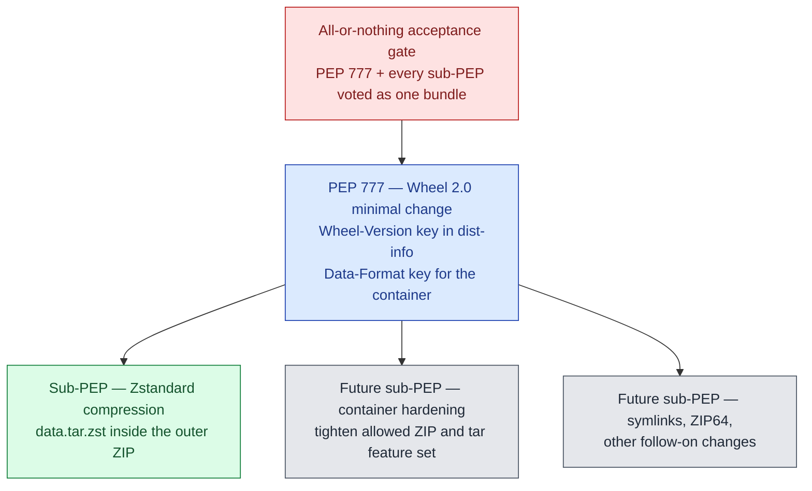
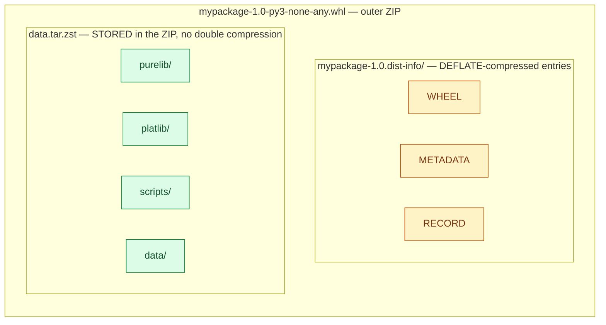
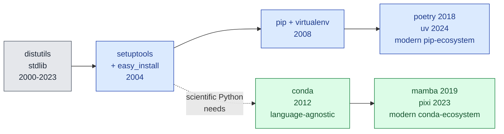
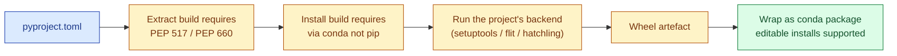
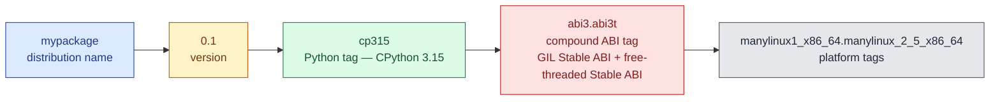
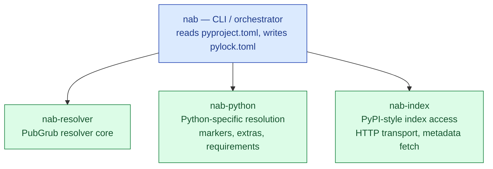

+++
author = "Bernat Gabor"
date = 2026-05-15T23:00:00Z
lastmod = 2026-05-16T00:00:00Z
description = "Per-talk notes from the PyCon US 2026 Packaging Summit in Long Beach: Emma Smith on Wheel 2.0 and Zstandard compression, Mike Fiedler on PyPI abuse vectors, Mahe Iram Khan on ecosystems, lightning talks on PEP 772, mobile wheels, AI accelerator variants, and the roundtable discussions."
draft = false
image = "mike-fiedler-pypi-as-cdn.webp"
images = [ "mike-fiedler-pypi-as-cdn.webp"]
slug = "pycon-us-2026-packaging-summit-recap"
tags = [ "python", "pycon", "pycon-us", "packaging-summit", "packaging", "pypi", "wheel", "pep-777", "pep-694", "pep-772", "pep-817", "pep-825", "pep-803", "conda", "trusted-publishing", "supply-chain", "mobile", "beeware", "wheel-variants"]
title = "PyCon US 2026 Packaging Summit Recap"
+++

The [PyCon US 2026 Packaging Summit](https://us.pycon.org/2026/events/packaging-summit/) ran Friday May 15, 2026, from
1:45 PM to 5:45 PM in Room 201A of the Long Beach Convention Center. Three talks, nine lightning talks, six roundtable
discussions. Organized by [Pradyun Gedam](https://pradyunsg.me/), [C.A.M. Gerlach](https://github.com/CAM-Gerlach), and
[Jannis Leidel](https://github.com/jezdez). This recap is for anyone who could not be in the room.

> [!TLDR] **TLDR:**
>
> - Emma Smith's revised [PEP 777 (Wheel 2.0)](https://peps.python.org/pep-0777/) is a minimal change with sub-PEPs
>   layered on top; the first sub-PEP proposes Zstandard compression for ~25% smaller wheels.
> - Mike Fiedler brought three PyPI abuse vectors (persistent state, open-ended releases, PyPI as a CDN), framed by 3×
>   growth against 1× resources (~24,000 new packages per month, up from ~8,000) and a single full-time PyPI safety and
>   security engineer.
> - Mahe Iram Khan argued conda and pip are two parallel ecosystems, not two competing tools.
> - Lightning talks: [PEP 772 Packaging Council](https://peps.python.org/pep-0772/) approved (Barry Warsaw), mobile
>   wheel pipeline live (Malcolm Smith), Coherent + Compile-to-Flit (Jason Coombs), wheel variants for AI accelerators
>   and shared malware scanning (Joongi Kim), conda-pypi (Daniel Holth), Nebi (Dharhas Pothina).
> - Roundtables: [PEP 803 abi3t](https://peps.python.org/pep-0803/), Wheel 2.0 hardening, cross-platform builds, CVE
>   propagation, and [nab](https://github.com/notatallshaw/nab) (Damian Shaw's pure-Python resolver aimed at pip
>   swap-in).
> - Involved in Python packaging? Consider running for the Packaging Council this fall or becoming a voting
>   [PSF member](https://www.python.org/psf/membership/) to nominate and vote.

For background, I list the packaging-topic PEPs resolved in the year leading up to the summit (January 2025 through May
2026), newest first.

Accepted or Final:

- [PEP 772 — Packaging Council governance process](https://peps.python.org/pep-0772/), Accepted 2026-04-16
- [PEP 783 — Emscripten Packaging](https://peps.python.org/pep-0783/), Accepted 2026-04-06
- [PEP 815 — Deprecate RECORD.jws and RECORD.p7s](https://peps.python.org/pep-0815/), Final 2026-01-28
- [PEP 794 — Import Name Metadata](https://peps.python.org/pep-0794/), Accepted 2025-09-05
- [PEP 792 — Project status markers in the simple index](https://peps.python.org/pep-0792/), Final 2025-07-08
- [PEP 770 — Improving measurability of Python packages with SBOM](https://peps.python.org/pep-0770/), Accepted
  2025-04-11
- [PEP 751 — A file format to record Python dependencies for installation reproducibility](https://peps.python.org/pep-0751/),
  Final 2025-03-31
- [PEP 739 — build-details.json 1.0, a static description file for Python build details](https://peps.python.org/pep-0739/),
  Accepted 2025-02-05

Rejected or Withdrawn:

- [PEP 708 — Extending the Repository API to Mitigate Dependency Confusion Attacks](https://peps.python.org/pep-0708/),
  Rejected 2026-04-02 after three years provisionally accepted, because the required implementation conditions (PyPI UI,
  second-repository support in pip with positive user feedback) were never met
- [PEP 763 — Limiting deletions on PyPI](https://peps.python.org/pep-0763/), Withdrawn 2025-09-21; the conclusion was
  that PEPs are not the appropriate venue for changes to PyPI's deletion or usage policies
- [PEP 759 — External Wheel Hosting](https://peps.python.org/pep-0759/), Withdrawn 2025-01-31; the community preferred
  richer multi-index priority and trust controls (pointing toward [PEP 766](https://peps.python.org/pep-0766/)) over
  external hosting

Several of these came up during the summit; I reference them inline below.



## Welcome

The three organizers opened the summit by sharing the
[HackMD notes document](https://hackmd.io/@jezdez/pycon2026-packaging-summit/edit) for collaborative live notes, and by
reminding the room that this is where conversations start; proposals move from here into
[discuss.python.org](https://discuss.python.org/c/packaging/14) and the PEP process. The deeper
[official notes from the summit](https://hackmd.io/3AUJd0GkRFKHclfzULowTw) are the canonical source for anything I left
out of this recap.

## Revisiting Wheel 2.0 and Better Compression — Emma Smith

[Emma Smith](https://github.com/emmatyping) ([emmatyping.dev](https://emmatyping.dev/)) authored
[PEP 777, "How to Re-invent the Wheel"](https://peps.python.org/pep-0777/) and is a CPython core developer. Slides:
[Google Slides deck](https://docs.google.com/presentation/d/1zh-3FkCg2cSMp3QD5oFji5sebeJlu3Hg_d-maYe7Pno/edit?usp=sharing).
The prerequisite stdlib work is also hers: she authored
[PEP 784 (Adding Zstandard to the standard library)](https://peps.python.org/pep-0784/) and then, in her
[Decompression is up to 30% faster in CPython 3.15](https://emmatyping.dev/) post (November 2025), wrote up the
`PyBytesWriter`-based decompression rewrite that made zstd decompression 25–30% faster and zlib decompression 10–15%
faster for payloads of at least 1 MiB. That work is what makes a Zstandard-based Wheel 2.0 practical, though wide
adoption waits until [Python 3.13 reaches end-of-life in October 2029](https://devguide.python.org/versions/), when
3.14+ becomes the oldest supported interpreter and installers can rely on `compression.zstd` being present everywhere.

The earlier version of PEP 777 added a wheel-version field to the filename so existing installers would skip Wheel 2.0
outputs. The community raised three objections: updates would silently stop on old installers, they found the existing
wheel-compatibility schema sufficient, and the PEP missed the `pip install ./wheel_file.whl` path. Emma Smith worked
through this with [Donald Stufft](https://github.com/dstufft) and landed on a different plan.

The Python packaging ecosystem is too distributed to migrate coherently, so any all-at-once approach has too many
downsides. The revised PEP 777 makes the minimum change: wheels stay zip files, and the only hard requirement is that
`dist-info` contains a `Wheel-Version` entry stored or `DEFLATE`-compressed inside the wheel. Each package index (PyPI
itself, internal mirrors like [Artifactory](https://jfrog.com/artifactory/), [conda-forge](https://conda-forge.org/)
wheel builds, alternative indices like [Anaconda.org](https://anaconda.org/) and [devpi](https://devpi.net/)) decides
when to start accepting Wheel 2.0 uploads. Each further change rides on top as its own sub-PEP, individually motivated,
and the full PEP 777 plus its sub-PEPs get accepted or rejected together.

The first sub-PEP is **Zstandard compression**. Emma analyzed the top 1,000 most-downloaded projects on PyPI:

- About 25% smaller wheels on average.
- About 100 PB of bandwidth saved across those 1,000 projects.
- About 36 years of cumulative decompression time saved per month.

A constraint shaped the rollout: pure-Python installers, including pip, prefer to avoid C dependencies. Emma landed
Zstandard in the standard library, which shipped in Python 3.14 as
[`compression.zstd`](https://docs.python.org/3/library/compression.zstd.html). The wheel proposal stores non-metadata
files in a `data.tar.zst` archive, uncompressed inside the outer zip, and adds a `Data-Format` key to the wheel metadata
so future container formats can swap in.

Threads from the Q&A:

- **Why not zstd-compressed entries inside the zip?** Per-file compression always loses to whole-archive compression,
  and per-file zstd would create Python-version compatibility issues when installing into an older interpreter's
  environment.
- **Compression-differential attacks.** Mike Fiedler raised this. The tentative answer is to verify the declared
  decompressed size in the zstd header against the actual size, which matches what scanners already do.
- **Stored entries.** uv reads selected zip entries as stored so it can mmap them. Metadata stays accessible the same
  way; other files go through one extra tar-extraction step.
- **Symlinks.** Tar supports them; zip mostly does not. Emma's instinct is to keep symlinks out for now to avoid the
  escape-the-environment surface.
- **Reproducibility.** Zstd at the same version and compression level is deterministic; an embedded checksum at the end
  of the stream can be disabled, and Emma agreed it could move into `RECORD`.
- **Timeline.** Provisional acceptance within a year or two of writing, no upper bound on when an index can flip the
  switch. Emma thinks five years is a reasonable expectation for general adoption.

Daniel Holth added context from [conda-package-streaming](https://github.com/conda/conda-package-streaming): tar inside
zip streams cleanly through zstd decompression and tar unpacking, whereas a hypothetical inner zip would force
decompressing the whole inner archive before reading any member.

## Limiting vectors and incentives for abuse — Mike Fiedler



[Mike Fiedler](https://github.com/miketheman) ([miketheman.net](https://www.miketheman.net/)) is the Safety and Security
Engineer at the PSF, working full-time on PyPI. Slides:
[PDF](https://www.dropbox.com/scl/fi/kg4fr4gc1t9c27sbbqvig/PyCon-US-2026-Packaging-Summit-Mike-Fiedler.pdf?rlkey=4u3v4n201ja82ugkdydf0jy6f&dl=0).

He opened with the growth chart above: between December 2024 and April 2026, PyPI saw 3.1× more new projects per month,
3.5× more bytes per month, 2.5× more files and malware reports, and 1.6× more active uploaders. Monthly new-project
count moved from around 8,000 (manageable through reactive moderation) to around 24,000. PyPI holds about 36 TB of live
storage and roughly the same again in cold storage of deleted files.

The recurring theme: load on every axis grew roughly 3×, while resources stayed at 1×. Physical infrastructure scales
with money. The human side does not scale that fast; Mike is still the only full-time PyPI-specific safety and security
engineer, supported by a network of volunteer reporters and by [Seth Larson](https://sethmlarson.dev/) (PSF Security
Developer-in-Residence) on the broader Python ecosystem. Some support tickets sit in longer queues than they used to,
and reactive moderation alone no longer keeps up with the volume. Hence the prevention work below.

Recent work on the PyPI side:

- Rate limits tightened from 40 new projects per hour to 4 new projects per day per uploader.
- Trusted publishing adoption rose from about 10% to about 30% of new file uploads year over year.
- Project archival lifecycle status (advisory; installers do not act on it yet).
- Pending-publisher cleanup after 30 days of disuse.
- A growing prohibited-name list on the admin side.

The three vectors Mike wanted to discuss:

### 1. Persistent state

Mike's framing: PyPI is a warehouse, and people leave things in the warehouse. Deletions today move files to cold
storage but the content stays accessible by URL at `files.pythonhosted.org`. Attackers know this and use the trusted
hostname to push "install from this URL" links after removing the index entry. People also upload non-package content
(MP3 collections, ebooks, one project that used PyPI as Dropbox), which PyPI has to remove for legal reasons.

Mike's questions: should the cold-storage layer eventually be garbage-collected; should users be allowed to delete or
should that move to admin-only; should the quota system stay tied to user-driven deletion when those deletions do not
free space.

In the discussion I suggested a two-phase delete: mark for deletion, then actually delete after one to six months. Mike
noted the copyrighted-material case where the legal obligation rules out a long grace window.

Related sub-thread: unused API tokens. PyPI has over a million user accounts and many of those accounts hold API tokens
they never used. The room agreed PyPI should notify and then delete unused tokens, and that the trusted-publishing setup
flow should offer to delete the corresponding API token at the same time. A few voices flagged the migration cost:
applying this to existing tokens without an opt-in path could break CI that someone set up and forgot years ago.

### 2. Open-ended releases

A pinned version is not always frozen content. A publisher today can upload new files (post-releases, additional wheels)
to an existing release after the fact, and `==1.0.0` will pick them up. Mike asked whether to lock releases after a
window (he suggested seven days) and ask publishers to issue post-releases instead.

The discussion landed on a tension. Post-releases are useful for back-filling new-Python or new-architecture wheels
months after a release, and the room wanted to keep that capability available. Attendees floated two ideas (any change
here would need [PEP 440 (Version Identification and Dependency Specification)](https://peps.python.org/pep-0440/)
amended too, not only installer behaviour):

- **Stale-release upload as an opt-in.** Today it works by default; flip it so the publisher has to re-open the release
  in the UI, with extra security checks.
- **Cooldown windows.** Make a freshly uploaded file scannable but invisible to installers for a day, so malware
  scanners get a head start.

The bigger change is [PEP 694, Upload 2.0 API for Python Package Indexes](https://peps.python.org/pep-0694/), which
would give publishers staged uploads and atomic publish, and would tie into a sealed-release state.

Emma noted that `==1.0.0` already pulls any matching local versions and dot-zero variants, so any change to
upload-after-release semantics needs the version-specifier spec amended, not only installer behavior.

### 3. PyPI as a CDN



The vector Mike called *Turducken Software*: a Rust binary installs a Python package that ships a Go binary that invokes
a Zig compiler. PyPI now hosts Java JARs, Node `node_modules` directories, and complete language runtimes from people
who use it as a general content-distribution network. The slide noted 12,716 projects that declare an OSS license but
ship neither an sdist nor a source-repository link in metadata, around 3% of the OSS-licensed set.

The open question: where does the community want PyPI to draw the line between "Python package that bundles a binary"
and "not a Python package at all"? Mike asked the room to start thinking about it rather than proposing a policy
himself.

He flagged namespaces as a fourth topic that would take four hours on its own, and set it aside for another day.

## Encouraging the community to view Packaging in terms of ecosystems, not tools — Mahe Iram Khan

[Mahe Iram Khan](https://github.com/ForgottenProgramme) is a software engineer at [Anaconda](https://www.anaconda.com/)
based in Berlin and has maintained [conda](https://github.com/conda/conda) for about four years. The talk grew out of
three questions she keeps getting asked: what is the difference between conda and pip, when should you use one or the
other, and can you mix them.

Her thesis: conda and pip are two parallel ecosystems with different origins, not two competing tools. The history
sketch:

- [`distutils`](https://docs.python.org/3.11/library/distutils.html) shipped in the standard library with no dependency
  management, no uninstall, and a release cadence tied to CPython.
- [`setuptools`](https://setuptools.pypa.io/) and
  [`easy_install`](https://setuptools.pypa.io/en/latest/deprecated/easy_install.html) (2004) added dependency handling
  and PyPI integration.
- [`pip`](https://pip.pypa.io/) and [`virtualenv`](https://virtualenv.pypa.io/) (2008) added uninstall, better error
  messages, and resolved the day-to-day pain points for most of the community.
- [`conda`](https://github.com/conda/conda) (2012) was built for the scientific Python community, whose heavy non-Python
  dependencies the pip-era tooling could not handle. It was language-agnostic from day one and combined package and
  environment management in a single tool.

Later tools fall into one ecosystem or the other: [poetry](https://python-poetry.org/) and
[uv](https://docs.astral.sh/uv/) into the pip ecosystem, [mamba](https://mamba.readthedocs.io/) and
[pixi](https://pixi.sh/) into the conda ecosystem. Comparing them across ecosystems produces a lot of the confusion
users hit when they read packaging advice online.

Mahe acknowledged the lines are blurry and that this is a personal sense-making frame, not a formal theory. With a
packaging council on the way (see Barry's lightning talk below), she asked the room how to give new users a clearer
on-ramp.

The discussion ran longer than the talk. Threads worth keeping:

- **Vendor-neutral on-ramp.** Deborah Nicholson (PSF) noted there is no "right way in" on python.org for newcomers to
  packaging today and offered PSF funding for someone to build one. People added the current set of links piecemeal over
  the years.
- **More than two ecosystems.** A consultant pointed out that [Ecosyste.ms](https://ecosyste.ms/) treats every
  distribution channel (PyPI, conda, Debian, Nix, Spack, Homebrew) as a separate ecosystem with different metadata
  semantics. Security advisories published on a PyPI package do not propagate to a conda or Nix repackaging of the same
  code, which leaves CVE-coverage gaps that translation layers between ecosystems would close.
- **The scientific-community frame.** A long exchange on two framings: can wheels eventually solve the scientific use
  case (multiple compiled languages, hardware variance), or does the conda model exist because PyPI cannot? The room
  cited [Ralf Gommers](https://github.com/rgommers)' [pypackaging-native](https://pypackaging-native.github.io/) as the
  reference on this. The wheel-next working group's effort on
  [PEP 817 wheel variants](https://peps.python.org/pep-0817/) and [PEP 825](https://peps.python.org/pep-0825/) is the
  visible bridge between the two ecosystems.
- **Publishing-side experience.** As an author of a pure-Python CLI tool, you ship to PyPI and you are done; the package
  showing up in Homebrew three months later is somebody else's work. Getting more involved in the various places others
  republish your work is a specialist skill the community does not document well.

## Lightning talks

### PEP 772 Packaging Council update — Barry Warsaw

[PEP 772 (Packaging Council)](https://peps.python.org/pep-0772/) is approved. [Barry Warsaw](https://barry.warsaw.us/)
walked through the elections plan: aligned with the PSF board election in the fall, three two-week phases (nominations,
voting), two cohorts on a rotating two-year cycle, PSF membership required to nominate or be nominated.
[Deborah Nicholson](https://github.com/deborahgu) called out the spread-the-word problem: not everyone interested is in
this room. Barry encouraged everyone present to consider running.

### Mobile packaging update — Malcolm Smith



A year on from last summit, [Malcolm Smith](https://github.com/mhsmith) reported the build / host / install pipeline is
in place. [cibuildwheel](https://cibuildwheel.pypa.io/) supports Android and iOS, PyPI accepts the new wheel tags, and
the Python installer ships official support. [Kivy](https://kivy.org/) joined [BeeWare](https://beeware.org/) in
supporting mobile this year. The dashboard above shows 11/360 Android wheels and 9/360 iOS wheels across the top
packages, mostly user-request driven. The BeeWare team is at the sprints Monday and Tuesday and happy to help
maintainers add mobile support.

Live tracker: [beeware.org/mobile-wheels](https://beeware.org/mobile-wheels).

### Coherent System and Compile-to-Flit bootstrapping — Jason Coombs

[Jason Coombs](https://github.com/jaraco) ([jaraco.com](https://jaraco.com/), GitHub:
[@jaraco](https://github.com/jaraco)) maintains over 100 packages and built the
[Coherent build system](https://github.com/coherent-oss/system) to keep that volume sustainable. Highlights: automatic
dependency inference from imports (overridable but mostly correct by default), automatic author and version inference, a
lightweight `pyproject.toml`, and a [Flit](https://flit.pypa.io/)-based build that keeps the whole thing minimal.
Dependency inference draws on a [MongoDB](https://www.mongodb.com/) database derived from PyPI that maps imports back to
projects.

The companion trick is **Compile-to-Flit**, Jason's answer to the bootstrap problem for build backends with their own
dependencies. [Setuptools](https://setuptools.pypa.io/) solves the problem by vendoring; Flit solves it by having no
dependencies; [Hatch](https://hatch.pypa.io/) uses `backend-path`. Compile-to-Flit takes a backend with N dependencies
and produces an sdist whose `pyproject.toml` declares only `flit_core`, with the metadata concretized at sdist build
time. Coherent itself has 15 dependencies and would be unworkable to vendor; with Compile-to-Flit the sdist stays tiny.

The known trade-off: users can no longer `pip install` the project straight from a git checkout and need to consume the
published sdist instead. Jason is willing to live with that constraint, and is planning to apply the same treatment to
Setuptools so it can have proper dependencies again.

### Wheel variants for AI accelerators, and shared malware scanning — Joongi Kim

[Joongi Kim](https://github.com/achimnol) (GitHub: [@achimnol](https://github.com/achimnol); CTO at
[Lablup](https://www.lablup.com/), creator of [Backend.AI](https://www.backend.ai/)) gave back-to-back lightning talks
on two parallel proposals.

The first
([slides](https://speakerdeck.com/achimnol/pycon-us-2026-packaging-summit-lt-more-variant-more-diversity-for-ai-accelerators))
extends the wheel-variants idea ([PEP 817](https://peps.python.org/pep-0817/)) into container ecosystems. Today
[`docker pull`](https://docs.docker.com/reference/cli/docker/image/pull/) auto-selects by architecture but not by
hardware feature, and
[Kubernetes' Dynamic Resource Allocation](https://kubernetes.io/docs/concepts/scheduling-eviction/dynamic-resource-allocation/)
makes users configure GPU and vendor-specific matching by hand. Joongi targets
[NVIDIA CUDA](https://developer.nvidia.com/cuda-zone) SM architectures plus [Rebellions](https://rebellions.ai/) and
[Furiosa](https://www.furiosa.ai/) NPUs, and pointed at Backend.AI's [Sokovan](https://github.com/lablup/backend.ai)
scheduler as an existing implementation of per-node variant providers feeding into per-workload variant labels. The
design lets compute nodes report their properties to the scheduler, which matches them against container-image labels
equivalent to the wheel-variant properties pip would resolve.

The second
([slides](https://speakerdeck.com/achimnol/pycon-us-2026-packaging-summit-lt-sharing-malware-scanning-results-of-pypi-from-multiple-providers))
proposed a way to share malware-scan results across providers. Lablup mirrors all of PyPI (up to roughly 40 TB, doubled
since 2024) for their Reservoir mirror and runs monthly scans with Ahnlab V3 and [ClamAV](https://www.clamav.net/). The
proposal is a signed "scanned by X on date Y" metadata field exposed via the index API, modelled on
[Google's Assured OSS](https://cloud.google.com/assured-open-source-software), so no single team has to keep up with the
upload volume alone. Sign-up happened on-site.

### conda-pypi reusing the pip stack — Daniel Holth

[Daniel Holth](https://github.com/dholth) walked through [conda-pypi](https://github.com/conda-incubator/conda-pypi).
Slides:
[dholth.github.io/presentation-conda-pypi-internals](https://dholth.github.io/presentation-conda-pypi-internals/). The
integration builds on [unearth](https://github.com/frostming/unearth),
[pypa/installer](https://github.com/pypa/installer), and [pypa/build](https://github.com/pypa/build), and threads build
requirements through the standard backend interfaces in
[PEP 517 (A build-system independent format for source trees)](https://peps.python.org/pep-0517/) and
[PEP 660 (Editable installs for pyproject.toml based builds)](https://peps.python.org/pep-0660/).

Daniel noted that build backends like setuptools, flit, and hatchling arriving from PyPI in a mixed conda + pip
environment is a common source of subtle issues; the conda-pypi flow keeps those backends on the conda side. Editable
installs work end-to-end. pip runs inside the same Python environment it targets; conda runs in a separate one. The
integration handles the bridge without manual intervention.

### Nebi — environment management for teams — Dharhas Pothina

[github.com/nebari-dev/nebi](https://github.com/nebari-dev/nebi); web entry point at
[nebi.nebari.dev](https://nebi.nebari.dev). [Dharhas Pothina](https://github.com/dharhas) (GitHub:
[@dharhas](https://github.com/dharhas); [OpenTeams](https://www.openteams.com/)) presented a successor to
[conda-store](https://conda.store/) for teams whose environments live outside the application code. Nebi is a server
plus CLI built on top of [Pixi](https://pixi.sh/) that adds version history and rollback, OCI-registry distribution
([Quay](https://quay.io/),
[GHCR](https://docs.github.com/en/packages/working-with-a-github-packages-registry/working-with-the-container-registry)),
role-based access control, and named workspace activation. Nebi versions lock files and spec files together. The
long-term goal is reproducible environments for science.

## Roundtable discussions

The roundtables ran in parallel. These notes come from the rooms I was in plus the shared notes for the others.

### PEP 803 — abi3t Stable ABI for free-threaded Python — Petr Viktorin

[Petr Viktorin](https://github.com/encukou) ([encukou.cz](https://encukou.cz/)) walked through
[PEP 803 (abi3t)](https://peps.python.org/pep-0803/), the Stable ABI for free-threaded CPython. The resulting wheel
filename looks like `mypackage-0.1-cp315-abi3.abi3t-manylinux1_x86_64.manylinux_2_5_x86_64.whl`. The new bit is the
compound ABI tag `abi3.abi3t`, which says the wheel offers the Stable ABI for both the GIL build and the free-threaded
build of CPython 3.15.

Extension suffixes are `.abi3t.so` on Linux and macOS (with `.so` as a workaround for the 3.13–3.14 window if you want
both) and `.pyd` on Windows. pip already supports installing abi3t wheels. Other installers need to accept the `abi3t`
tag for free-threaded CPython in the same places they accept `abi3` today, and build tools need to opt in when they want
to expose the feature.

### Yoda conditions in PEP 508 markers

The marker grammar in [PEP 508](https://peps.python.org/pep-0508/) and the
[dependency specifiers spec](https://packaging.python.org/en/latest/specifications/dependency-specifiers/) is
underspecified for "Yoda-form" expressions (`'3.13.*' == python_full_version`), and the
[`packaging`](https://packaging.pypa.io/) library does not expose the parsed marker tree as a public API. The room
agreed an editorial PR against the spec should clarify that markers always compare an environment variable on the left
with a literal on the right, mention the complexity that lets implementations be loose, and add a failing example in the
tests. uv does not implement `'3.13.*' == python_full_version`. The `~=` operator is also confusing in this position.

### Wheel 2.0 and Zstandard container hardening

Picking up from Emma's talk. Concrete suggestions for tightening what a valid Wheel 2.0 container looks like:

- **Restrict the zip and tar feature set.** Parser-differential attacks have come from GNU tar versus POSIX tar
  extensions, both of which most unpackers tolerate. A Wheel 2.0 sub-PEP should pick one and ban the other, and specify
  the outer zip's binary layout exactly (it only ever holds two regular files with specific compression methods).
- **No hard links, no device files, no resource forks or NTFS streams, no xattrs.**
- **ZIP64 for large wheels.** The choice between requiring ZIP64 unconditionally or only above a size threshold needs to
  stay compatible with what major build tools can produce.
- **`data.tar.zst` or `wheel-filename.data.tar.zst`.** Daniel Holth's preference: keep the existing `.data` convention
  so you can unpack two wheels side-by-side without collision, and list only the tar archive in `RECORD` (not its
  members), matching existing rules.
- **Symlinks.** Tar supports them. The question of whether Wheel 2.0 should allow them inside the data archive stayed
  open; the simplest path is to keep them out.
- **Self-describing format key.** Emma agreed the `Data-Format` field should name the container too (`tar-zstd` rather
  than `zstd`), so a later sub-PEP can switch the inner archive format cleanly.

### Cross-platform environments and wheel building

Android, iOS, and Emscripten each landed their own cross-platform wheel-building solution, with a lot of overlap between
the three. They all rely on a `.pth` file that monkey-patches `sysconfig` and other stdlib modules to simulate running
on the target platform, because most Python build systems still have no concept of cross-compilation. Even for
established platforms, cross-compilation matters when CI for the target architecture is limited (Apple Silicon before CI
vendors caught up; Windows on ARM today). The longer-term path is for build backends
([setuptools](https://setuptools.pypa.io/), [meson-python](https://meson-python.readthedocs.io/),
[hatchling](https://hatch.pypa.io/latest/)) to gain native cross-compilation support driven from the Python environment.
cibuildwheel does this for the platforms it recognizes.

### Improving security metadata across ecosystems

CVEs and malware are different problems. The open work is propagating CVE coverage across repackagings of the same
project, where each ecosystem has its own naming and version conventions and the [NVD](https://nvd.nist.gov/),
[OSV](https://osv.dev/), and [GHSA](https://github.com/advisories) mappings cover only part of the surface.

A single project gets repackaged across many ecosystems, each with its own name and version style:

| Ecosystem   | Example package name for `requests 2.32.0` |
| ----------- | ------------------------------------------ |
| PyPI        | `requests` 2.32.0                          |
| conda-forge | `requests` 2.32.0                          |
| Debian      | `python3-requests` 2.32.0-1                |
| Homebrew    | `python-requests` 2.32.0                   |
| Nix         | `python3.13-requests-2.32.0`               |

A CVE filed against the PyPI name auto-matches the PyPI entry and nothing else; ecosystem-translation work fills the
gap. [PEP 804 (External dependency registry and name mapping)](https://peps.python.org/pep-0804/) is the closest
in-flight proposal; conda recipes can already declare an upstream [`purl`](https://github.com/package-url/purl-spec).
Other notes from the discussion: connect packages via source-repository URL, distinguish patch builds that change build
recipes from patches that change source code, and consider how [SLSA](https://slsa.dev/)-style provenance carries
through dependency chains. Cooldown periods on releases have the opposite cost: they delay vulnerability discovery if
widely adopted.

### Dependency resolution and nab — Damian Shaw

[github.com/notatallshaw/nab](https://github.com/notatallshaw/nab). [Damian Shaw](https://github.com/notatallshaw)
(GitHub: [@notatallshaw](https://github.com/notatallshaw)) is a pip maintainer. nab is a pure-Python dependency resolver
based on [PubGrub](https://nex3.medium.com/pubgrub-2fb6470504f), with the medium-term goal of becoming a drop-in swap
for pip's current resolver and an available library for other tools. It fixes bugs that uv inherits from the
[`pubgrub-rs`](https://github.com/pubgrub-rs/pubgrub) library, and performance on uncached resolves is comparable to uv.

[PubGrub](https://nex3.medium.com/pubgrub-2fb6470504f) is a dependency-resolution algorithm developed by
[Natalie Weizenbaum](https://github.com/nex3) for the [Dart package manager](https://dart.dev/tools/pub). When the
resolver hits an incompatibility it derives a generalized cause and records it as a permanent fact so the same conflict
cannot resurface, which both prunes the search space and produces actionable error messages that name the conflicting
constraints. In the Python ecosystem, [uv](https://docs.astral.sh/uv/) uses PubGrub via the
[`pubgrub-rs`](https://github.com/pubgrub-rs/pubgrub) Rust crate; pip and [PDM](https://pdm-project.org/) instead use
[resolvelib](https://github.com/sarugaku/resolvelib), which is a backtracking resolver rather than a PubGrub-style one.

Today nab has four pluggable layers: `nab-resolver` (the PubGrub-based resolver core), `nab-python` (Python-specific
resolution), `nab-index` (PyPI-style index access), and the top-level `nab` package that wires the three together into
the CLI.

As a secondary use case it can also emit [PEP 751](https://peps.python.org/pep-0751/) lockfiles and leaves installation
to existing tools; it ships a security-first build policy switch (`never` / `build-local` (default) / `build-remote`)
for builds during resolution.

First impression after sitting with the project: nab is impressive for a tool built in about two months. The resolver
design is solid and performance is competitive with uv on uncached resolves. The lightning-talk slot was an
introduction; the roundtable focused on what would still need to land before nab could become a pip-side resolver
alternative, with the lockfile output a useful side benefit.

My own interest in nab is the `pylock.toml` generation. I have spent the last few months trying to land PEP 751 lockfile
output in two other places, [uv#14728](https://github.com/astral-sh/uv/pull/14728) and
[pip-tools#2380](https://github.com/jazzband/pip-tools/pull/2380), and both stalled for different reasons. A fresh tool
focused on resolution plus PEP 751 output therefore appeals to me. Damian and I worked through the gaps together during
the roundtable; I
[filed them as tracking issues against the repo](https://github.com/notatallshaw/nab/issues?q=is%3Aissue+author%3Agaborbernat)
afterwards. They are the ones that would need to close before I could adopt nab as a drop-in solution for that workflow:

- **Universal-mode coverage.** Cross-platform lockfiles cannot include PyPy alongside CPython, and ad-hoc cross-platform
  locks need a `pyproject.toml` edit because there is no CLI flag for the matrix.
- **CLI ergonomics.** Common flags from pip and uv (`--constraint`, `--pre`, `--upgrade-package`, `--verbose`/`--quiet`)
  are not yet present, and there is no progress feedback or diff summary across re-locks.
- **PEP 751 portability.** Reproducibility gaps include missing
  [`SOURCE_DATE_EPOCH`](https://reproducible-builds.org/specs/source-date-epoch/) support, `file://` URLs that nab does
  not rewrite to relative paths in the lockfile, and an unpopulated `packages.dependencies` graph.
- **Resolution stability.** No seed-pins from a prior lockfile means unrelated packages can churn on re-lock; some
  dependency-group conflict messages do not name which groups disagree.
- **Networking in corporate environments.** Both transports skip proxy environment variables and the OS certificate
  store, which keeps nab from running behind TLS-intercepting proxies.
- **Docs.** The current flat guides directory would benefit from restructuring along the
  [Diataxis framework](https://diataxis.fr/).

Within roughly 24 hours of filing the issues, Damian merged fixes covering lockfile portability, PEP 751 spec
conformance, the security gaps around auth credentials in lockfile URLs, the networking issues, and several CLI
ergonomics fixes: [PRs #41, #42, and #43](https://github.com/notatallshaw/nab/pulls?q=is%3Apr+is%3Amerged) closed
sixteen tracking issues in one batch.

## Wrapping Up

The format ran tight to schedule. The roundtables let attendees pick a thread and follow it across several ecosystems in
one afternoon. As someone who has attended every Packaging Summit since 2019, this year felt like the best one yet.
There was a lot of laughter and eager collaboration across project boundaries, and the audience keeps growing year over
year. With the [Packaging Council](https://peps.python.org/pep-0772/) coming online this fall, that pattern should
accelerate.

If you are heavily involved in Python packaging, please consider running for a seat on the council this fall. If you
have an opinion but not the bandwidth to run, the lighter lift is to
[become a voting PSF member](https://www.python.org/psf/membership/) so you can nominate candidates and vote in the
election. Two paths qualify: Supporting membership ($99/year, with a sliding-scale option) or self-certified
Contributing membership (free, granted to people who dedicate at least five hours per month volunteering on work that
advances the PSF's mission, such as maintaining open-source projects, organizing Python events, or serving on a PSF
working group).

Thank you to the organizers, to every speaker for putting their work up for discussion, and to everyone who jumped into
the deletions, post-release, and ecosystem-bridge conversations in the room.
