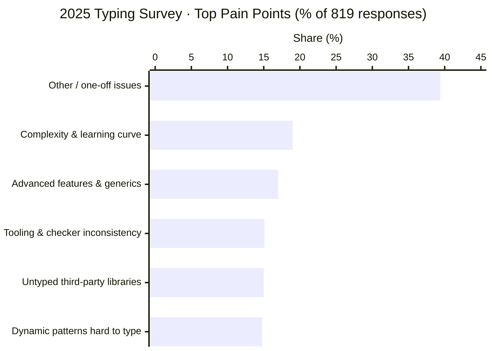

+++
author = "Bernat Gabor"
date = 2026-05-14T23:30:00Z
lastmod = 2026-05-15T00:00:00Z
description = "Per-talk notes from the PyCon US 2026 Typing Summit in Long Beach: Pyrefly and AI agents, ty constraint sets, Lean formalization, tensor shape types, intersection types, PEP 827, Guido on the direction of typing, and the Typing Council Q&A."
draft = false
image = "typing-council-panel.webp"
images = [ "typing-council-panel.webp"]
slug = "pycon-us-2026-typing-summit-recap"
tags = [ "python", "pycon", "pycon-us", "typing-summit", "typing", "type-hints", "pyrefly", "ty", "astral", "openai", "meta", "vercel", "pep-827", "intersection-types", "constraint-sets", "lean", "tensor-types", "pytorch", "typing-council", "guido"]
title = "PyCon US 2026 Typing Summit Recap"
+++

The [PyCon US 2026 Typing Summit](https://us.pycon.org/2026/events/typing-summit/) ran Thursday May 14, 2026, from 1 PM
to 5 PM in Room 201A of the Long Beach Convention Center, the day before the main conference started. Eight talks plus a
Typing Council Q&A, single track. This recap is for anyone who could not be in the room.

> [!TLDR] **TLDR:**
>
> - Guido van Rossum argued that [PEP 484](https://peps.python.org/pep-0484/)'s no-new-syntax rule is already broken in
>   practice and that the field should weigh user pain over power features, citing the
>   [2025 Python Typing Survey](https://engineering.fb.com/2025/12/22/developer-tools/python-typing-survey-2025-code-quality-flexibility-typing-adoption/).
> - Jelle Zijlstra proposed adding intersection and restricted-negation types to the typing spec, with an inhabitation
>   check as the load-bearing new rule.
> - Michael Sullivan presented [PEP 827](https://peps.python.org/pep-0827/) (Vercel) for type manipulation, modelled on
>   TypeScript's conditional and mapped types.
> - Douglas Creager showed how `ty` represents generic-call constraints internally with ternary decision diagrams, and a
>   third solver strategy that fixes a 9-line `partial(choose, None)` example every production checker today gets wrong.
> - Conner Nilsen presented a Pyrefly experiment with AI coding agents: type checking moves success on well-typed Meta
>   code from 79.6% to 83.9% with 21% fewer steps; no measurable help on lightly-typed SWE-bench Verified.
> - Avik Chaudhuri demoed tensor-shape types in Pyrefly, blocked in practice by
>   [PEP 695](https://peps.python.org/pep-0695/)'s eager evaluation of type parameters.
> - Jia Chen presented a Lean 4 formalization (Featherweight Python) with mechanized soundness and decidability proofs;
>   AI assistants turned what used to take years into weeks.
> - The Typing Council panel (Carl Meyer, Jelle Zijlstra, Rebecca Chen on stage) opened the floor to attendee questions
>   on governance, error-code consistency, metaprogramming, and the spec direction.

## Experiments with AI agents and Pyrefly type errors — Conner Nilsen



Conner (Meta, [Pyrefly](https://pyrefly.org/) team) presented two questions: (1) does giving an AI coding agent a type
checker help it finish tasks, and (2) does it prevent the agent from re-introducing old bugs while fixing new ones? His
team ran two benchmarks with and without type-checker feedback and tracked three metrics: success rate, number of steps
to completion, and wall-clock duration.

The answer to question 1 depends on coverage.

- **Well-typed code** (an internal Meta benchmark): success rate moved from **79.6% to 83.9%**, with **21% fewer steps**
  and **14% faster wall-clock runs**. The type checker caught problems before the agent went exploring.
- **Lightly typed code** ([SWE-bench Verified](https://www.swebench.com/) over libraries like Django, SymPy,
  Matplotlib): no meaningful improvement. The agent spent steps on type errors in code adjacent to the task, fixing
  import mismatches and missing attributes unrelated to the assigned bug.

The answer to question 2 was yes: with the type checker in the loop, the agent stopped re-introducing previously fixed
bugs when working on new ones.

Two findings on delivery mechanics:

1. **Models do not use tools just because you mention them.** Telling the agent "you can run the type checker" was not
   enough. The team wrapped Pyrefly invocations in a lightweight think-act-observe loop that ran the type checker after
   every edit and injected the result. With that wrapper, both models engaged with the errors. Without it, they did not.
2. **Surface errors as a fresh conversation turn, not as edit-tool output.** Errors returned inside the previous tool
   response got treated as noise. The same errors posted as a new turn got addressed.

Model sensitivity diverged. [Claude Sonnet 4.5](https://www.anthropic.com/news/claude-sonnet-4-5) chased every error the
type checker emitted, which helped on clean code and hurt on noisy code: the model would fix unrelated nags before
returning to the task. GPT-5 codex stayed goal-oriented and ignored errors unless the wrapper forced them into the
conversation.

The open-questions slide flagged the follow-up: SWE-bench Verified is the wrong benchmark for this question, because the
tasks themselves rarely require typing reasoning. A benchmark drawn from heavily typed projects would tell you whether
type checking is load-bearing for the agent or helpful at the margin.

## The `ty` implementation of constraint sets — Douglas Creager



Doug (Astral, billed on his title slide as "an OpenAI joint") walked through how [`ty`](https://docs.astral.sh/ty/)
represents the state of a generic function call. The vehicle was a 9-line program that runs fine but every production
type checker rejects, demonstrated live via [multiplay](https://github.com/astral-sh/multiplay), Astral's tool for
running a Python snippet through several type checkers side by side. Slides:
[dcreager/presentations](https://github.com/dcreager/presentations/raw/typing-summit/2026-05-typing-summit/dcreager-typing-summit-2026-slides.pdf).

```python
def choose[A](a1: A, a2: A) -> A:
    return random.choice([a1, a2])

def partial[X, Y, Z](fn: Callable[[X, Y], Z], x: X) -> Callable[[Y], Z]: ...

p = partial(choose, None)
p(2)        # type checker: error. argument 2 is not None.
p("hello")  # ditto.
```

The direct call `choose(None, 2)` type-checks fine: `A` solves to `None | Literal[2]` (or `None | int`, depending on the
checker). Routing it through `partial` does not. Doug ran the program through `mypy`, `pyright`, `pyre`, Pyrefly, and
`ty`, and every one of them produced the wrong answer.

His reframing: rather than ask "is this expression valid?", ask **"when is this expression valid?"** The answer is a
Boolean predicate over type variables, equivalently a set of valid assignments. Each type-check step adds a subtype
constraint to the set:

- For the direct call: `{Literal[2] ≤ A, None ≤ A}`.
- For partial application: `{None ≤ X, X ≤ A, Y ≤ A, A ≤ Z}`.

Doug walked the audience through three solver strategies for the `partial(choose, None); p(2)` example. The first two
are what production checkers do today and produce wrong answers in different directions; the third reproduces the
direct-call answer.

| Strategy | What it does                                               | `p`'s inferred type                                 | Result on `p(2)`                                                    |
| -------- | ---------------------------------------------------------- | --------------------------------------------------- | ------------------------------------------------------------------- |
| 1        | Solve `Y` and `Z` eagerly from the visible constraints     | `Callable[[None], None]`                            | `invalid-argument-type`: `2` is not `None`                          |
| 2        | Map `Y` and `Z` to `A`, drop `A` from the substitution     | `Callable[[A], A]`                                  | Accepts, but solutions for `A` lose `None`: only `Literal[2]`/`int` |
| 3        | Carry the whole constraint set forward as a latent generic | `Callable[[Y], Z]` with `Y ≤ Z ∧ None ≤ Z` attached | Same answer as the direct call: `Y = Z = None \| Literal[2]`        |

Astral is migrating `ty` to the third strategy; the work is not shipped publicly yet.

Doug walked through how `ty` represents constraint sets internally: **ternary binary decision diagrams**, BDDs extended
with a third "uncertain" edge, composed with a Horn-clause-style derived-fact engine for transitivity. He credited the
BDD variant to
[Guillaume Duboc's *Typing Dynamic Languages with Set-Theoretic Types: The Case of Elixir*](https://gldubc.github.io/),
defended at IRIF in Paris on January 19, 2026, with broader context in the
[Elixir set-theoretic typing project](https://elixir-lang.org/blog/2023/06/22/type-system-updates-research-dev/). For
background on subtyping inference and reifying constraints into types, he cited
[Stephen Dolan's *Algebraic Subtyping*](https://www.cs.tufts.edu/~nr/cs257/archive/stephen-dolan/thesis.pdf) (Cambridge,
2017).

Two open questions Doug flagged:

1. Should the typing spec gain "constrained callable" types, or should this stay an implementation detail of `ty`?
2. If constraints get reified into types, how do you report a contradiction to a user? Every constraint needs a
   back-pointer to the source span that introduced it, or the error message degenerates to "something somewhere is
   wrong."

## Formalizing parts of Python typing in Lean — Jia Chen



Jia (Meta, Pyrefly team) presented a side project: a mechanized formalization of a Python subset, written in
[Lean 4](https://lean-lang.org/), with theorems checked by Lean's kernel. He calls it Featherweight Python, in the
naming tradition of [Featherweight Java](https://www.cis.upenn.edu/~bcpierce/papers/fj-toplas.pdf). The project is
informal and unreleased. Jia uses it to answer design questions where the typing spec is silent and performance suites
are inconclusive, before deciding what to ship in Pyrefly.

The artifact bundles five Lean modules: source language, interpreter, type checker, theorem statements, proofs. The Lean
compiler either accepts the bundle (definitions well-formed, all proofs valid) or rejects it. The project totals roughly
39,000 lines of Lean, with the gradual-typing layer about twice the size of the static layer. Static took a week of his
time; gradual took about a month.

Two static-side theorems anchored the talk:

- **Soundness.** If the type checker accepts a program, running it does not hit a runtime type error.
- **Decidability.** The type system corresponds to an algorithm that terminates.

Writing those down forced Jia to surface assumptions that informal discussion leaves implicit: the class hierarchy obeys
the [Liskov substitution principle](https://en.wikipedia.org/wiki/Liskov_substitution_principle); MROs are valid and
acyclic; the world is open, so the type checker cannot enumerate every class that might exist.

The open-world choice constrains the type system. A negation type as set complement (everything that is not `T`) needs a
fixed universe to subtract from, and an open world does not give you one. Jia restricted negation to single classes
whose absence can be witnessed at runtime via `isinstance`. Jelle's intersection talk hit the same constraint later in
the afternoon.

For the gradual layer, Jia rephrased the theorem. With `Any` in the picture, soundness fails outright; you cannot prove
"no failure." The salvageable property: every failure traces back to an `Any` boundary. The proof device is to rewrite
the program by inserting runtime checks at each `Any`-to-static transition, then show that any check failure points to
an annotation that introduced the `Any`. Code without `Any` stays protected; the parts that opt out of the static side
are the only ones that can fail.

The closing meta-point landed on tooling. Jia tried to start a project like this five years ago and abandoned it because
writing formal proofs by hand is too slow. With recent AI assistants, the calculus changes. The architectural work stays
human: choose the language, decide which theorems to prove, recognize when a failed proof attempt is hiding a real
design issue. The mechanical proof writing goes to the AI. Jia's estimate is that the gradual layer took weeks of his
time instead of years.

## Exploration of tensor shape types in Pyrefly — Avik Chaudhuri



Avik (Meta) opened with a screenshot of
[Andrej Karpathy's nanoGPT](https://github.com/karpathy/nanoGPT/blob/master/model.py), the kind of PyTorch code where
every tensor operation carries a hand-written shape comment (`(B, T, C)`, `(B, nh, T, hs)`, etc.) because tensors are
otherwise opaque to readers. His pitch: those comments should be inferred by the type checker, not maintained by hand.

Avik described three building blocks:

1. **Symbolic arithmetic at the type level.** Pyrefly introduces a `Dim[N]` type that wraps either a concrete integer
   (`Dim[8]`) or a symbolic integer expression (`Dim[4 * config.n_embd]`). The type checker does not embed a SAT solver;
   it normalizes expressions and checks for syntactic match. Mental model: `Dim` is to
   [`Literal`](https://docs.python.org/3/library/typing.html#typing.Literal) what symbolic ints are to concrete ints.
2. **A `Tensor` type generic over a variable number of dimensions.** `Tensor[B, T, N]` for a 3D tensor; `Tensor[*Shape]`
   when the dimensionality is not statically known. Shapes flow from tensor-creation operations whose signatures tie
   them back to integer arguments in the model config.
3. **Op typing via a tiny shape DSL.** PyTorch has thousands of operators. Writing each one as a type stub is
   intractable because the shape transformations are too rich. Pyrefly defines a "fake op" for each PyTorch op: a
   comprehension-style function over ints that returns the output shape. The DSL is small enough to keep costs bounded,
   and it is borrowed in spirit from
   [PyTorch's own symbolic-shape work in `torch.compile`](https://docs.pytorch.org/docs/stable/torch.compiler_dynamic_shapes.html).

He walked through code samples from real modules: an MLP class, an attention block with a `chunk(3, dim=-1)` split (the
checker tracks the resulting tuple of three tensors), and a standard
[scaled-dot-product attention](https://docs.pytorch.org/docs/stable/generated/torch.nn.functional.scaled_dot_product_attention.html)
pattern with masking and reshapes.

Coverage on his sample: about 450 LOC and 30 shape-annotated tensors per model, about 1.5 `type: ignore` comments per
model. Most coverage loss came from familiar Python-typing limits (heterogeneous lists, list-comprehension shape
dependencies), not from anything specific to tensors. He flagged a couple of expressivity gaps for future work:
divisibility constraints (the system cannot prove `N * (M // N) == M`) and tensors-as-list-elements where the element
index drives the element type.

The practical blocker is syntactic, not theoretical. [PEP 695](https://peps.python.org/pep-0695/) evaluates type
parameters and base-class expressions of generic classes eagerly at definition time, so `Dim[4 * config.n_embd]`
referencing a runtime value will not work with the new generic syntax. The slide listed workarounds:
`from __future__ import annotations`, the older `TypeVar` form, or
[`jaxtyping`](https://github.com/google/jaxtyping)-style annotations as strings (all of which Pyrefly already accepts).
He framed the eager-evaluation rule as the lever worth pulling: relax it and tensor-shape types become writable without
ceremony.

Avik closed with an anecdote about onboarding the system: when his team used LLM agents to add tensor types to new
modules, the models pushed back and insisted the type system could not express what he was asking for. He had to
instruct them to try anyway, because tensor-shape types in Pyrefly are recent enough to fall outside the training data.

## Intersection types for Python — Jelle Zijlstra



Jelle ([Typing Council](https://github.com/python/typing-council)) presented a proposal to add intersection and negation
types to the [typing spec](https://typing.python.org/en/latest/spec/). He framed the type system two ways: types as sets
of values, and types as ranges on a lattice where lower equals subtype. Both pictures are useful; the lattice view makes
gradual types easier to reason about, with `Any` as a range from `object` at the top to
[`Never`](https://docs.python.org/3/library/typing.html#typing.Never) at the bottom.

Three practical motivations:

- **Type narrowing.** `isinstance` produces an intersection conceptually: if `x: A` and you check `isinstance(x, B)`,
  then in the positive branch `x: A & B`. The current
  [typing spec narrowing section](https://typing.python.org/en/latest/spec/narrowing.html) describes narrowing in terms
  of intersection without specifying intersection as a type. Filling that gap removes a class of ad-hoc rules.
- **Lightweight protocol combining.** A value that satisfies both `Closeable` and `Iterable` today requires declaring a
  new `Protocol` class. With intersections, write it inline.
- **Class decorators that add attributes.** Decorator return-type inference has improved in recent type-checker
  releases, but you still cannot express "the input class plus a few extra attributes" without writing a separate
  protocol.

Negation types are the dual: `not None` for the common "everything except this" pattern, or `str & not LiteralString`
for the "accept user-controlled strings, reject literals" case. Jelle restricted negation to single classes;
single-class evidence is the only kind `isinstance` can produce at runtime. The restriction matches Jia's open-world
reasoning from the previous talk.

The rules he proposed:

- `T` assignable to `A & B` iff `T` assignable to `A` and `T` assignable to `B`. Standard.
- `A & B` assignable to `T` iff `A & B` is assignable to `T` **and** the intersection is inhabited. The inhabitation
  check is the new part. Without it, `int & Any` ends up assignable to `str`, which is sound but useless.
- **Attribute access** on an intersection: look up the attribute on each member, classify each result as `Type`,
  `Definitely Absent`, or `Indeterminate`, and combine. Any `Definitely Absent` produces an error; all `Indeterminate`
  produces an error; otherwise intersect the resulting types.

Callable intersections were the open problem. For `(int -> str) & (Any -> Any)`, calling with an `int` gives you
`str & Any`, which is the cleanest answer. For `(int -> str) & (Any -> bytes)`, the right answer is less clear: is it
`str`, `str & bytes` (which simplifies to `Never`), or something more conservative? Overload resolution today resolves
to `Any` in ambiguous cases; Jelle and Carl Meyer agreed in the Q&A that the field can do better.

Jelle worked an example from the [typing conformance suite](https://github.com/python/typing/tree/main/conformance) to
ground the point. Starting from `x: int | Awaitable[int]` and applying
[`inspect.isawaitable`](https://docs.python.org/3/library/inspect.html#inspect.isawaitable), the intuitive narrowing is
`Awaitable[int]` in the positive branch and `int` in the negative branch. Strict reasoning gives a different answer,
because a subclass of `int` could also implement `Awaitable`: the positive branch becomes
`int & Awaitable[object] | Awaitable[int]`. Jelle noted that the sound answer surprises most users, while the
type-system community treats it as correct. The design space lives between "what is sound" and "what we report."

## PEP 827: Type Manipulation — Michael Sullivan



Michael ([Vercel](https://vercel.com/)) presented [PEP 827, Type Manipulation](https://peps.python.org/pep-0827/),
targeting Python 3.15 and currently Draft. The PEP is co-authored with Daniel W. Park and
[Yury Selivanov](https://github.com/1st1), who were not on stage. Michael walked through the motivating use cases the
PEP lists: Prisma-style typed query results, FastAPI's `Create`/`Read`/`Update` model duplication, dataclass-style class
generation, and decorators that transform a class.

He framed PEP 827 as the latest in a sequence of attempts to make Python types more programmable:
[PEP 681 (`dataclass_transform`)](https://peps.python.org/pep-0681/) covered a narrow slice of class metaprogramming;
[PEP 612 (`ParamSpec`)](https://peps.python.org/pep-0612/) added a way to talk about callable parameter lists; PEP 827
generalizes the pattern.

The PEP introduces three core constructs:

1. **Conditional types.**
   ```python
   T if typing.IsAssignable[T, list] else list[T]
   ```
   A ternary over a subtype check, in the same family as
   [TypeScript's conditional types](https://www.typescriptlang.org/docs/handbook/2/conditional-types.html) but adapted
   to Python's typing model.
2. **Unpacked comprehensions.** Iterate over a tuple type, transform each element, splice the result back in:
   ```python
   tuple[*[E | None for E in typing.Iter[T]]]
   ```
3. **Type operators.** A library of primitives for inspecting and constructing types: `IsAssignable`, `GetArg`,
   `Members`, `NewProtocol`, `NewTypedDict`, and others, covering callable inspection, tuple slicing, union iteration,
   attribute access, and class-decorator annotations. Roughly twenty in the current draft.

Michael ported the TypeScript utility-type playbook across. `Partial[T]` walks every member and marks each `Optional`.
`Pick[T, K]` keeps members assignable to a literal-union of keys. `Omit[T, K]` is `Pick` with the conditional flipped.
Python's spelling is heavier because Python's type system is heavier: TypeScript has a single object type; Python
distinguishes tuples, TypedDicts, classes, NamedTuples, and dataclasses, each with its own structural rules. TypeScript
covers this surface with `keyof` plus one form of mapped type; PEP 827 needs about twenty operators to do the same.

A core requirement: the system has to work at runtime, because libraries like [Pydantic](https://docs.pydantic.dev/) and
[FastAPI](https://fastapi.tiangolo.com/) drive behavior off types. The implementation depends on Python 3.14's
[PEP 649 `__annotate__`](https://peps.python.org/pep-0649/) functions, evaluated in a namespace built per call site. For
some cases (applying a type operator to `Any` and getting `Any` back rather than an unhelpful materialization), the
evaluator has to inspect the AST instead of running the annotation expression. That pushes against the implicit rule
that annotations are valid Python expressions, which is one of the structural questions the talk left open. The
prototype repository is at [vercel/python-typemap](https://github.com/vercel/python-typemap), with a companion `mypy`
fork at [msullivan/mypy-typemap](https://github.com/msullivan/mypy-typemap/tree/typemap) that type-checks every example
in the PEP.

During Q&A, an audience member who had co-authored an earlier typing PEP asked about the choice of
bracket-and-special-form syntax. Why not allow function calls in type positions and spell these as
`typing.is_assignable(T, list)` instead of `typing.IsAssignable[T, list]`? Michael's response: they are not functions in
the runtime sense; they operate on terms, not values; and mixing them with user-defined type aliases (which use
bracketed form today) would conflate two different syntactic categories. The discussion came down to whether to lean
further into existing type-form syntax or pull in the direction of familiar Python.

## Direction of Python's Type System — Guido van Rossum



Guido framed the talk as a discussion, not a conclusion. He opened with three things he keeps wondering about: are new
typing features becoming too esoteric for everyday Python users, are typing discussions dominated by "typing nerds" out
of touch with everyday pain, and are the discussions going in circles. Slides:
[gvanrossum.github.io/typingtalk.html](https://gvanrossum.github.io/typingtalk.html).

His starting point was Jukka Lehtosalo's original principle for [`mypy`](https://mypy-lang.org/): *useful, not perfect*.
Balance false positives against false negatives, and accept unsound behaviour when the sound option would make typical
user code too complicated or noisy. Guido asked whether that principle still anchors the field, or whether the
discussion has drifted toward type-theoretical purity at the expense of users.

From there he worked through three areas where he thinks the drift shows up. Intersection types are the first: the field
is already debating type manipulation in PEP 827, yet the last major discussion of intersections died off after a long
back-and-forth, and the spec still has no intersection type. Jelle's talk earlier in the day was a fresh run at the
proposal, which sharpened the question rather than answering it.

The second area is syntax. The "no core language changes" rule from [PEP 484](https://peps.python.org/pep-0484/) is, in
Guido's reading, already gone in practice: variable annotations, generics syntax, the `type` statement, and the new lazy
`__annotations__` work have all moved past it. He asked whether more ergonomic annotation-specific syntax (soft-keyword
based) would unlock a nicer-looking version of type manipulation, shorten common annotations, or make `cast` a soft
keyword.

The third area is tooling divergence. Making code conform to multiple checkers is hard, users get pushed to pick one and
live with its quirks, and tighter consistency across `mypy`, `pyright`, `ty`, and Pyrefly would make everyone's life
easier.

Guido grounded the user-pain framing in the
[2025 Python Typing Survey](https://engineering.fb.com/2025/12/22/developer-tools/python-typing-survey-2025-code-quality-flexibility-typing-adoption/)
(run by Meta and published December 22, 2025; 1,241 total responses, with 819 non-empty answers to the free-text
question "What is the hardest part about using the Python type system?"):



He read those as one community with two expectations: users who treat typing as a better linter, and users who treat it
as a correctness gate. The gap is about workflow rather than expertise. The same data shows where the pressure lands in
practice: gaps in third-party type information push effort onto maintainers and downstream users, and users
over-constrain types for convenience (writing `list[str]` instead of `Sequence[str]` because the latter requires an
extra import and is longer to type), which trades local ergonomics for global rigidity. Guido closed by asking the room
to weight user pain over power features in the next round of proposals, since that is where the survey points.

## Typing Council panel / Q&A



The Typing Council itself exists under [PEP 729, Typing Governance Process](https://peps.python.org/pep-0729/), accepted
in 2023. Current members:

- [Carl Meyer](https://github.com/carljm) — Astral, `ty` *(on stage in person)*
- [Jelle Zijlstra](https://github.com/JelleZijlstra) — typeshed maintainer, CPython typing module *(on stage in person)*
- [Rebecca Chen](https://github.com/rchen152) — Meta, Pyrefly *(on stage in person)*
- [Jukka Lehtosalo](https://github.com/JukkaL) — mypy lead
- [Dave Halter](https://github.com/davidhalter) — Jedi, Zuban (joined March 2026 after Eric Traut stepped down)

The panel opened with a state-of-the-world on type checkers. Actively maintained: [Pyrefly](https://pyrefly.org/)
(Meta), [`ty`](https://docs.astral.sh/ty/) (Astral), [Zuban](https://github.com/zubanls/zuban) (David Halter),
[Pycroscope](https://github.com/JelleZijlstra/pycroscope) (Jelle Zijlstra),
[Pyright](https://github.com/microsoft/pyright) (Microsoft), and [`mypy`](https://mypy-lang.org/). Meta's Pyre is no
longer in active development; it has been superseded by Pyrefly. [pytype](https://github.com/google/pytype) (Google) is
being wound down too; Google has announced Python 3.12 as the last supported version, and pytype has been dropped from
the
[typing conformance leaderboard](https://htmlpreview.github.io/?https://github.com/python/typing/blob/main/conformance/results/results.html)
(now covering `mypy`, Pycroscope, Pyrefly, Pyright, `ty`, and Zuban).

Carl Meyer walked through what the council has handled over the past year: PEP recommendations on typing-adjacent
proposals, plus a longer queue of spec clarifications that did not warrant a full PEP.

PEPs the council has shepherded or advised on, with resolution dates:

- [PEP 749 — Implementing PEP 649](https://peps.python.org/pep-0749/) — Final, 2025-05-05
- [PEP 728 — TypedDict with Typed Extra Items](https://peps.python.org/pep-0728/) — Accepted, 2025-08-15
- [PEP 747 — Annotating Type Forms](https://peps.python.org/pep-0747/) — Final, 2026-02-20
- [PEP 800 — Disjoint bases in the type system](https://peps.python.org/pep-0800/) — Accepted, 2026-04-15
- [PEP 661 — Sentinel Values](https://peps.python.org/pep-0661/) — Final, 2026-04-23

Draft PEPs in the typing pipeline:

- [PEP 718 — Subscriptable functions](https://peps.python.org/pep-0718/)
- [PEP 746 — Type checking Annotated metadata](https://peps.python.org/pep-0746/)
- [PEP 764 — Inline typed dictionaries](https://peps.python.org/pep-0764/)
- [PEP 767 — Annotating Read-Only Attributes](https://peps.python.org/pep-0767/)
- [PEP 781 — Make TYPE_CHECKING a built-in constant](https://peps.python.org/pep-0781/)

Spec clarifications resolved since last year (existing spec was ambiguous; the council picked an interpretation):

- [#57 — Allow type checkers to ignore specific error codes in conformance tests](https://github.com/python/typing-council/issues/57)
  — accepted unanimously, 2026-04-24
- [#54 — Do not mandate `TypeVarTuple` inference rules](https://github.com/python/typing-council/issues/54) — left to
  checker discretion, 2026-04-02
- [#53 — Class access of `Self` variables](https://github.com/python/typing-council/issues/53) — proposal to disallow
  withdrawn, 2026-03-31
- [#50 — `tuple` permitted as argument to `type[...]`](https://github.com/python/typing-council/issues/50) — clarified,
  2026-02-14
- [#48 — TypedDict chapter rewrite](https://github.com/python/typing-council/issues/48) — closed 2025-10-14
- [#47 — NamedTuple field semantics](https://github.com/python/typing-council/issues/47) — closed 2025-10-14
- [#45 — `assert_type` using type equivalence](https://github.com/python/typing-council/issues/45) — closed 2025-10-14

In flight on the spec side (open issues on the council tracker):

- [#46 — `float`/`int` promotion via implicit unions](https://github.com/python/typing-council/issues/46)
- [#51 — String-reference / forward-reference handling in class bodies](https://github.com/python/typing-council/issues/51)
- [#52 — Platform-check rules](https://github.com/python/typing-council/issues/52)
- [#56 — Ambiguous overload arguments](https://github.com/python/typing-council/issues/56)
- [#58 — Conditional fields in `TypedDict`, `NamedTuple`, `Enum`, dataclasses](https://github.com/python/typing-council/issues/58)
- [#59 — Variance for `ParamSpec` and `TypeVarTuple`](https://github.com/python/typing-council/issues/59) (both
  invariant today)
- [#61 — PEP 718 (subscriptable functions)](https://github.com/python/typing-council/issues/61)

The Q&A leaned into structural questions more than spec mechanics.

**On theoretical purity vs. legacy.** Asked about cases where the typing spec keeps a special case because removing it
would break code (variance checking on protocols differing from variance checking on regular classes was the example),
the panel's answer was: prefer general rules, but weigh ecosystem disruption. The spec can change a thing in isolation;
type checkers have to ship migration paths and clear error messages or the change does not land.

**On governance.** The Typing Council does not approve or reject PEPs in general. The Steering Council usually delegates
PEPs that affect only typing, and consults the Typing Council on PEPs that affect runtime. Changing the constraints
around new syntax would require Steering Council buy-in. Carl was straightforward that the council is reactive: it acts
on proposals that come in. If the field wants this, someone needs to write the proposal.

**On metaprogramming.** An audience question framed Python type checking as two distinct problems: catching
static-intent bugs in dynamic code, and modeling runtime metaprogramming (decorators,
[PEP 681 `dataclass_transform`](https://peps.python.org/pep-0681/), the libraries that add `__init__` methods at
class-creation time). The current spec handles the first well and the second poorly. The panel agreed, acknowledged that
pushing everything through `dataclass_transform` and `__init_subclass__` hooks has hit its limit, and stopped short of
committing to a council-led effort. The type-checker implementers in the room are the right people to drive a solution;
the council can ratify what they converge on.

**On error-code consistency.** A user asked whether the spec could mandate consistent error codes across type checkers,
so suppression comments are portable. The panel's view: partial standardization would help library maintainers more than
end users, but full standardization runs into real differences in how each checker slices the error space. Worth doing
piece by piece; not worth aiming for 100%.

**On `ty` specifically.** Carl mentioned that `ty` is migrating its generics solver to use constraint sets for all
expressions, not just callables and explicit generics. The next step, reifying constraint sets into user-facing types,
has not been taken; that is the same question Doug Creager left open earlier in the day.

## Wrapping Up

Four hours, eight talks, one Q&A panel, single track. The same audience stayed in the room across talks, so the
questions built on what came earlier.

Thank you to the program organizers, to the Typing Council members who sat on the panel, and to every speaker for
sharing their work and answering questions.
