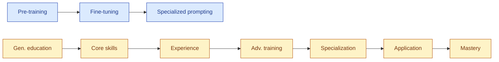
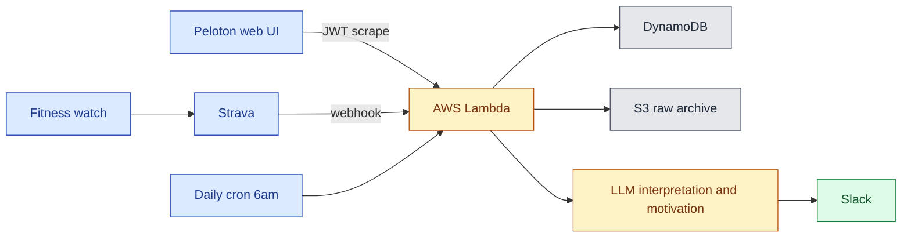
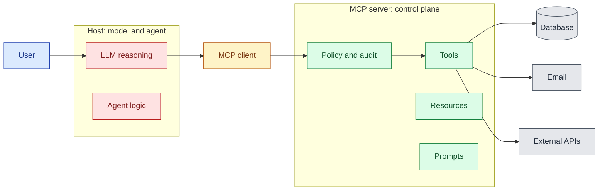

+++
author = "Bernat Gabor"
date = 2026-04-19T22:00:00Z
lastmod = 2026-04-20T00:00:00Z
description = "Per-talk notes from PyTexas 2026 in Austin: Hynek on domain modeling, Dawn Wages on specialization, MCP security, PEP 810 lazy imports, free-threading, Ruff, ty, uv, supply chain."
draft = false
image = "pytexas-2026-duck-mascot-og.webp"
images = [ "pytexas-2026-duck-mascot-og.webp", "pytexas-2026-duck-mascot.webp"]
slug = "pytexas-2026-recap"
tags = [ "python", "pytexas", "conference", "austin", "ai", "llm", "mcp", "keynote", "hynek", "packaging", "supply-chain", "pep-810", "free-threading", "ruff", "uv", "ty", "type-checking", "observability", "cli"]
title = "PyTexas 2026 Recap"
+++

[PyTexas](https://www.pytexas.org/) is the annual Python conference held in Austin, Texas. The 2026 edition ran April
17–19 at the [Austin Central Library](https://library.austintexas.gov/central-library) in downtown Austin.

> [!TLDR] **TLDR:**
>
> PyTexas 2026 ran April 17–19 in Austin. Friday was tutorials, Saturday and Sunday were talks with two keynotes and two
> lightning-talk blocks. A few themes kept coming back across unrelated talks:
>
> - **Design deliberately.** A thread across both keynotes. Hynek Schlawack: the domain model is *"the precious"* —
>   design it first, translate at the edges. Dawn Wages: ownership over your stack as one of her three pillars for model
>   and career specialization.
> - **Agents should write code, not decide what to write.** Peter Sobot's Seven Stages of AI Grief ended on that line.
>   Al Sweigart argued "agentic engineering" is vibe coding with better marketing, and that almost-right is worse than
>   wrong. Maria Silvia Mielniczuk's MCP talk built the same idea into an architecture: models suggest, only the server
>   executes. Adam Gordon Bell's running coach split deterministic work (plain Python) from interpretation (LLM). The
>   Sunday opener framed it bluntly: when AI ships a bad PR, fix the process, not the model.
> - **Code quality is an input to AI productivity.** Miguel Vargas's framing: AI agents produce cleaner, safer code in
>   codebases that are already clean, safe, and typed, so Ruff, ty, and uv matter more now.
> - **The supply chain is still the attack surface.** Christopher Ariza on why `pip install` still runs arbitrary code,
>   with `.pth` files, `sitecustomize.py`, and `setup.py` as the specific places to pay attention.
> - **CPython itself is getting faster.** Jacob Coffee on [PEP 810](https://peps.python.org/pep-0810/) lazy imports for
>   startup wins; Charlie Lin on the free-threaded build and what it takes to make an extension module safe under it.
>
> This post details the takeaways from each talk I attended, in schedule order.





## Friday

Friday was the tutorial day. **Heather Crawford** taught *Import is Important: The Secret Life of Python Modules and
Packages* in the morning slot, and I taught
[*Becoming a Better Python Developer with AI*](https://www.pytexas.org/2026/schedule/) in the afternoon. Slides are at
[gaborbernat.github.io/py-texas-26-workshop](https://gaborbernat.github.io/py-texas-26-workshop/). I plan to write up my
tutorial as a separate, more detailed post in the coming weeks.

## Saturday

### Dawn Wages keynote: Fine-Tune Your Future

Subtitle: *The case for career and model specialization*.



Dawn (Director of Community and Developer Relations at [Anaconda](https://www.anaconda.com/), former PSF Chair) opened
with a caveat on the AI productivity narrative: early UC Berkeley research suggests AI intensifies workload rather than
reducing it. Lower start/stop costs mean tasks fragment and bleed into the breaks your brain needs. She asked the
audience to drink water.

The keynote framed an **experimentation loop** as the foundational mental model for engineers, researchers, and
scientists: plan → design → build → test → release, as a dialogue, not a linear path. Specialization is the reward you
unlock by running that loop deliberately enough.

Her analogy carried the rest of the talk: LLM specialization and career specialization are the same shape.



Scaling laws say bigger models keep improving while small language models plateau fast, so matching capacity to the
problem matters more than chasing size. The same U-shaped curve of return applies to human effort.

She argued for **ontology** as the lever that lets both models and careers compound instead of sprawl. Ontology goes
further than semantics: where semantics asks what a word means in context (a "sidecar" might be a drink, a motorcycle
attachment, or an Azure component), ontology formally defines what entities exist, how they relate, and what rules
govern them. Tools from the knowledge-graph world ([OWL](https://www.w3.org/OWL/), [RDF](https://www.w3.org/RDF/),
[SPARQL](https://www.w3.org/TR/sparql11-overview/), triple stores) underpin this, and in multi-agent systems ontologies
become essential for semantic consistency between agents.

She walked through specialization techniques on the model side: [**LoRA**](https://arxiv.org/abs/2106.09685) (small
adapters inside transformer layers), full fine-tuning, parameter-efficient methods, ontology-driven data cleaning, world
models (predicting the next *state* rather than the next word), **RAG** (retrieval-augmented generation), and SLM
optimization (knowledge distillation, pruning, quantization, focused fine-tuning).

Then she mapped each onto careers under three pillars:

1. **Efficiency through expertise.** The Pareto 80/20 rule: focus on the 20% of skills that deliver 80% of the results.
   A personal knowledge base as your career's RAG. Teaching as distillation (repeat the explanation, deepen the
   mastery). Pruning low-value tasks, requiring that managers say out loud what counts as valuable. Domain flexibility
   from small modular learning in adjacent areas.
2. **Small iterations, big wins.** Frequent check-ins compound. Design workflows that give you regular feedback instead
   of saving up for one big deliverable.
3. **Ownership over your stack.** In software: your workflow, data, models, and infrastructure. In career: your income,
   reputation, network, and skills. She advocated for local-first AI, and debunked the "you need a Mac Mini" reflex: the
   point is a contained environment with clear boundaries, not the hardware.

She closed by reframing specialization as the **"art of strategic ignorance"**: deliberately choosing what *not* to
know, so you can set boundaries, deepen expertise, and protect your energy. Scaling laws apply to humans too: balance
skills (size), experience (data), and energy/time (compute). "Just relax" burnout advice is well-intentioned but naive
under real-world pressure. Build supportive communities (she called them "cadre friends").

Slides: [dawnwages.info/pytexas-keynote-26](https://dawnwages.info/pytexas-keynote-26/) (also
[bit.ly/pytexas-keynote-26](https://bit.ly/pytexas-keynote-26)).

### Moshe Zadka: Python as Your DSL

Moshe's thesis: *any* Python code can serve as a domain-specific language if you design it thoughtfully. The failure
mode is building "fake Python": systems that look like Python but break its rules through runtime magic. Early Django
did that: it injected names like `book_set` when you declared a `ForeignKey`, hid a global `db` object, and created
reverse relationships invisible in the source. Editors and linters couldn't resolve them, tests broke outside the
framework, pickling failed because the classes weren't attached to modules, and users couldn't trust introspection.
Django eventually ran a *magic removal* pass for these reasons.

**Why magic is harmful:**

- **Breaks tooling and discoverability.** IDEs can't resolve injected names. Ctrl-click fails. Linters fight you.
- **Undermines reusability.** Code written inside the DSL often can't be reused outside the framework (tests included).
- **Prevents debugging.** `print` and `logging` become unreliable. Pickling breaks.
- **Surprises experienced Pythonistas.** "People will assume they can do all the things they do in Python, but they
  can't."

The better path is a DSL that *is* valid, idiomatic Python. Moshe's examples:

- [**NumPy**](https://numpy.org/): few people call it a DSL, but the slicing syntax (`x[0, ..., -1]`), broadcasting, and
  operator overloads (`+`, `*`, `@`) make it one. It was influential enough that `...` became a language literal. Every
  standard Python tool (debuggers, profilers, IDEs, test runners) works on it.
- **Stan**: an HTML/XML construction DSL built on context managers and callables.
  `with tag('html'): with tag('body'): ...` builds the tree using plain `with` blocks, with no magic imports, and a
  working debugger.
- **Modern [Django](https://www.djangoproject.com/) models**: class attributes stand in for database columns. The
  library still uses metaclasses under the hood, but the interface is transparent: misspelling a relation name raises an
  error at import time.
- [**Pyramid**](https://trypyramid.com/) routing: `@view_config(route_name='home', renderer='string')` as a function
  decorator. A configurator scans for decorated functions to assemble the application, which keeps the routes
  discoverable and testable.

**Techniques that do the work without magic:** dunder methods (`__call__`, `__getitem__`) for operator-style ergonomics,
decorators for declarative configuration, context managers for nested scopes, generators for lazy streams, and
metaclasses for intervention at class creation (used sparingly). For plugin discovery, prefer
[`importlib.metadata.entry_points`](https://docs.python.org/3/library/importlib.metadata.html) or
[`pluggy`](https://pluggy.readthedocs.io/) over global registration side effects.

**Moshe's principles for a Pythonic DSL:** require explicit imports, stay discoverable (jump-to-definition must work),
support standard testing and debugging, leverage familiar syntax instead of custom parsers, start small and let users
fall back to plain Python when the DSL runs out, and don't surprise people who know Python well. Build a DSL when users
interact with your system through the same three or four patterns repeatedly. Skip it for one-off or highly variable
tasks.

### Adam Gordon Bell: I Built an AI Running Coach (That Actually Remembers My Training)



Adam (community engineer at [Pulumi](https://www.pulumi.com/)) built "Momentum Bot" to beat his friend Malcolm at the
2026 Monster's Mazinaw 30K, an ultramarathon through the Canadian Shield. His slide showed the 2025 10K results: Malcolm
Clarke 12th, Adam Bell 25th. Previous attempts failed because he trained for a few months before the race each year;
this time he committed to building a coach that would train him year-round.

**Architecture.** [Strava](https://www.strava.com/) → [AWS Lambda](https://aws.amazon.com/lambda/) (cron + webhook) →
[DynamoDB](https://aws.amazon.com/dynamodb/) (structured run data) → [S3](https://aws.amazon.com/s3/) (raw archive) →
[Slack](https://slack.com/). [Peloton](https://www.onepeloton.com/) has no public API, so his Lambda scrapes his Peloton
account using a refreshed JWT.



Data arrives second-by-second from multiple sources (fitness watch, Peloton, cadence sensors), gets timestamp-aligned
and normalized to a columnar per-second format, and rolls up into per-activity stats: time in heart-rate zones, average
incline, cadence, power, and heart-rate trends.

**The split he kept hammering.** Deterministic work (distances, paces, averages) stays in plain Python. The LLM only
handles what he'd otherwise be doing by reading the data with his eyes: interpretation, motivation, and adaptive
feedback. This keeps costs down and the system predictable.

**Training philosophy.** Polarized training: 80% low-intensity (Zone 2) for endurance and injury resilience, 20%
high-intensity (Zone 4+) for speed. Three mid-week runs, one long weekend run, one strength session. The plan shifts
seasonally (fall volume build, winter treadmill, spring trails).

**Adaptive feedback.** If Adam misses one or two days the coach keeps nudging the plan. After three days it detects a
"fragile motivational state" and scales back: *"Maybe just do a 20-minute run today. We won't even talk about the
plan."* He also wired in **intensive stacking**: restricting Netflix shows (*Stranger Things*) to treadmill time only.
The coach learned the pattern and started suggesting, "After work, jump on the treadmill and keep watching Stranger
Things." A [Slack](https://slack.com/) chat interface lets him respond to sessions ("that was a bad idea"), which the
bot stores in S3 via registered function calls, so it doesn't rely on LLM memory.

**Cost.** The whole thing runs on AWS free tier (Lambda fires at most once a day). The only real cost is LLM API calls,
roughly **$1/month**. Inference uses an open-weight OpenAI OSS model served by an external provider. Coding assistance
throughout the build came from [Claude](https://www.anthropic.com/claude).

**Results.** Weekly volume and consistency are both up sharply; visualization graphs (generated via
[Claude Code](https://www.anthropic.com/claude-code)) show clear upward trends. He admits he gave up on measuring speed
improvement: sleep, diet, and alcohol produce so much noise that a meaningful trend signal is not reachable with his
dataset. His invitation to the audience: *what could you build with your own data?*

Code: [github.com/adamgordonbell/ai-running-coach](https://github.com/adamgordonbell/ai-running-coach). More from Adam
on the [Pulumi community page](https://www.pulumi.com/community/community-engineering/adam-gordon-bell/).

### Maria Silvia Mielniczuk: Using MCP to Build Safe, Auditable AI Systems in Python



Maria's framing: when you connect a model to tools, its output stops being text and becomes actions with real-world
consequences. Building model × tool integrations by hand gets you an N×M explosion of custom glue with high maintenance
cost, inconsistent interfaces, poor observability, and a larger security surface. She called it the "wild west" of
ad-hoc integrations.

[**MCP (Model Context Protocol)**](https://modelcontextprotocol.io/) is the open standard for that glue, built on a
host/client/server architecture:

- **Host**: where the model runs and reasoning happens. Contains agent logic but doesn't execute tools itself.
- **Client**: manages sessions and transport, converts high-level agent requests into structured JSON events, sanitizes
  inputs.
- **Server**: a stateful message processor that routes requests to Python tool functions. Acts as the control plane for
  capability discovery, request validation, policy enforcement, and audit logging.



**Three MCP primitives** on the server side: **tools** (Python functions that do work, such as a database query or
sending email), **resources** (context the model needs, such as schemas or configs), and **prompts** (templates that
guide interaction, including example queries). A database server might expose the schema as a resource, sample SQL as a
prompt, and the execute function as a tool, so the LLM can discover capabilities without hard-coding.

**The key boundary.** Models suggest actions; only the server executes them. That separation is what gives you
isolation, observability, and predictability. Every action passes through a central logging point with input validation
and policy checks.

**Three new threat models in agentic workflows:**

1. **Malicious or untrusted MCP server.** A third-party server claims to offer analytics but probes internal APIs.
   Supply-chain risk similar to malicious `pip` packages. Mitigate by validating all responses, never trusting external
   servers implicitly.
2. **Misguided or overzealous agent.** A well-intentioned agent misuses a tool because of faulty reasoning, for instance
   reaching for a log-purging tool and deleting production data. Mitigate with execution limits, rate limiting, and
   contextual policy checks.
3. **Confused deputy.** A privileged tool is talked into performing an action the user shouldn't be allowed to do.
   Classic privilege escalation via social engineering of the model. Mitigate with server-level policy enforcement based
   on provenance and intent.

Traditional authn/authz doesn't cover this because agents act on behalf of users across systems where permissions are
technically valid but contextually inappropriate. The question shifts from "who are you" to "what is happening right
now".

**Demo.** Maria ran three scenarios against a local setup using Llama 3:

- **Happy path**: user asks for customer data, agent retrieves and proposes an update, human approves, server executes.
  Logs capture the full trace.
- **Risky data from untrusted source**: fetched data contains suspicious instructional text. Agent flags it; human
  approves anyway (simulating negligence). The server blocks execution on policy: *"no data from untrusted sources with
  risky provenance can be written to the database"*. Human approval alone is not enough.
- **Email with restricted scope**: agent wants to send to an external domain, human approves, server intercepts and
  redirects to an internal domain because the policy only allows internal email. Server-side policy overrides both the
  agent and the human.

She compared **FastMCP** (convenient framework, hides JSON plumbing, minimal observability by default) with raw MCP
(slower to build, exposes protocol details, forces you to design governance). Speed of development should not come at
the cost of visibility and control.

**Open problems** as MCP systems compose: server-to-server calls (multi-hop workflows that lose end-to-end visibility),
agent-to-agent delegation (chains of trust, policy propagation), and infinite loops between agents (budget controls and
loop detection become survival features). *"As systems grow in composability, governability becomes more critical than
connectivity."*

Demo code: [github.com/MS-Mielnic/pytexas-mcp-demo](https://github.com/MS-Mielnic/pytexas-mcp-demo).

### Dr. James A. Bednar (Anaconda): Data Visualization in Python (Sponsored)



James has been using Python since 2003 and works on [PyViz](https://pyviz.org/) (a neutral catalog) and
[HoloViz](https://holoviz.org/) (his team's opinionated project) at [Anaconda](https://www.anaconda.com/). His core
point: Python has over **175 visualization tools** cataloged on [pyviz.org](https://pyviz.org), and no individual has
used more than 25% of them. About 90% remain largely untested by the wider community. R has
[ggplot2](https://ggplot2.tidyverse.org/) as the obvious default; Python has a paradox-of-choice problem instead.

**Seven decision dimensions** for narrowing the space:

1. **Info-viz vs. sci-viz.** Information visualization (bar charts, line graphs with interpretable axes) vs. scientific
   visualization (3D or 4D, spatially embedded, axes optional). Tools are rarely good at both: Python's ecosystem shows
   almost no overlap between the two.
2. **Type of data.** Statistical/tabular (most Info Viz tools work), array-based (satellite imagery, microscope images,
   simulation grids; needs [HoloViews](https://holoviews.org/), [xarray](https://xarray.dev/)), or specialized (graph
   data → [NetworkX](https://networkx.org/), genomic data → bioinformatics libraries).
3. **Data size.** Legacy tools render each point on its own and break on large datasets, giving you a "solid block of
   blue". [Datashader](https://datashader.org/) (James's team) plots density instead of points, scaling to billions. His
   analogy: if every star in the sky got a dot, the night sky would be white.
4. **Output target.** Static outputs (PDF, PowerPoint, publications) favor [Matplotlib](https://matplotlib.org/).
   Interactive web outputs need JavaScript-backed tools like [Bokeh](https://bokeh.org/) or
   [Plotly](https://plotly.com/python/), which are weak at publication-quality export. Native desktop GUIs
   ([Qt](https://www.qt.io/) / [Tkinter](https://docs.python.org/3/library/tkinter.html)) are a third category with few
   good options.
5. **API design.** Three styles: concise one-liners
   ([`pandas.plot()`](https://pandas.pydata.org/docs/reference/api/pandas.DataFrame.plot.html), convenient but limited),
   verbose object-oriented (Matplotlib's full API, maximum control), and declarative
   ([Altair](https://altair-viz.github.io/), HoloViews; you describe the outcome, not the steps).
6. **Underlying tech stack.** HTML/JS, OpenGL (great 3D, terrible text rendering),
   [Qt/PySide](https://doc.qt.io/qtforpython/), or built on top of Matplotlib/Bokeh/Plotly. The base tech determines the
   ceiling. If a library sits on Matplotlib, it inherits the strengths and the constraints.
7. **Adjacent categories.** Color mapping ([`cmocean`](https://matplotlib.org/cmocean/),
   [`colorcet`](https://colorcet.holoviz.org/)), table rendering ([`itables`](https://mwouts.github.io/itables/),
   [`pandas`](https://pandas.pydata.org/) styling), dashboarding ([Streamlit](https://streamlit.io/),
   [Panel](https://panel.holoviz.org/), [Dash](https://dash.plotly.com/)). Starts plot-adjacent, ends up app
   development.

**Practical framework.** Start with Matplotlib. Eliminate irrelevant options using the seven dimensions. Don't pick a
sci-viz tool unless you're doing 3D spatial work. Use `pandas.plot()` and [`dask.plot()`](https://docs.dask.org/) as
unified APIs that dispatch to multiple backends (Matplotlib, Plotly, Bokeh) with one syntax. Popularity matters because
LLMs are trained on popular libraries, so using an obscure one means worse AI code completion unless you wire up
something custom. Feature comparisons are the *last* filter, not the first.

**On AI and viz.** Python visualization isn't becoming obsolete just because AI can generate React/D3 one-offs. For
ad-hoc plots it's great. As a daily workflow, understanding a library still beats iterating on prompts.

### Christopher Ariza: Why Installing Python Packages Is Still a Security Risk

Christopher's thesis: the primary risk of installing Python packages is arbitrary code execution, and every other threat
follows. That code runs with the user's privileges, which is enough to do damage without root. Transitive dependencies
carry the same risk as top-level packages and are easy to overlook. For a broader treatment of the defenses in this
space, see my earlier post on \[Python supply chain security\]().

**Three attack surfaces**:

- **Running imported modules**: importing a third-party module executes its code.
- **Execution during installation**: `setup.py` in source distributions, introduced in PEP 229 twenty-six years ago,
  still widely used. 454 of the top 1000 PyPI packages still ship a `setup.py` because C extensions and legacy build
  systems need it.
- **Execution at interpreter startup**: `site.main` processes `.pth` files and `sitecustomize.py` on every Python
  launch. A 2003 change allowed `.pth` files to contain `import`-prefixed lines that run through `exec()` at startup, so
  a one-line `.pth` file with semicolons is enough for arbitrary code execution at every interpreter invocation.
  Exceptions in these executions are caught and printed, not raised, so failures stay invisible.

**Attack techniques**:

- **Compromised maintainer credentials** (the `ctx` case; PyPI has since shipped domain-resurrection prevention).
- **Typosquatting and masquerading** (e.g., a package called `brockn-wrapper` pretending to wrap a legitimate library).
- **Dependency confusion**: a public package shadowing an internal private name so the resolver grabs the attacker's
  version, as in the `torch-triton` incident.
- **Social engineering via fake recruiters or IT support** pushing a "coding test" package during a job interview.

Python's standard library alone covers reconnaissance (`socket.gethostname`, `os.getlogin`, `platform.platform`),
credential and API-key exfiltration (dumping `os.environ` and `.env` files, URL-encoded and shipped off), clipboard
extraction via Tkinter (a favorite for crypto wallet addresses), persistence through shell startup files (a one-line
append to `.bashrc` gives you a reverse shell in every new terminal), crypto-mining, and ransomware-style wipers. "One
line with semicolons" is the recurring theme.

**Modern abuse patterns**:

- Malicious `setup.py` with a custom `build_py` command that writes a `.pth` file into `site-packages` during install.
- [Hatch](https://hatch.pypa.io/)'s `targets.wheel.force_include` option can bundle `.pth` files into a wheel, skipping
  the historical assumption that wheels don't execute code.
- Adversarial wheel modification: unzip a wheel, add a `.pth`, rezip, republish. Only detectable if you verify hashes.

**Mitigations Christopher recommended**:

- **PyPI-side.** [PyPI](https://pypi.org/) hired its first Safety and Security Engineer in 2023, mandated 2FA in 2024,
  shipped [trusted publishing](https://docs.pypi.org/trusted-publishers/), added malware reporting on package pages, and
  runs automated typosquatting detection. The system is open by design; no amount of platform effort removes all risk.
- **Avoid `site.main`**. Run `python -S` to skip `.pth`, `sitecustomize`, and `usercustomize` processing, then add
  `site-packages` to `sys.path` manually.
- **Lock files with pinned versions and hash validation**, across all transitive dependencies.
- **Pre-install research** using [libraries.io](https://libraries.io/), [Snyk](https://snyk.io/), or similar signals.
- **Private mirrors** ([Artifactory](https://jfrog.com/artifactory/),
  [CodeArtifact](https://aws.amazon.com/codeartifact/)) to curate the set of packages available, bounded by user
  circumvention.
- **Vulnerability scanners**: [Dependabot](https://docs.github.com/en/code-security/dependabot),
  [`pip-audit`](https://github.com/pypa/pip-audit). He also introduced his own tool,
  [fetter](https://github.com/fetter-io/fetter-py), a system-wide scanner that inspects `.pth`, `sitecustomize.py`, and
  `usercustomize.py` contents, plus an MCP variant that ensures agents install the latest non-vulnerable versions.
- **Canary tokens**: fake AWS keys and API tokens dropped in the expected locations on developer machines. If anything
  reads or exfiltrates them, you get an alert. Cheap, proactive, high signal.

**Closing recommendations**: don't install untrusted packages, always pin with hashes, prefer wheels over source
distributions so `setup.py` doesn't run, be skeptical of packages that still ship `setup.py`, audit `.pth` and
customization files regularly, and roll out canary tokens organization-wide.

### Al Sweigart: Failed Experiments in Vibe Coding





Al wrote [*Automate the Boring Stuff with Python*](https://automatetheboringstuff.com/). His day job is teaching
non-programmers to code, so when he says the AI discourse is an information hazard, he has standing. His framing: the
current claims about AI in software range from "AI will replace all developers" to "AI lets juniors work at senior
level" to "AI gives you a 10× or 20× productivity boost" to the new "non-developers can ship software now." Most of it
isn't empirically supported.

He anchored the talk on Andrej Karpathy's original **vibe coding** definition: *"I accept all always. I don't read the
diffs anymore. When I get error messages, I just copy-paste them in with no comment usually."* Al argued that what is
now called *agentic engineering* is indistinguishable from vibe coding in practice, and that calling it something else
is marketing, not method. He invoked James Randi (the magician who debunked psychics) as a model: skepticism as
professional duty, because to evaluate a claimed trick you need to understand how the trick could work.

**The empirical part: five esoteric apps** he tried to build with LLMs, first in August 2025 and again in February 2026
with updated models:

1. **Borderless African Geography Quiz.** Display a map of Africa *without political borders* and ask the user to click
   the right country. Early maps looked like "potatoes". Later attempts drew a real map by pulling SVG outlines. Hidden
   bug: the app downloaded the map data from a public GitHub repo on first run and cached it. Run it offline once, or
   take the repo down, and the app is permanently broken for new users. A vibe coder would never catch this; only
   someone reading the code would.
2. **Circular maze generator.** Early outputs were circular in shape but not mazes (every path led to the center).
   February's version looked like it worked; Al didn't inspect the code. "Looks good enough" is not the same as correct.
3. **Pinball game in Tkinter.** Terse prompt and verbose prompt produced nearly identical code. Worked, but the ball
   would occasionally move "hypersonically" out of the shooter because of a hard-coded velocity fudge. His line: *"Would
   you fly on an airplane that had 99% of its parts?"*
4. **Lava lamp simulator.** Initial output: static ovals. Breakthrough only happened when the prompt included the term
   **"metaball algorithm"** by name. Al's point: if you have to know the name of the algorithm, the AI isn't solving the
   problem from the description; it's surfacing what you already know. The "you didn't write the prompt right" rebuttal
   collapses once you realize the user has to be the domain expert first.
5. **Combination lock simulator.** August 2025: complete failure. February 2026: sometimes unlocked correctly, sometimes
   not. As Al refined the prompt, the model started editing parts of the code that had already been correct.

**Four recurring rebuttals to any AI criticism**, from his slide:

- "You didn't write the prompt right."
- "That model is garbage. The new model can do it."
- "That problem will be fixed in the next five years." (Al noted the "five years" timeline is always five years away,
  making it unfalsifiable.)
- "Well, I don't have that problem."

Al looked for functioning apps built by non-developers using AI alone, the thing all the breathless blog posts promise.
He found maybe half a dozen that were installable and usable. The best was a poker-themed match-3 game, made by someone
with web development experience who spent two weeks refining it. The rest were minimal or uninstallable.

He also flagged the legal reality: the terms of service of major AI products disclaim liability even for foreseeable
damages and frame the output as "for entertainment purposes only". He pointed out this is the same disclaimer phone
psychics use.

**His key line**: ***almost right is worse than wrong.*** Wrong is detectable and fixable. Almost right gets shipped,
rationalized, and carried forward as technical debt, security bugs, or failure modes nobody noticed. To trade off
reliability against speed sensibly, you need accurate information, not plausible output. The closing question he
answered: *is there a point to understanding things?* "Yes. Absolutely."

FYI: Carol Willing followed up in the Discord with a research project Al might enjoy —
[*The LLM Writing Distortion*](https://sites.google.com/view/llmwritingdistortion/home), which studies how LLM
assistance reshapes the writing people produce. Adjacent to Al's framing about AI output as plausible rather than
correct.

### Saturday Lightning Talks

- **Ana Eilering** (senior developer relations engineer at [Google](https://www.google.com/), speaking independently):
  "models are not magic, they are code." LLMs are lists of layers and neurons implemented in Python, and every neuron
  operates as a non-deterministic black-box function. She showed a visual of [Gemma 2](https://ai.google.dev/gemma)'s
  neuron activity during a factorial calculation.

- A [Django Rest Framework](https://www.django-rest-framework.org/) cautionary tale: a serializer field `book_returned`
  (boolean column) shared a name root with a model method `book_return` that updated the database. DRF treats any
  callable with no required arguments as serializable, so every GET request over the list silently ran the method and
  marked books as returned.

- **The Seven Stages of AI Grief** by **Peter Sobot**, describing his own arc with coding agents:

  1. **Denial, "Why use this?"** "These tools are overhyped, my workflow works fine." The coding agent suggests walking
     50 feet to the car wash instead of driving.
  2. **Discovery, "Wait, it can do that?"** Tools improve with better configuration (more effort, more tokens). The same
     agent, tuned, now reasons: "Drive. The car must end up at the car wash."
  3. **Enthusiasm, "Let's build something useful."** First productive use: a dashboard generated from Google Calendar
     data to show team availability. Rapid success with minimal effort.
  4. **Over-automation, "Let's run multiple agents."** Three Claude Code instances in parallel. Code on screen where an
     agent fetches [Jira](https://www.atlassian.com/software/jira) tickets, implements fixes, and opens pull requests on
     its own.
  5. **AI psychosis, "I've automated my job."** Peak overuse. Full automation of development tasks with minimal human
     oversight. Code generated fast, without planning or quality checks.
  6. **AI shame, "What have I done?"** Colleagues' PR comments start questioning the motivation and reasoning. "What's
     the goal here?" Embarrassment when the quality and intent behind the code turn out to be absent.
  7. **AI maturity, "Productive collaboration."** Regaining control. AI as a collaborator, not a decision-maker. Using
     Cursor to plan code, discuss architecture, and review every line or chunk before approval. The landing insight:
     *let agents write your code; don't let them decide what to write.*

- **Beating [Timsort](https://en.wikipedia.org/wiki/Timsort)**: a two-pointer merge rewritten in C as a Python extension
  module, benchmarked faster than Timsort for the narrow case of merging two already-sorted lists. Tim Peters responded
  on a new account, offered seven improvements, and suggested the name Adammerge instead of Timmerge.

- **Kyle Wakama Jimbo and Jesse**: three [Discord](https://discord.com/)-controlled LED matrix panels for the venue,
  built in eight days. 165 commits, 70 on one Monday. Components: a Discord bot capturing `/ledtext` commands, a
  [FastAPI](https://fastapi.tiangolo.com/) hub, a [Raspberry Pi](https://www.raspberrypi.com/) ("Wrangler") creating a
  private Wi-Fi network because venue Wi-Fi was unstable, three panels, and a PWA frontend. A `/panic` command shuts off
  all panels instantly.

## Sunday

### Hynek Schlawack keynote: Intentional Software Design



Hynek (PSF fellow, infrastructure and software engineer at Variomedia in Berlin, maintainer of
[attrs](https://www.attrs.org/) and [structlog](https://www.structlog.org/)) framed the keynote around **design
pressure** (a term he credits to J.B. Rainsberger's talk
[*Integrated Tests Are a Scam*](https://blog.thecodewhisperer.com/permalink/integrated-tests-are-a-scam)): forces that
change your code unintentionally, like tooling choices, test scope, or organizational constraints. His thesis: ORMs,
class-based validators, and LLM-generated pull requests are calcifying business logic into compromises it didn't choose
— and with every implementation one prompt away, we have lost *"an important pain signal of bad design."*

The opening provocation: *"The use of object-relational mapping in fast-paced related frameworks ruins your projects."*
He walked it back in the next breath: [Django](https://www.djangoproject.com/),
[SQLAlchemy](https://www.sqlalchemy.org/), [Pydantic](https://docs.pydantic.dev/) and friends are fine tools when you
are aware of what they do to your code. The talk is about architecture, not tools.

**Testing as positive design pressure.** When tests are painful to write, the pain is a signal about the shape of your
code. Growing the scope of a test (class → package → end-to-end) hides coupling instead of fixing it. AI code generation
makes this worse because a model can mock half the universe without feeling the pain that would have forced decoupling.

**Three moves in the argument:**

1. **Business logic is the reason your application exists.** Not the Django views, not the Pydantic schemas, not the
   SQLAlchemy models. The code that decides what to do based on data and business rules. Many engineers have never seen
   explicit business logic in their career because tutorials teach it embedded in a framework.
2. **Domain, data, and API are three different models with conflicting goals.** A database model is shaped by
   normalization, indexing, and storage performance. An API model is shaped by what's ergonomic for consumers. A domain
   model reflects the problem. Forcing them into one class produces a compromise between two of them, imposed on the
   third — not one impedance mismatch but two.
3. **The domain model is *"the precious."*** Design it first, from the problem. Validate at the edges, reshape incoming
   data at the boundary, and keep the domain model *"completely isolated from everything that is not part of the
   domain."*

He illustrated the domain-first approach with Matt Drury's PyCascades 2024 talk *The Rising Sea*: an Advent of Code
puzzle about moving boxes between harbor stacks. The elegant solution starts by modeling `Harbor`, `Stack`, and `Move`
classes that encapsulate business logic with their data, then keeps the ugly input-parsing code isolated in a separate
module Matt called **"the darkness"**. The maxim: *structure your data so that the problem solves itself*.

Hynek's worked example: international postal addresses. The "one table, all fields nullable" database shape is honest
about storage but useless for business logic, because you end up checking `if field is None` everywhere. Replace it at
the edge with tagged unions of per-country classes (`USAddress`, `IEAddress`), so a function receiving a `USAddress`
knows which fields it can rely on. Make illegal states unrepresentable, and let [mypy](https://mypy-lang.org/) be the
buffer between messy input and clean logic.

**Why people don't do this.** He pulled a line from Ed Montgomery's blog post *How I Build*: *"It's okay to have
duplicated domain types for different layers of a project… types near the edge, like API schemas and database tables,
are inherently less flexible. It's often better to explicitly map types between these layers rather than create a common
type and allow the least flexible layer to calcify the rest."* Hynek called this his whole talk in one slide.

He closed on a broader point borrowed from Rich Hickey's
[*Simple Made Easy*](https://www.infoq.com/presentations/Simple-Made-Easy/): **easy is not the same as simple**. Raw
dicts instead of proper classes are easy, not simple. God classes (one big file because you don't want to split it) are
easy, not simple. Mantras like "keep it simple" or "you aren't gonna need it" get misused to justify laziness. The
current AI moment risks accelerating this because the pain of bad design no longer slows the author down.

Two verbatim quotes:

> I'm here to encourage you to have thoughts in the first place.

> AGI is not around the corner. You may quote me, and it will definitely not save you.

Closing: he thanked his employer Variomedia, and pointed to his YouTube channel,
[youtube.com/@The_Hynek](https://www.youtube.com/@The_Hynek), for longer-form versions of the same ideas. Talk page:
[hynek.me/talks/design-pressure/](https://hynek.me/talks/design-pressure/).

### Jacob Coffee: The Bakery, How PEP810 Sped Up My Bread Operations Business



Python 3.15 will introduce a `lazy` import keyword via
[PEP 810, Explicit Lazy Imports](https://peps.python.org/pep-0810/) (accepted November 3, 2025). Rather than import a
module at startup, Python creates a lightweight proxy in the namespace and resolves the real module on first attribute
access. For the wider context on how Python's import machinery has evolved, see my earlier post on \[the state of Python
packaging\]().

Real-world numbers he cited:

- **Meta** ([Cinder](https://github.com/facebookincubator/cinder)): 70% startup reduction, 40% memory savings.
- **HRT**: shorter import times, critical for low-latency trading.
- **Microstar's CLI**: 35% faster startup.

Target use cases: CLI tools (help, completion discovery), [pytest](https://pytest.org/) discovery, plugin architectures,
[AWS Lambda](https://aws.amazon.com/lambda/) cold starts, GUI applications. Caveats: circular imports that used to fail
at startup will fail at first access instead; modules that configure logging or run side effects on import will behave
differently. `lazy` works at module level only. His advice: profile first, target modules that take more than 50ms, skip
the reflex to rewrite every import, and document which imports are lazy. Demo CLI (the "bakery"):
[github.com/JacobCoffee/breadctl](https://github.com/JacobCoffee/breadctl).

### Kassandra Keeton: Python in the Browser, Building Interactive Documentation with MkDocs & JupyterLite



Kassandra (the Prosperous Heart, PyTexas marketing lead) built a 3-day live Python bootcamp at
[Cisco](https://www.cisco.com/) that was well-received but didn't scale: learners struggled with environment setup and
lacked real-time mentorship. Her solution is [MkDocs](https://www.mkdocs.org/) +
[JupyterLite](https://jupyterlite.readthedocs.io/) + [Pyodide](https://pyodide.org/), which runs Python in the browser
via [WebAssembly](https://webassembly.org/) without local installation.

Three ways to embed JupyterLite in MkDocs:

1. **Notebooks**: inline rendering of specific notebooks via iframes.
2. **Lab**: the full [JupyterLab](https://jupyter.org/) interface embedded in the docs.
3. **File Browser (Tree)**: browse and open files.

Configure everything in `mkdocs.yml` and publish with `mkdocs gh-deploy`. Her Community Garden project demonstrates
specification-driven development: Markdown pages carry metadata (requirements, priority, status, doc numbers) and
build-time scripts generate tables, charts, and status icons, turning the doc site into a lightweight ticketing system.
Template repo site:
[resume.prosperousheart.com/mkdocs-jupyterlite-template-repo](https://resume.prosperousheart.com/mkdocs-jupyterlite-template-repo/).
She later clarified on Discord that it's [mkdocs-material](https://squidfunk.github.io/mkdocs-material/), not MkDocs
itself, that [Zensical](https://zensical.org/about/) is positioned to replace.

### Sophia Solomon: Introducing Meow'py, Observability for the Internet of Living Things



Sophia's framing: observability doesn't have to stop at distributed systems. Living things (wearable trackers,
GPS-tagged livestock, sensor-monitored houseplants, endangered species tracking) are autonomous and non-deterministic,
which makes them a good demo target. She ran a virtual cat named Meow'py (Whiskers), modeled as a state machine with
hunger, energy, and bladder, and instrumented it with [**OpenTelemetry**](https://opentelemetry.io/).

Signals:

- **Logs**: discrete events ("Whiskers ate 34.9g of food").
- **Metrics**: counters (escape attempts, distance traveled) and histograms (nap duration).
- **Traces**: spans around each behavior using context managers, enriched with name, position, and movement.

Data flowed over [OTLP](https://opentelemetry.io/docs/specs/otlp/) to
[Elastic Observability](https://www.elastic.co/observability), which auto-generated dashboards, a service map,
transaction tracing, alerting (e.g., more than 10 escape attempts per minute), log-to-trace correlation, and ML anomaly
detection (scalable to real cases like sick livestock on a farm).

Best practices she called out: semantic conventions, meaningful metric attributes, sampling, batch exporters, and
monitoring your monitoring. Pitfalls: no sampling strategy, instrumenting after launch, skipping auto-instrumentation
tests, logging PII, and cosmetic dashboards.

### Charlie Lin: Tying Up Loose Threads, Making Your Project No-GIL Ready



Charlie covered the free-threaded CPython interpreter and what it takes to make an extension safe under it. Changes to
the runtime: a garbage collector that doesn't rely on linked lists, fine-grained internal locks on built-in `dict` /
`set` / `list`, modified reference counting to reduce contention, and critical sections (`PyBeginCriticalSection` /
`PyEndCriticalSection`) for per-object locking. `PyDict_Next` is not thread-safe and must be wrapped in a critical
section.

Module initialization:

- **Single-phase**: call `PyUnstable_Module_SetGIL` in the extension module's entry point `PyInit_<module name>`:
  ```c
  #ifdef Py_GIL_DISABLED
      PyUnstable_Module_SetGIL(m, Py_MOD_GIL_NOT_USED);
  #endif
  ```
- **Multi-phase**: add a `PyModuleDef_Slot` with `Py_mod_gil` set to `Py_MOD_GIL_NOT_USED`.

Language and tool support: [Cython](https://cython.org/) (type annotations for efficient, compatible code),
[PyBind11](https://pybind11.readthedocs.io/)
([free-threading support](https://pybind11.readthedocs.io/en/stable/advanced/misc.html#free-threading-support),
`PYBIND11_MODULE(..., m, py::mod_gil_not_used())`), [PyO3](https://pyo3.rs/)/[Rust](https://www.rust-lang.org/) (since
0.28,
[assumes Rust code is thread-safe](https://pyo3.rs/v0.28.3/free-threading.html?highlight=gil_used#supporting-free-threaded-python-with-pyo3);
opt out with `#[pyo3::pymodule(gil_used = true)]`). [SWIG](https://www.swig.org/) is not recommended.

Testing: environment variable `PYTHONMALLOC=debug` and `Py_GIL_DISABLED=1`,
[AddressSanitizer](https://clang.llvm.org/docs/AddressSanitizer.html) and
[ThreadSanitizer](https://clang.llvm.org/docs/ThreadSanitizer.html). The `cPython-sanity` project provides pre-built
Docker images of CPython with ASan and TSan enabled. Build wheels targeting free-threaded Python using versions ending
in `T` (e.g., `3.13.0T`).

Further reading: [porting extensions guide](https://py-free-threading.github.io/porting-extensions/),
[PEP 703](https://peps.python.org/pep-0703/),
[free-threading extensions HOWTO](https://docs.python.org/3/howto/free-threading-extensions.html#freethreading-extensions-howto),
[What's New in 3.13](https://docs.python.org/3/whatsnew/3.13.html#free-threaded-cpython). Community tracker for
verified-compatible packages: [hugovk.dev/free-threaded-wheels](https://hugovk.dev/free-threaded-wheels/). Code examples
from the talk: [gist](https://gist.github.com/clin1234/429cd977609a758e0e6f71f39789312b).

### Avik Basu: Upgrading Python CLIs, From Scripts to Interactive Tools



Avik (data scientist at [Intuit](https://www.intuit.com/), [PyOpenSci](https://www.pyopensci.org/) editor) opened with
the 2013 story of running [`git commit`](https://git-scm.com/) on a fresh [Ubuntu](https://ubuntu.com/) install, landing
in [Vim](https://www.vim.org/), and spending 30 minutes trying to save and exit. Good CLIs are fast, composable,
scriptable, universal, and AI-friendly.

He rebuilt the same tool (an ML model explainability monitor with `log`, `generate report`, and `watch` subcommands)
three ways:

1. [**argparse**](https://docs.python.org/3/library/argparse.html): standard library, boilerplate-heavy, manual argument
   definition and validation, no conflict hierarchy, text-only output.
2. [**Typer**](https://typer.tiangolo.com/) + [**Rich**](https://rich.readthedocs.io/): type hints become CLI
   definitions, built-in path validation via `typer.Argument(exists=True)`, priority hierarchy (flag > environment
   variable > default), shell completion, and Rich tables with color-coded output. Demoed with `report summary` and
   `report drift` subcommands using PSI (Population Stability Index) to flag drift on features like `debt_ratio`.
3. [**Textual**](https://textual.textualize.io/): the `watch` command opens a full-terminal dashboard that
   auto-refreshes every 5 seconds, with a filter input, a table of feature metrics, and bar charts. Defined as a class
   with CSS-like layout, composed of widgets, with `on_mount` / `set_interval` lifecycle hooks and key bindings.

Production patterns: output JSON so downstream tools can pipe into [`jq`](https://jqlang.org/), keep `--help` fast with
lazy loading or module-level `__getattr__`, and distribute via [pip](https://pip.pypa.io/) /
[conda](https://docs.conda.io/) / [pex](https://docs.pex-tool.org/) / [shiv](https://shiv.readthedocs.io/) /
[conda-pack](https://conda.github.io/conda-pack/) (and optionally [brew](https://brew.sh/) or
[winget](https://learn.microsoft.com/en-us/windows/package-manager/) for wider reach).

Slides: [github.com/ab93/building-cli-talk](https://github.com/ab93/building-cli-talk/blob/main/slides/slides.pdf). Demo
tool: [github.com/ab93/shap-monitor](https://github.com/ab93/shap-monitor).
[LinkedIn](https://www.linkedin.com/in/avik-basu/).

### Miguel Vargas: Lint Fast, Type Hard. Elevating Python Code Quality with Modern, Ultra-Fast Tooling



Miguel's framing: AI agents produce cleaner, safer, faster code in codebases that are already clean, well-typed, and
well-tested. Quality is an input to AI productivity, and without guardrails, AI accelerates technical debt. For
background on the typing side of this argument, see my earlier post on \[the state of type hints in
Python\]().

Key terms:

- **SAST** (Static Application Security Testing): scans code for vulnerabilities like SQL injection and XSS.
- **SCA** (Static Code Analysis): bugs, code smells, anti-patterns.
- **SCA** (Software Composition Analysis): third-party dependency risk.

Commercial platforms ([Sonar](https://www.sonarsource.com/), [Snyk](https://snyk.io/),
[Veracode](https://www.veracode.com/), [Black Duck](https://www.blackduck.com/)) can exceed $15k/year. Open-source
alternatives: [Ruff](https://docs.astral.sh/ruff/), [Pyright](https://github.com/microsoft/pyright),
[Mypy](https://mypy-lang.org/), and [`pip-audit`](https://github.com/pypa/pip-audit).

The toolkit he used comes from [Astral](https://astral.sh/) (Charlie Marsh's company, which announced on March 19 that
it is joining OpenAI's Codex team): **uv, Ruff, and ty**, all written in Rust, all 10×–100× faster than the tools they
replace.

- [**Ruff**](https://docs.astral.sh/ruff/): linter and formatter, 900+ rules spanning bugs,
  [PEP 8](https://peps.python.org/pep-0008/) style, dead code, security ([Bandit](https://bandit.readthedocs.io/)
  rules), import sorting ([isort](https://pycqa.github.io/isort/)), and docstrings. Configurable from `pyproject.toml`.
  Adopted by [FastAPI](https://fastapi.tiangolo.com/), [pandas](https://pandas.pydata.org/),
  [Airflow](https://airflow.apache.org/), and [Hugging Face](https://huggingface.co/).
- [**ty**](https://docs.astral.sh/ty/): type checker with gradual adoption, clear error messages, per-rule severity, and
  a built-in language server for [VS Code](https://code.visualstudio.com/) and
  [PyCharm](https://www.jetbrains.com/pycharm/).
- [**uv**](https://docs.astral.sh/uv/): Python package and version manager.

Agentic coding playbook: design workflows at the repo root, define skills for Ruff, ty, and uv, run them after every
task, enforce with [pre-commit](https://pre-commit.com/) hooks locally and
[GitHub Actions](https://docs.github.com/en/actions) in CI. Demo repo:
[github.com/lmiguelvargasf/lint_fast_type_hard](https://github.com/lmiguelvargasf/lint_fast_type_hard).

### Sunday Lightning Talks

- **AI snow and guardrails.** Opening talk on the two narratives emerging around heavy AI-agent use in teams: one camp
  says their codebase is "full of AI snow" and everything is horrible (cue the [Amazon](https://www.amazon.com/)
  incident); the other says they're shipping faster and catching more edge cases. The speaker argued both can be right
  at the same time, and the variable is the strength of the software guardrails. Guardrails are "rough roads you can't
  escape" and scale independent of PR volume; without them, a 4× productivity boost means a 4× boost in bad PRs reaching
  production. When an AI PR causes an incident, the blame goes to the model (*"the model is the only one who can't
  defend itself"*) instead of to the process that let it through. The right fix is boring: unit test coverage,
  integration tests, blue-green canaries. His challenge: find one code-review comment you've given that says "don't do
  that" and find a way to automate it so it can't ship.
- **Andy on spec-driven development with Cursor.** A year into vibe-coding with [Cursor](https://cursor.com/), Andy hit
  the wall where each fresh chat forgot his conventions. His fix was **context engineering**: a `.cursor/rules` file
  pointing Cursor at a `specs/` folder with feature files, a project constitution, a development process document, and
  Gherkin BDD standards. He demoed "Buggy Board", a bug-tracker web app he'd been iterating on, adding a `creator` field
  live on stage by having Cursor read the spec, update the [Gherkin](https://cucumber.io/docs/gherkin/) scenarios, and
  implement the change end to end. The kicker: the stack was [TypeScript](https://www.typescriptlang.org/),
  [Node](https://nodejs.org/), [React](https://react.dev/), [Express](https://expressjs.com/), and
  [SQLite](https://www.sqlite.org/), and he'd never written React or Express before. His line: *"if you can describe it,
  you can do it."*
- **[Tristan Lee](https://trislee.github.io/pytexas-network/)** (data journalist): a network visualization of PyTexas
  itself, built the night before. Pipeline: [yt-dlp](https://github.com/yt-dlp/yt-dlp) to download the conference video
  playlist, an ASR model (he used "Vidya Therapy" for speed) to transcribe, [spaCy](https://spacy.io/) to extract
  entities, general cleanup (PyTexas is apparently a hard token for ASR), [NetworkX](https://networkx.org/) for the
  graph, [Gephi](https://gephi.org/) to lay out the nodes, and [Sigma.js](https://www.sigmajs.org/) to render. Nodes are
  entities; edges connect two entities mentioned within ten words of each other. Clusters emerged for tooling/packaging,
  APIs, systems and containers, and a "Zen of Python" cluster. *"Don't yell at me, I know Gephi and Sigma.js aren't
  Python, but hey, what can we do?"* Live project:
  [trislee.github.io/pytexas-network](https://trislee.github.io/pytexas-network/).
- **Al Sweigart on [Turtle](https://docs.python.org/3/library/turtle.html).** A tour of the standard-library module most
  people forget exists. Seymour Papert at MIT invented Turtle graphics in the '70s/'80s and every teaching environment
  has copied it since. Al has made the [Simple Turtle Tutorial](https://inventwithpython.com/), fractal examples in *The
  Recursive Book of Recursion*, Escher-style impossible-object generators inspired by Oscar Reutersvärd, *Tortuga* (a
  translation of `turtle.py` into non-English languages for accessibility), *Turtle SD* (shorter aliases), and
  [scrollart.org](https://scrollart.org/), where a `print`-in-a-loop fills the screen, then scrolls upward. Scroll art
  works in every language that has `print` and `random`.
- **Joshua Cannon, "You Ain't God".** A non-technical talk on the way modern tech encourages us to treat ourselves as
  omniscient and omnipotent, illustrated with fake scripture references (*"I can know anything about anything, for I
  know all things," Google-ations 8:8*). He asked the audience to close their eyes and imagine being an astronaut on the
  moon, then a deep-sea diver, then at Disney World with their kids behaving. Then: remember your last actual vacation.
  His frame: accept your finitude. Say no to things you could say yes to. Be honest with yourself and others. Get bored
  and wait. Do hard things because they're hard. The slide was titled *Heres what ya are* and listed: incongruent,
  contradictory, awkward, emotional, weak, short-sighted, mean, forgetful, obtuse, tired, a failure, and more.
- A lightning talk framed as "AI system thinking": Korean-language jokes, a new acronym set including **AI DOS** (AI
  Direct Operating System) and **AASI** (Advanced Advanced Artificial Super Intelligence), and a pitch for a company
  working on a "vaccine" for the social side effects of AI adoption.
- **LLM mental-model talk**: a front-end platform engineer on how Cursor and
  [Copilot](https://github.com/features/copilot) land in teams, and why disappointing results often trace back to a weak
  mental model of what an LLM is. His framing: LLMs are "statistical pattern machines" whose output is shaped by
  training data, so thinking of the LLM's output as "my code" misses the point; it's "code we've all contributed." He
  uses **persona prompts** via a Cursor system-prompt Markdown file to pick the voice the model writes in. On screen: a
  slide comparing book covers of Harry Percival's *Test-Driven Development with Python* (2017), *Architecture Patterns
  with Python* (2020), and *Test-Driven Development with Python, 3rd Edition* (2025) to show how the same author's
  thinking evolved across editions. Different personas (e.g., Django-era vs. Laravel-era) produce noticeably different
  code.
- A pitch to come to [**EuroPython 2026**](https://ep2026.europython.eu/) this summer, featuring a live Core Dev podcast
  episode with Guido van Rossum, Łukasz Langa, and Pablo Galindo Salgado. A quick audience poll: are your summer plans
  still the same, does Europe sound tempting, have you met someone here you want to talk to again. Most hands went up.
- **Laura** (PyTexas organizer; Mason Egger calls her his CFNO): *How to Organize the Monkeys and Make Sure They Can
  Peel Bananas*, a title someone else signed her up for. Tips from a decade of running community conferences: every
  community conference runs on a razor edge financially (one conference she knows pulled 70% of its revenue in the last
  two weeks); nobody reads emails, the website, or the sponsor prospectus, only the schedule, and only because they're
  going to show up late; every speaker runs over time, except when they don't and finish in ten minutes; everyone loses
  their badge on day two; order more swag than you think because "everyone wants a memory"; every plan fails, and what
  matters are the people who show up. Her ask of attendees: show up, help, participate, clap, ask questions, volunteer,
  share. Also: PyTexas attendees are weirdly obsessed with bananas.
- **Mason Egger** closed the conference.

## Hallway Track

Most hallway conversations this year centered on using AI agents better: what worked for whom, which workflows held up
under real projects, where people were still hitting walls. Hearing how different teams set up context, guardrails, and
review loops was often more useful than the talks themselves. One new find out of those conversations was
[Lumbergh](https://lumbergh.dev), a self-hosted dashboard that streams and coordinates multiple AI coding sessions side
by side ([Claude Code](https://www.anthropic.com/claude-code), [Cursor](https://cursor.com/),
[Aider](https://aider.chat/)), surfaces real-time git activity, and lets you run git operations from a browser. Worth a
look if you're running more than one agent at a time.



## Wrapping Up

This was a great conference. Thank you to Mason Egger, Laura, the volunteers in tie-dye shirts, and everyone else who
kept the whole thing running. Most of the weekend ran smoothly. The dinners on Friday and Saturday were great, in food
quality and in atmosphere, and the crowd was friendly and open throughout.

If you're on the fence about next year: PyTexas is a strong single-track conference, and the size fits meeting people
instead of losing them in a hallway. Worth making the trip.

One piece of feedback on the format. This year had Open Spaces on both days, which I love in principle. In practice,
running them alongside the main-stage talks meant Open Spaces attendance looked thinner than the interest warranted.
Running them in a dedicated block (or without competing with the talks) would let them flourish. Small change, big
payoff.

A final thanks to the many attendees, too many to enumerate, who came up to ask questions, share feedback on the Friday
tutorial, trade notes on AI agents and packaging and everything in between, or just chat in the hallway.
